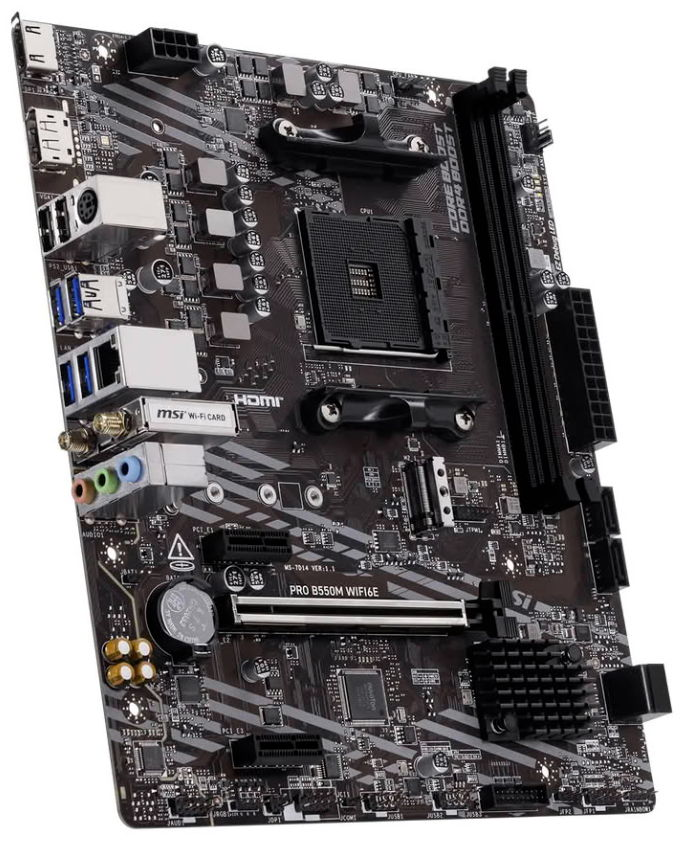
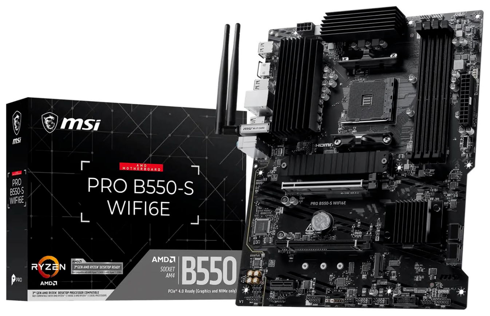

MSI suma tres nuevas placas base a su catálogo AMD AM4: **PRO B550M WIFI6E, PRO B550-S y B550-S WIFI6E**. Las tres montan el chipset B550, están disponibles en formato ATX y microATX y son compatibles con los Ryzen 3000, 4000G y 5000. La llegada de estos modelos no es un simple retoque de catálogo: llega en un momento en el que montar un equipo sobre AM5 se ha vuelto difícil por el precio de la memoria DDR5, de las SSD PCIe y de las CPUs más avanzadas, y en el que la plataforma AM4 de AMD se perfila como una salida de transición mientras la presión de la IA sobre la producción de chips no afloje.

## MSI apuesta de nuevo por AM4 con tres placas B550

La de las placas base AM4 es una estrategia que MSI viene sosteniendo durante todo el mes. Hace dos semanas la marca ampliaba la plataforma con la MAG B550 TOMAHAWK WIFI, y ahora repite la fórmula con tres modelos adicionales que modernizan el diseño de las placas: componentes de mayor calidad, PCB revisados, reguladores de voltaje más capaces y estándares de conexión más recientes, todo sobre un socket que ya se daba por amortizado.

El objetivo declarado es ofrecer una vía de actualización asequible. Frente a un escenario en el que la [crisis de la memoria RAM deja los PC de oficina en 16 GB](/noticias/office-pc-16gb-ram-price-crisis/) y encarece cualquier compra nueva, una placa B550 con DDR4 permite seguir amortizando el hardware existente en lugar de saltar de golpe a un estándar mucho más caro.

## Qué ofrece cada uno de los tres modelos

La **PRO B550M WIFI6E** es el modelo más compacto y probablemente el más interesante para quien busca un equipo contenido. Usa formato microATX con 243,84 × 210 mm, adopta un diseño minimalista con un radiador pequeño sobre el chipset B550 y monta dos ranuras DIMM DDR4 con soporte para 4600+ MT/s (OC). En expansión ofrece una PCIe 4.0 x16 y dos PCIe 3.0 x1, más una M.2 a PCIe 4.0 x4 y cuatro SATA de 6 Gb/s. La conectividad inámbrica Wi-Fi 6E va de serie.

Las **PRO B550-S** y **B550-S WIFI6E** llegan en formato ATX completo, 243,84 × 304,8 mm, con un apartado térmico más sobrado: disipadores independientes para el VRM, el chipset y la M.2. Las dos montan cuatro ranuras DIMM DDR4, máximo 128 GB y frecuencias de hasta 4800+ MT/s (OC). El apartado de expansión incluye dos ranuras PCIe x16 y una PCIe x1, dos ranuras M.2 (la primera a PCIe 4.0 x4 y la segunda a PCIe 3.0 x4) y cuatro puertos SATA. En el panel trasero hay puertos USB Type A y Type C de 5 Gbps junto a otros Type A y Type C de 10 Gbps. La variante B550-S WIFI6E suma la conectividad Wi-Fi 6E de fábrica.

Compartidas entre las tres placas están la tarjeta de audio Realtek ALC897 de 7.1 canales, un chip Realtek RTL8111H que aporta Gigabit Ethernet por red cableada, un puerto HDMI 2.1 y varios conectores USB 3.0 Tipo A y Tipo C.

## Qué cambia para el lector

Lo relevante no es tanto la ficha técnica —que es la esperable en una placa B550 de gama de entrada— sino la dirección que marca. Mientras AM5 se encarece por la escasez de memoria, volver a AM4 con DDR4 se convierte en una de las formas más racionales de montar o ampliar un equipo sin asumir el sobreprecio completo de la nueva generación. Es una apuesta por la transición: sigue sin ser la plataforma a la que apuntaría quien construye un equipo nuevo pensando en los próximos años, pero alarga la vida útil de los Ryzen 3000, 4000G y 5000 que ya están en circulación.

MSI no ha comunicado precios para estos tres modelos y se espera que se ubiquen en la banda económica; llegarán en breve al mercado internacional.
