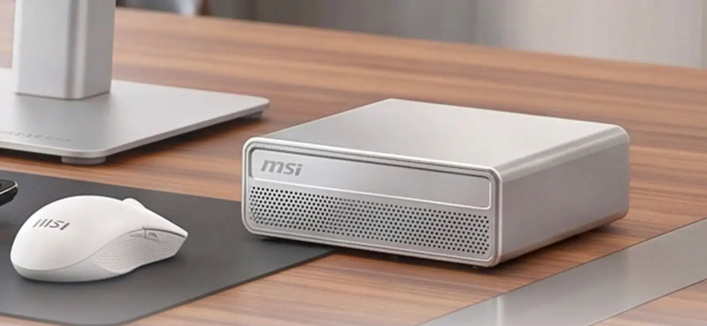
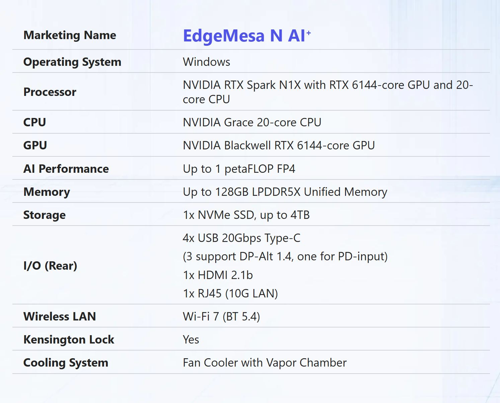

MSI ha publicado en su web el EdgeMesa N AI+, un mini PC compacto construido alrededor del chip RTX Spark N1X de NVIDIA, la variante más potente de la plataforma. No hubo nota de prensa ni anuncio previo: el equipo apareció directamente en el sitio del fabricante, que todavía no ha habilitado la página de especificaciones completa ni ha comunicado precios o fecha de venta.

## Un mini PC con el RTX Spark más capaz

El N1X es la configuración tope de la familia RTX Spark, que NVIDIA reparte en dos versiones: el N1 y el N1X, siendo este último el de mayor potencia. Según los datos que acompañan al listado, el sistema integra un SoC con CPU Grace de 20 núcleos junto a una GPU basada en Blackwell con 6.144 núcleos CUDA.

La memoria es uno de los puntos fuertes: hasta 128 GB de LPDDR5X unificada. El almacenamiento se limita a una única ranura NVMe, con soporte para unidades de hasta 4 TB. MSI cifra el rendimiento de IA en hasta 1 petaFLOP en FP4, una medida pensada para inferencia de precisión reducida, que es la que se usa habitualmente al ejecutar modelos de lenguaje en local.

El chasis es de acabado plateado y monta un frontal completamente ventilado, un detalle que apunta a que el equipo disipa bastante calor pese a su tamaño reducido.

## Conectividad para un equipo compacto

En el apartado de puertos, el EdgeMesa N AI+ ofrece cuatro USB Type-C a 20 Gbps. Tres de ellos admiten DP-Alt 1.4 para salida de vídeo y uno soporta Power Delivery para cargar dispositivos. Se suma un HDMI 2.1b y un puerto de red 10 G LAN, además de Wi-Fi 7 y Bluetooth 5.4. No queda claro si el equipo incluye también puertos USB Type-A, algo habitual en este tipo de sistemas.

## Qué cambia para quien quiere IA local

La clave de estos equipos no está en la potencia bruta, sino en la memoria unificada. Al compartir un único bloque de memoria entre CPU y GPU, el sistema puede cargar modelos grandes que no caben en una tarjeta gráfica de consumo con VRAM convencional. Ese es justamente el argumento de la plataforma RTX Spark, que NVIDIA posiciona como alternativa de escritorio para desarrollo, inferencia y cargas profesionales.

MSI no es la única que se está moviendo en esta dirección: el catálogo de estaciones de trabajo compactas para IA no deja de crecer, y el propio RTX Spark ya está moviendo precios en otros productos de NVIDIA, como muestra el encarecimiento del [DGX Spark](/noticias/nvidia-dgx-spark-price-hike/). Para un desarrollador hispanohablante que quiera montar un servidor de IA doméstico sin depender de la nube, este tipo de máquina reduce el consumo y el ruido frente a una torre con GPU dedicada, aunque a cambio limita la ampliación a un solo SSD y no permite cambiar la GPU.

Buen momento para seguirle la pista: la llegada de [CUDA 13.4 a Windows on Arm](/noticias/cuda-13-4-windows-on-arm/) ensancha el terreno de la plataforma, y el soporte de software suele ser el factor que decide si un mini PC de IA resulta útil o se queda a medio camino.

## Precio y disponibilidad, todavía pendientes

MSI no ha detallado el precio ni la fecha de lanzamiento del EdgeMesa N AI+, y la ficha de producto aún no está publicada. Hasta que llegue ese anuncio, los datos disponibles son los del listado inicial y conviene tratarlos como provisionales.
