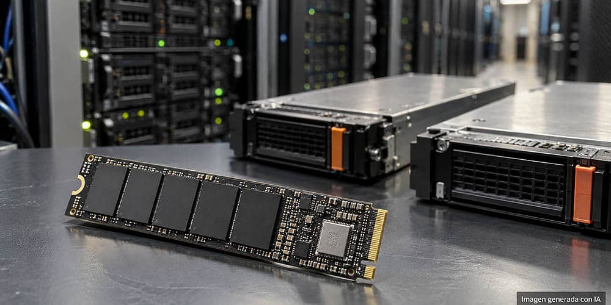

El precio de la memoria **NAND** vuelve a estar en el centro de atención del mercado de componentes. Lo que hace unas semanas se presentaba como un ajuste moderado para cerrar el año se ha convertido en una previsión bastante más agresiva: la subida esperada de la NAND para el cuarto trimestre de 2026 pasaría del 2 % al 17 %, según la revisión de previsiones que publica el analista Jeff Pu sobre el contexto de demanda que describe TrendForce.

La clave no está en un único dato, sino en cómo se ha movido el escenario en apenas dos semanas. Los proveedores de nube estadounidenses han elevado sus previsiones de compra de SSD empresariales y, con más pedidos sobre la mesa, los fabricantes de memoria ganan capacidad de negociación. Eso es exactamente lo contrario de lo que le conviene a quien solo quiere ampliar el almacenamiento de su equipo.

## Tres trimestres de subidas en el precio de la NAND

TrendForce señala que los pedidos de SSD empresariales para el cuarto trimestre podrían superar incluso los del tercero, un cambio de tendencia que la consultora atribuye al empuje de la IA. Sobre ese análisis, Jeff Pu publica unas previsiones revisadas que endurecen el panorama: para el tercer trimestre de 2026 el incremento pasa del 18 % al 21 %; para el cuarto, del 2 % al 17 %; y para el primer trimestre de 2027, de la estabilidad a otro 15 % de subida. Todos son incrementos respecto al trimestre anterior.

Conviene precisar el alcance de esas cifras. TrendForce aporta el análisis de demanda, mientras que los porcentajes concretos proceden de la publicación de Pu y no del comunicado público de la consultora. Son estimaciones sobre el precio medio de la NAND, no aumentos ya ejecutados ni una tarifa idéntica para todos los SSD.

## Por qué la IA presiona la NAND: más QLC y bases de datos vectoriales

El origen del movimiento está en cómo ha cambiado el uso de la IA. Ya no se trata únicamente de entrenar modelos: los agentes de IA necesitan recuperar y manejar grandes volúmenes de información, y las bases de datos vectoriales empujan al alza el uso de SSD QLC. En China, arquitecturas como las de DeepSeek también favorecen este tipo de almacenamiento para descargar parte de la caché KV desde la memoria.

La gráfica de TrendForce refleja ese giro: la NAND QLC pasaría del 18 % de la capacidad de los SSD empresariales en 2026 al 38 % en 2027, más del doble de cuota.

Este es el mismo fenómeno que ya está tensionando otras partes del mercado de memoria: el auge de la IA [desvía producción y amenaza al NOR Flash y al SLC NAND](/noticias/nor-flash-slc-nand-undersupply/), mientras el sector debate cuánta capacidad nueva hace falta. Los planes de nuevas fábricas, como [la que Solidigm estudia levantar en Estados Unidos](/noticias/solidigm-first-us-nand-fab/), se leen precisamente en ese contexto.

## Qué cambia para quien quiere comprar un SSD

Para el PC de casa, la consecuencia no es una subida idéntica e inmediata, sino una presión adicional sobre una NAND que comparten el mercado empresarial y el de consumo. Cuánto de ese encarecimiento llega a las tiendas dependerá de las existencias, de los contratos ya firmados y de la competencia entre fabricantes.

Aun así, el escenario deja una idea clara: dar por hecho que esperar traerá SSD más baratos resulta cada vez menos defendible. Quien tenga previsto ampliar el almacenamiento de su equipo quizá prefiera adelantar la compra antes de que las revisiones de precio se trasladen a las listas de precios.
