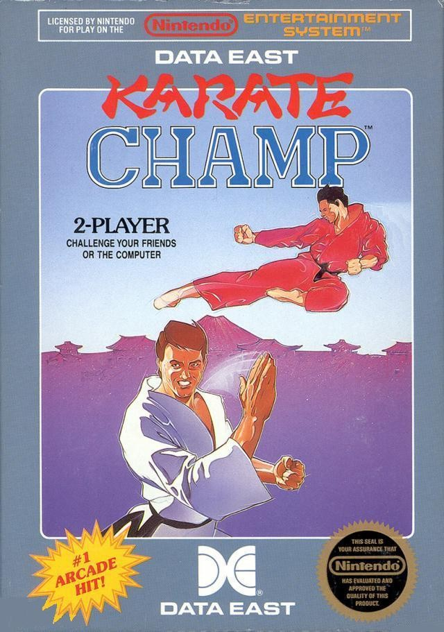

Karate Champ, uno de los primeros representantes del género de lucha uno contra uno, se incorpora hoy al catálogo de Console Archives, la línea de relanzamientos de Hamster dedicada a juegos de consola. La versión que llega es la de NES, publicada originalmente en 1986 por Data East, y el título ya está disponible en PlayStation 5 y Nintendo Switch 2.

## Karate Champ, un veterano de los fighting games

Karate Champ nació como recreativa en 1984 y fue una de las primeras muestras de ese subgénero en el que dos luchadores se miden cara a cara. En cada combate, un árbitro ejerce de maestro de ceremonias mientras los contendientes se enfrentan en escenarios variados: un dojo, un almacén, un muelle, un callejón y un acantilado. La regla es sencilla y severa a la vez: gana quien conecta dos golpes limpios y sin obstrucciones.

La versión doméstica de Data East es hoy recordada como una conversión irregular de aquella recreativa. Su sistema de ataques contextuales, que sobre el papel encajaba con las limitaciones de la época, se volvió confuso al jugarlo: acertar un puñetazo se convierte en un ejercicio de paciencia. El detalle más celebrado del port es, precisamente, la voz sintetizada que abre y cierra cada asalto, uno de los pocos elementos que ha resistido bien el paso del tiempo.

## El contexto: la fiebre del kárate de los años 80

Karate Champ formó parte de una oleada de títulos de artes marciales que inundó el mercado a mediados y finales de la década de 1980. El empujón vino del cine: el éxito de The Karate Kid en 1984 y la llegada masiva de películas de artes marciales procedentes de Hong Kong alimentaron una auténtica fiebre por el kárate que también se dejó notar en los videojuegos.

Para el público actual, la propuesta tiene más de documento histórico que de reto competitivo. Entender su control rígido y su planteamiento de golpes limpios ayuda a leer de dónde vienen los juegos de lucha modernos y por qué la recreativa original se ganó un lugar en la memoria del sector.

## Qué aporta que esté en Console Archives

La noticia importa menos por el título en sí y más por lo que representa: un servicio que traslada juegos de consola clásicos a plataformas actuales con licencia, sin depender de emuladores gestionados por el usuario. Es la misma lógica que hay detrás de otras iniciativas recientes por recuperar el ritual del arcade con hardware dedicado, como la [ranura de monedas física que devuelve la sensación de insertar una ficha](/noticias/coin-slot-arcade-emulators/).

Los interesados pueden jugar a Karate Champ desde hoy en PlayStation 5 y Nintendo Switch 2. Para quien nunca lo jugó, es una ocasión de comprobar por qué este port tiene fama de difícil; para quien lo recuerda, una forma de volver a él sin depender de cartuchos de segunda mano.
