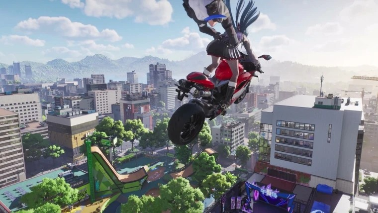
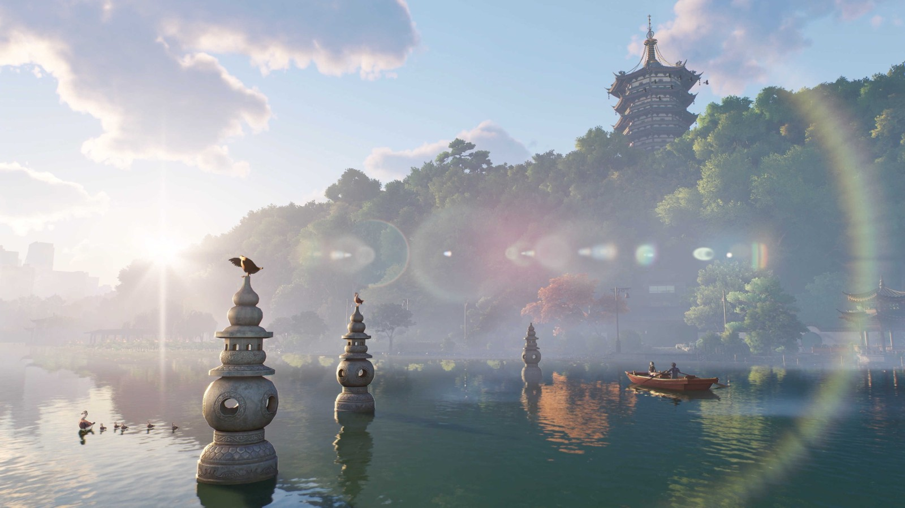
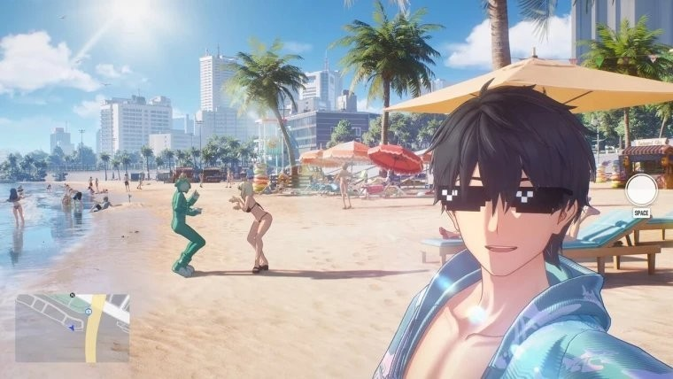
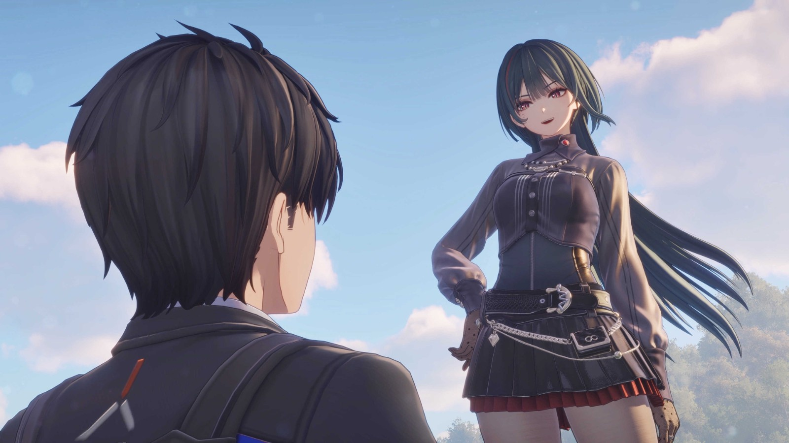
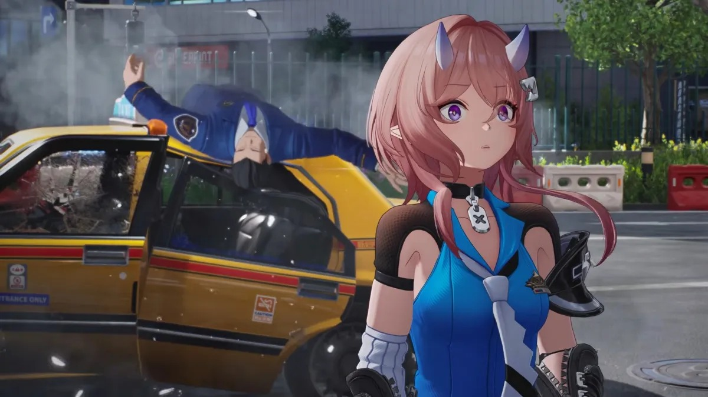
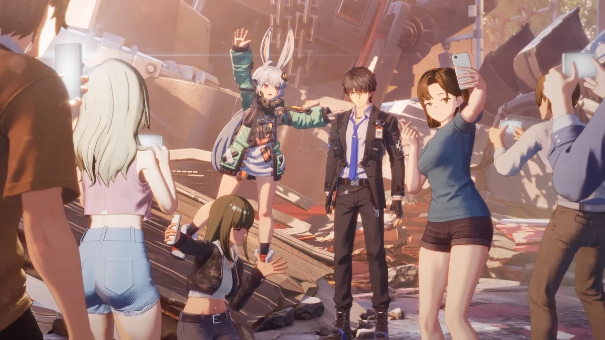
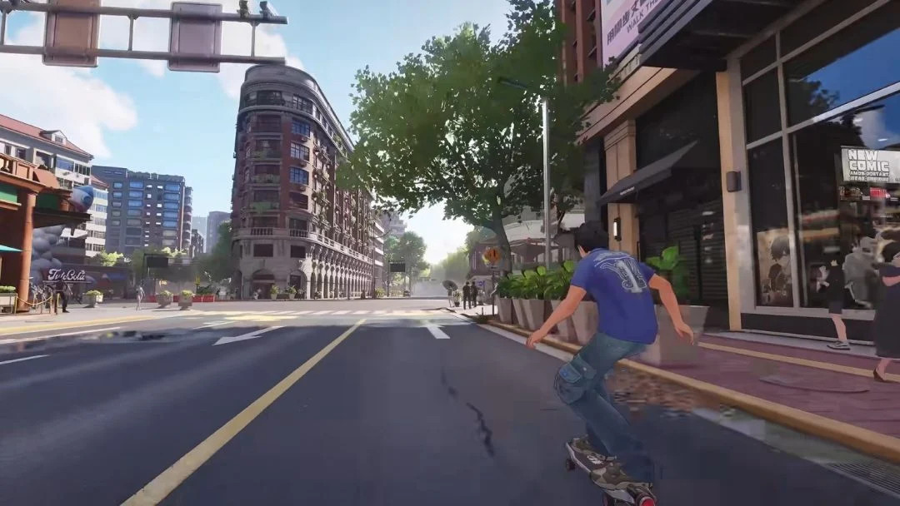
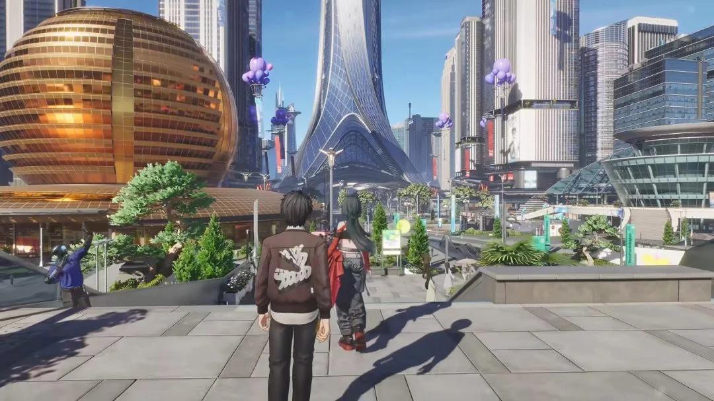

NetEase ha confirmado la fecha de lanzamiento global de Ananta (无限大 en China), su RPG de mundo abierto de ambientación urbana: estará disponible el 15 de enero de 2027 de forma gratuita en PC, PS5 y dispositivos móviles, con una única versión compartida entre el mercado chino y el internacional.

Según el anuncio oficial, el proyecto se presentó por primera vez en agosto de 2023 bajo nombre en clave y acumula más de 1.097 días de desarrollo. Las reservas globales superan los 17 millones de jugadores en más de 110 países y regiones.

## Una ciudad que mezcla Shanghái y Hangzhou

El estudio presentó Chongxiao (重霄), la nueva ciudad principal del juego, cuyo diseño combina los perfiles urbanos de Shanghái y Hangzhou: rascacielos modernos, calles históricas de estilo jiangnan y paisajes naturales conviven en un mismo mapa. Esa ciudad es, además, el hogar del protagonista, y la historia gira en torno a su regreso a casa y al reencuentro con viejos conocidos, en contraste con la metrópolis moderna de Xinqi (新启).

Cada ciudad ofrecerá, como mínimo, 100 horas de contenido jugable, y el jugador podrá moverse libremente entre Chongxiao y Xinqi. En su ciudad natal, el protagonista mantiene vínculos con amigos de la infancia y vecinos, y volver a casa desbloquea nuevas líneas argumentales.

El jugador crece como una figura conocida en internet: resuelve incidentes urbanos y acumula fama y seguidores, lo que a su vez desbloquea compañeros y zonas de exploración. Los personajes jugables ejercen profesiones distintas —policía, hacker o conductor, entre otras— que ofrecen perspectivas diferentes en las misiones. El estudio confirmó que la versión final incluirá una protagonista femenina opcional, todavía en proceso de pulido.

El sistema de combate se inspira en el cine de artes marciales: en Chongxiao se incorporan espadas, puños y patadas de estilo oriental, con mecánicas de bloqueo, contraataque y combos. Según el equipo, el estado del combate ya alcanza el nivel de calidad interna que buscaban. Para moverse, el juego apuesta por medios de transporte cotidianos, como bicicletas compartidas, patinetes eléctricos y embarcaciones.

El lanzamiento llegará con unas 100 horas de contenido, y NetEase no celebrará una beta pública a gran escala: las pruebas se limitarán a un programa interno y confidencial para, según la compañía, no desvelar la historia por adelantado y preservar el factor sorpresa.

## Sin gachapón: personajes gratuitos y pago solo cosmético

El anuncio más llamativo es el del modelo de negocio. NetEase elimina por completo el sistema de gachapón para obtener personajes, habitual en los juegos de estética anime: todos los personajes jugables se consiguen gratis avanzando en la historia.

El contenido de pago se limita a cosméticos —trajes, apariencias de vehículos y decoración del hogar— y buena parte de ellos puede obtenerse con moneda ganada en el propio juego. La compañía asegura que pagar no afecta en ningún caso a las estadísticas de combate.

NetEase compromete además un soporte a largo plazo de al menos siete años, con actualizaciones de misiones, personajes y mapas, en una hoja de ruta que podría extenderse hasta 2034.

## Requisitos en PC y soporte técnico

En PC, los requisitos mínimos piden un Intel Core i5-9400F o un AMD Ryzen 7 3700X, una GeForce GTX 1060 de 6 GB, 16 GB de memoria y 40 GB de almacenamiento. La configuración recomendada sube a un Core i7-12700K o Ryzen 9 9900X, una RTX 3080, 32 GB de memoria y 100 GB de espacio.

El juego obtuvo la licencia china (版号) en diciembre de 2024 y llegará también a iOS, Android y plataformas de juego en la nube. NVIDIA anunció que Ananta será compatible con DLSS 4 y trazado de rayos.
