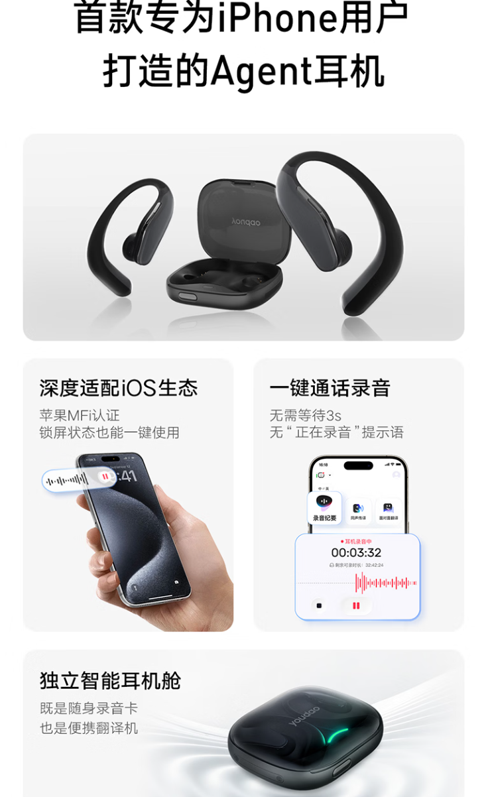
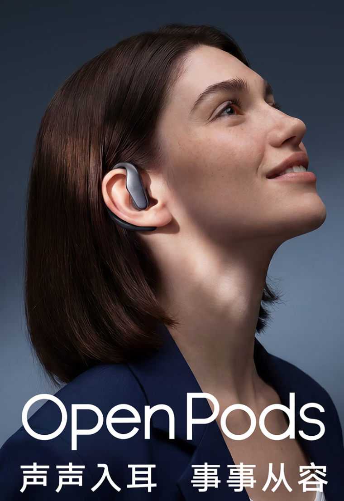

NetEase Youdao ya vende sus OpenPods, unos auriculares inalámbricos que la compañía presenta como los primeros del mundo diseñados específicamente para usuarios de iPhone. El precio de salida es de 1.499 yuanes y llegan en dos acabados, negro y blanco, aunque por el momento su comercialización se limita al mercado chino.

La propuesta no es la de unos auriculares convencionales con un asistente añadido, sino la de un dispositivo que la firma describe como "agente": buena parte del valor está en lo que hace por sí solo, sin depender de que el usuario saque el teléfono del bolsillo.

## Grabar sin desbloquear el teléfono

El rasgo que NetEase Youdao destaca por encima del resto es la grabación a nivel de sistema. Durante llamadas telefónicas, reuniones en línea o videollamadas, basta con pulsar el botón físico del auricular para empezar a registrar el audio, sin necesidad de desbloquear el iPhone. La compañía asegura que la integración con iOS es profunda y que funciona incluso con la pantalla bloqueada, gracias a un chip autorizado por Apple y a la certificación MFi.

A esto se suma un estuche inteligente que no se limita a cargar: incorpora micrófono, altavoz y almacenamiento propio, de modo que puede dejarse sobre la mesa para captar conversaciones con varias personas. Al doble toque, el estuche también reproduce traducción directa entre chino e inglés y actúa como intérprete portátil.

## Traducción simultánea y apoyo en reuniones

En el terreno de la traducción, los OpenPods cubren más de veinte idiomas e incluyen variantes como el cantonés y el shanghainés, con la promesa de ampliar la lista mediante actualizaciones OTA. Para conversaciones cara a cara, cada interlocutor puede llevar un auricular y hablar en su propio idioma mientras el sistema traduce en tiempo real.

En el ámbito laboral, la firma señala que el dispositivo detecta los puntos clave de una reunión, distingue a los distintos ponentes y reconoce y corrige terminología especializada. Además, la función Ask AI permite hacer preguntas sobre el contenido de grabaciones y documentos, y emplear atajos para resumir, generar tareas pendientes o redactar correos.

## Diseño, autonomía y el detalle que limita su alcance

En lo físico, los OpenPods apuestan por un diseño abierto y ligero: cada auricular pesa unos 7 gramos y monta un controlador dinámico de 10,8 mm. La autonomía anunciada es de hasta 8 horas por carga y de 32 horas si se cuenta el estuche.

El punto que conviene tener presente es el del ecosistema. Las funciones de IA más relevantes están pensadas para iOS, y las versiones para Android y HarmonyOS siguen en desarrollo. Es decir, quien use un móvil que no sea un iPhone no podrá aprovechar ahora mismo la propuesta completa.

Para el lector español, la noticia es interesante por lo que anticipa más que por lo que ya ofrece: los auriculares dejan de ser un accesorio de audio para convertirse en una puerta de entrada a la IA, con grabación y traducción como funciones centrales. El movimiento encaja con la estrategia de los fabricantes chinos de integrar asistentes en el hardware cotidiano. La duda razonable es la de siempre en este tipo de productos: cuánto de esas capacidades depende de la nube, qué ocurre con la privacidad de las conversaciones grabadas y si el soporte multilingüe llegará a España con la misma calidad que en su mercado de origen.
