La emulación de PlayStation 2 acaba de asomarse a Nintendo Switch sin pasar por
Android. El desarrollador conocido en la escena como **NaGaa95** (Nagaa en
GBAtemp) ha publicado un port homebrew de **NetherSX2**, el emulador de PS2 para
Android, que se ejecuta directamente sobre el sistema de la consola. El hilo de
presentación se abrió el 12 de julio de 2026 y acumula ya más de 290 respuestas
y 45.000 visitas, según los datos del propio foro.

## Qué es NetherSX2 y cómo funciona el port

NetherSX2 no es un emulador nuevo: es la continuación parcheada de AetherSX2, el
emulador de PS2 para Android. El port para Switch tampoco reescribe ese núcleo
para el hardware de la consola. Lo que hace, según su autor, es cargar el
binario Android original, parchearlo y ejecutarlo: en la práctica reproduce un
entorno Android mínimo en el que el emulador de siempre corre de forma nativa.
La ventaja es evidente para el usuario, porque evita instalar una distribución
completa de Android en la consola, que era la vía habitual hasta ahora.

El proyecto se distribuye desde el repositorio
[NaGaa95/NetherSX2_nx](https://github.com/NaGaa95/NetherSX2_nx) en GitHub. En
los créditos, el autor reconoce el trabajo de los desarrolladores de
AetherSX2/PCSX2 por el emulador y el de los mantenedores de NetherSX2 por las
compilaciones parcheadas de Android, además de la base del *so-loader* de Switch
de **fgsfds**, la línea original del *so-loader* de Android de **TheOfficialFloW**,
el driver Vulkan de Switch de **Dantiicu** y la utilidad IconGrabber de **Slluxx**.

## Qué incluye y cómo se configura

El lanzador incorpora una biblioteca con carátulas que se descargan
automáticamente desde SteamGridDB, banderas de región (EE. UU., UE y Japón),
ordenación de la colección y ajustes por juego que permiten reemplazar cualquier
opción de forma individual, además de renombrar o eliminar títulos. También hay
reasignación completa de mandos, configuración de los *sticks*, zona muerta y
vibración.

En el apartado gráfico, el autor documenta escalado de resolución de hasta 6×
(4K), relación de aspecto, parches de pantalla ancha y de desentrelazado, realce
de sombras y sombreadores CRT/TV. La parte de red queda marcada como
experimental: el adaptador DEV9/Sockets llega desactivado por defecto y se
habilita a mano en Ajustes → Red.

El port ofrece dos renderizadores en Ajustes → Gráficos → Renderizador:
**Vulkan (NVK)**, que el autor recomienda por ofrecer mejor compatibilidad y
rendimiento en la mayoría de juegos, y **OpenGL** como alternativa cuando un
título se comporta mal en Vulkan. En Ajustes → Emulación/Sistema → Versión del
núcleo hay además dos compilaciones: la parcheada (4248), la más reciente, y la
clásica (3668), que según el autor puede dar mejor rendimiento en dispositivos
menos potentes.

## Qué dicen las primeras pruebas del hilo

Además del anuncio, el hilo funciona como un banco de pruebas en abierto.
Preguntado por si hace falta overclock, el autor responde que sí, sobre todo de
CPU mientras se mantiene la resolución a x1, y descarta que este método tenga
sentido para Vita3K u otros emuladores de código abierto. Sobre un futuro
lanzador directo a los juegos (*forwarder*), señala que todavía no existe, pero
que lo estudiará.

Frente a ARMSX2, el otro port de PS2 que ya existía para Switch, el autor
sostiene que el resultado depende del juego, pero que NetherSX2 no arrastra el
tartamudeo que afecta a muchos títulos en ARMSX2. No todos los reportes son
favorables: un usuario probó *Devil May Cry 3: Special Edition* en una Switch
con overclock y midió entre 50 y 60 FPS con ARMSX2 en Vulkan, con pausas de
alrededor de un segundo, posiblemente por compilación de sombreadores. Con
NetherSX2 y ajustes casi idénticos, los FPS eran bastante más bajos, hasta el
punto de ralentizar el juego. En ese título concreto, concluye, ninguno de los
dos emuladores resulta jugable.

Conviene leer todo esto como lo que es: afirmaciones y pruebas de un hilo de
foro, no cifras oficiales del proyecto. Algunos usuarios han compartido capturas
de *Deus Ex* funcionando en la consola a través del port:

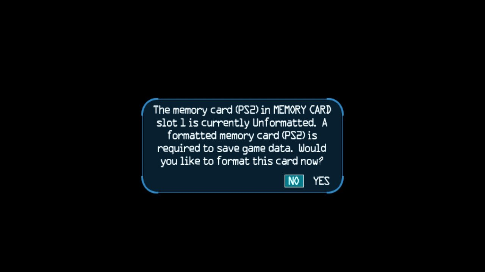

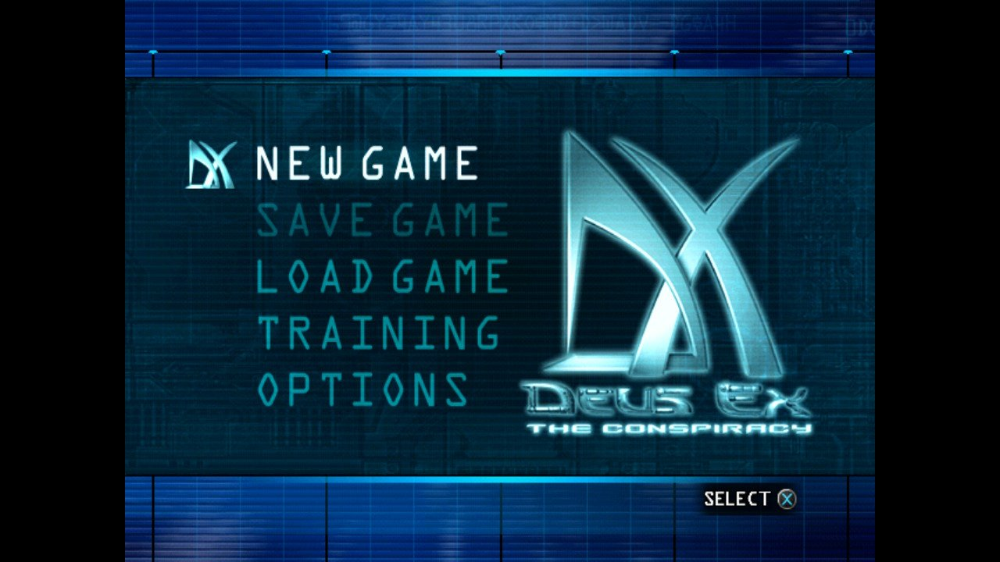

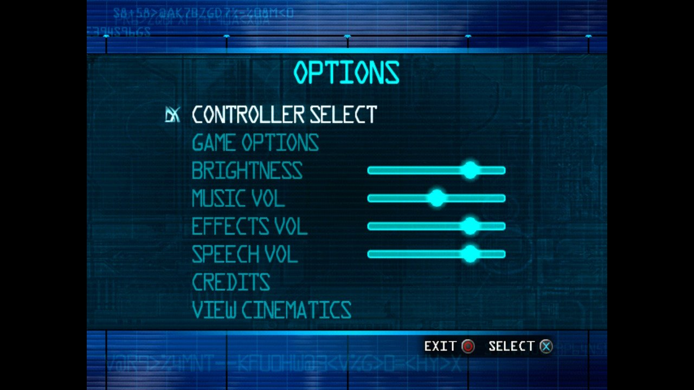

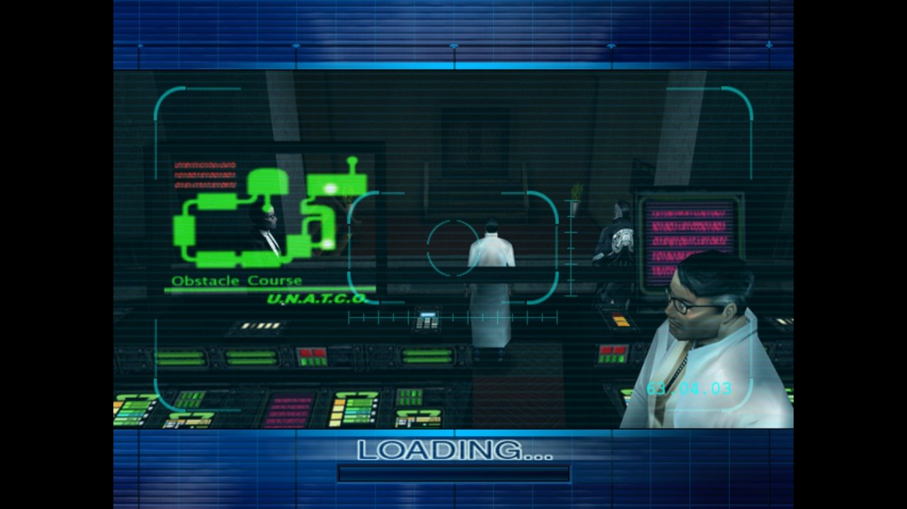

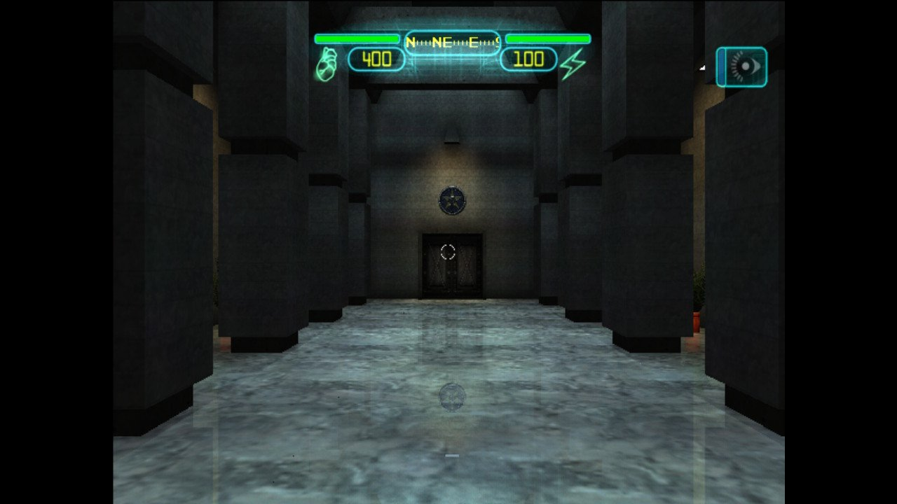

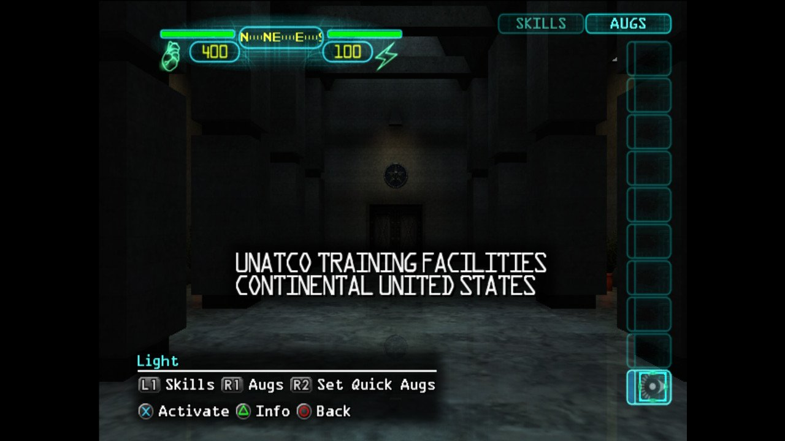

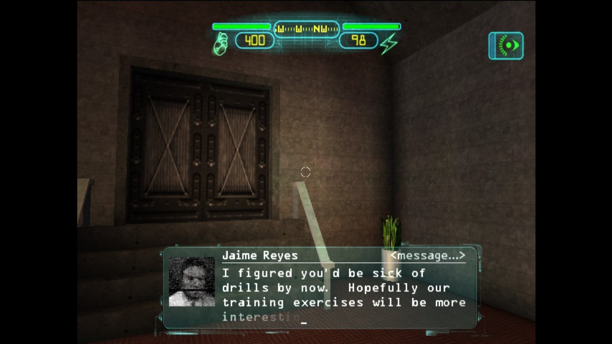

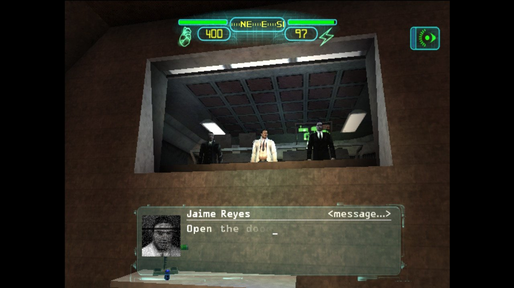

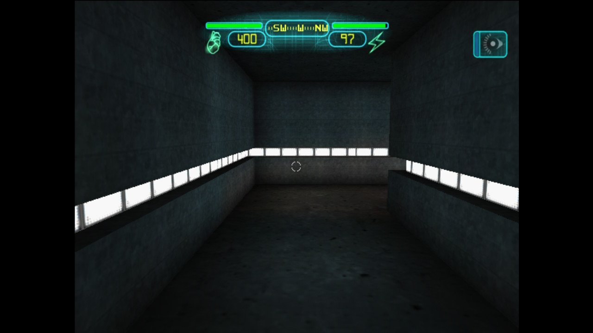

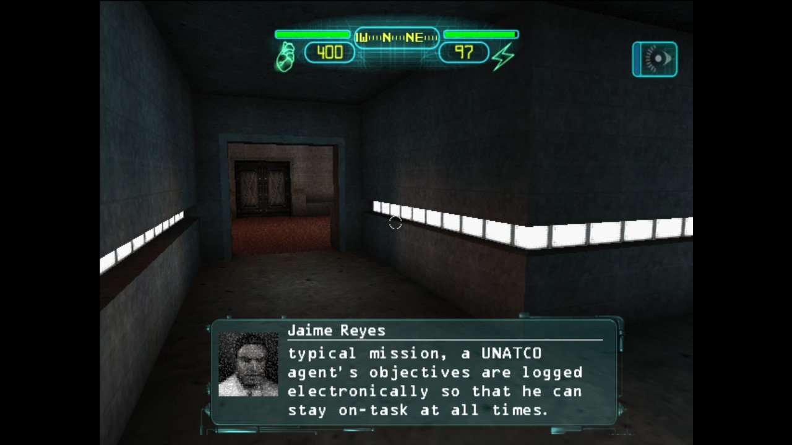

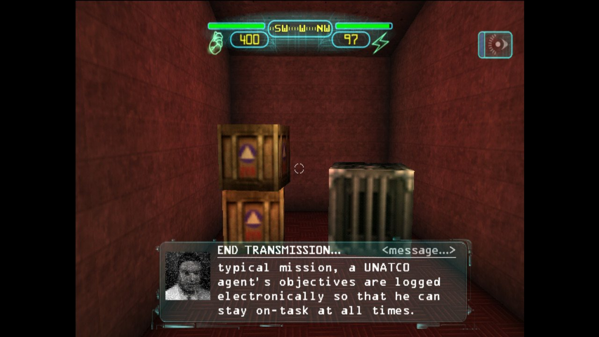

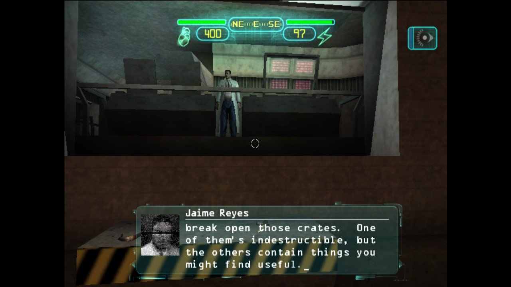

## Qué necesita quien quiera probarlo

NetherSX2 para Switch es **homebrew**, así que exige una consola con acceso a
Homebrew Menu; no funciona en una consola de fábrica. Tampoco reparte juegos:
hay que aportar copias propias obtenidas de forma legal. En buena parte de los
títulos el overclock no es opcional, a juzgar por lo que indican el propio autor
y los usuarios que ya lo han probado. Y el proyecto sigue en fase temprana: no
hay lanzador directo a los juegos y la compatibilidad varía mucho de un título a
otro.

El port se suma a la racha de lanzamientos del mismo desarrollador para Switch,
entre ellos [Cemu-nx, el port homebrew del emulador de Wii U](/noticias/cemu-wii-u-switch-port/),
y DraStic (Nintendo DS). Para quien ya emula en la consola, la novedad amplía el
catálogo disponible sin depender de una instalación de Android.
