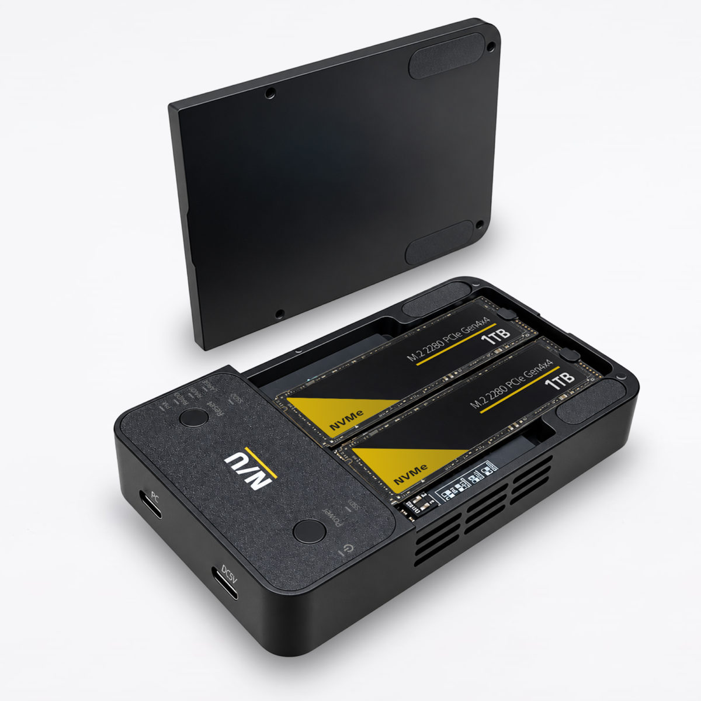
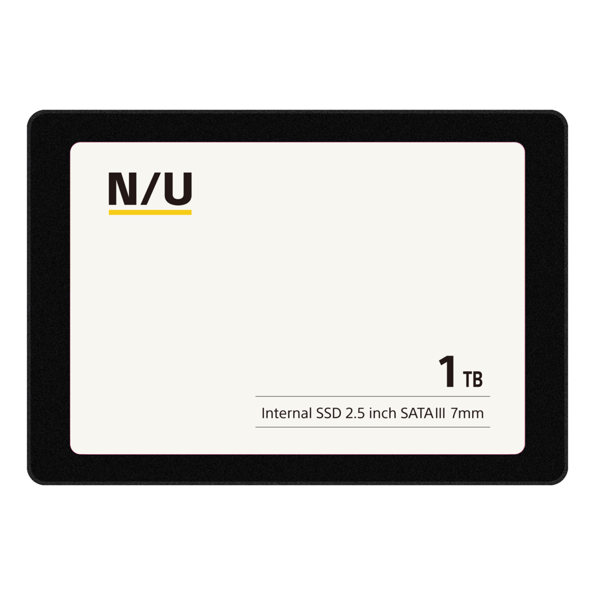
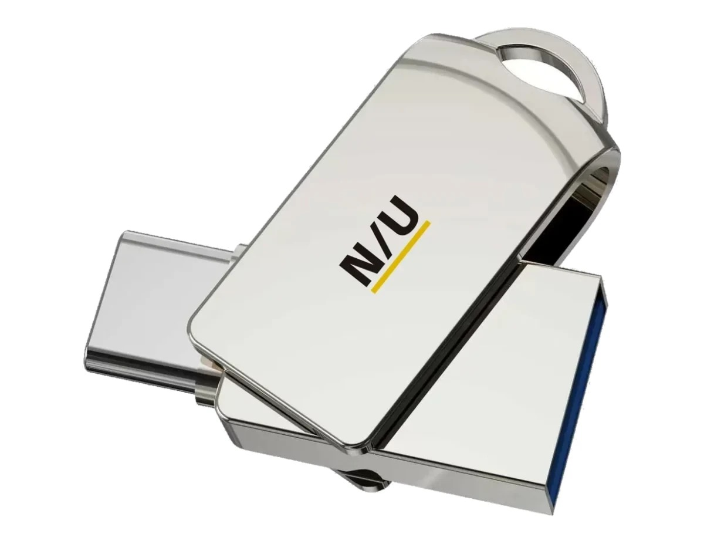

Nextorage, el fabricante japonés especializado en módulos de memoria, dio a conocer a principios de
septiembre una submarca orientada al uso cotidiano, **N/U**, y el 28 de septiembre publicó su
primer lote de productos: una caja de array para unidades M.2, un SSD SATA de 2,5 pulgadas y un
llavero USB con dos conectores. Los tres artículos se presentan con precio en yenes, IVA incluido,
y cubren desde la reutilización de discos NVMe sueltos hasta el equipamiento de un portátil antiguo.

## N/U: la apuesta de Nextorage para el día a día

N/U no sustituye a la marca principal, la complementa: Nextorage se presenta como una empresa
japonesa especializada en módulos de memoria, y esta submarca recién estrenada apunta al terreno
del uso cotidiano, con productos que se compran una vez y se usan durante años. El anuncio de la
marca llegó antes que el de los artículos, y esta primera tanda deja claro por dónde va: cajas para
discos sueltos, SSD internos de 2,5 pulgadas y memorias USB con doble conector.

## Los tres productos iniciales y sus precios

El artículo más complejo del trío es la **NU-ENU34B2**, una caja de array de doble bahía para
unidades M.2 PCIe NVMe. Acepta formatos 2280, 2260, 2242 y 2230, y ofrece cuatro modos de trabajo:
independiente, RAID 0, RAID 1 y JBOD. Enfría con un disipador de aluminio y un pad térmico de
silicona, y se conecta por USB-C a 20 Gbps. Su precio es de **13.980 yenes**.

La **NU-SSSA** es un SSD interno de 2,5 pulgadas y 7 mm de grosor con interfaz SATA, disponible en
256 GB, 512 GB y 1 TB. Declara velocidades secuenciales de lectura de hasta 540 MB/s y de escritura
de hasta 500 MB/s, con tres años de garantía. Precios: **6.980 yenes** (256 GB), **12.800 yenes**
(512 GB) y **22.980 yenes** (1 TB).

Por último, la **NU-UFD (G32T)** es una memoria USB con carcasa giratoria que expone dos
conectores, USB Type-A y Type-C, ambos a 5 Gbps. Se vende en 32 GB, 64 GB y 128 GB, con lectura
secuencial de hasta 130 MB/s y escritura de hasta 45 MB/s, y un año de garantía. Precios:
**1.980 yenes** (32 GB), **2.780 yenes** (64 GB) y **3.980 yenes** (128 GB).

## Qué le cambia al usuario

Para quien arrastra un portátil que aún funciona pero va lento, el SSD SATA sigue siendo la vía
más barata de darle una segunda vida, y la NU-SSSA se apunta a ese hueco con tres capacidades y
garantía de tres años. Para el que tiene unidades NVMe sobrantes de una actualización, la caja
NU-ENU34B2 permite ponerlas a trabajar fuera del equipo: en RAID 1 da una copia de seguridad
tolerante a fallos de una unidad, y en RAID 0 prioriza la velocidad. El único matiz es la
interfaz: la caja trabaja por USB-C a 20 Gbps.

La compra conviene mirarla en contexto de mercado: la demanda de almacenamiento ligada a la
inteligencia artificial ha empujado [el precio de la NAND al alza](/noticias/nand-price-hike-2026/),
con unas previsiones para el cuarto trimestre revisadas hacia arriba, de modo que el coste de
cualquier SSD puede moverse en poco tiempo. El mismo fenómeno se deja ver también en los SSD
portátiles de gran capacidad, como [el Samsung P9 de 8 TB](/noticias/samsung-p9-8tb-portable-ssd/).
La oferta de N/U llega, por tanto, en un momento en el que el almacenamiento no está barateando.

ITHome no informa de fechas de salida ni de mercados de lanzamiento de estos tres productos.
