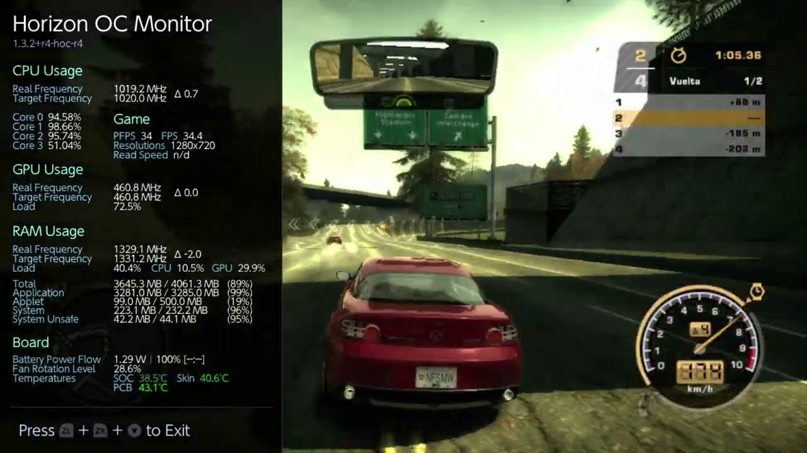

Need for Speed: Most Wanted (2005) ya puede jugarse en Nintendo Switch a través de un port nativo publicado por el desarrollador StevensND. El proyecto se presentó en un hilo de GBAtemp con el código en GitHub, un instalador web y dos vídeos: uno de anuncio y otro de gameplay.

Lo relevante no es solo que el juego arranque en la Switch, sino cómo lo hace: no hay emulación de por medio. La noticia se suma a los proyectos que la comunidad ha llevado a la consola de Nintendo en las últimas semanas.

## Cómo funciona este port de Need for Speed: Most Wanted

El proyecto no ejecuta el juego dentro de un emulador de Xbox 360. Según explica su autor en el hilo, el código PowerPC del `default.xex` de la versión de Xbox 360 se recompila estáticamente a C++ mediante [ReXGlue](https://github.com/rexglue/rexglue-sdk) y se compila después para la Switch; el dibujado corre en un renderizador Vulkan nativo que se ejecuta sobre NVK (Mesa).

Esa arquitectura es la que permite fijar un objetivo concreto de rendimiento: **30 FPS a las frecuencias de fábrica de la consola, sin overclock**. Es también la diferencia práctica frente a rodar el juego con una capa de compatibilidad o con un emulador: menos sobrecarga por capa y una salida gráfica pensada para el hardware de la Switch.

## Qué necesitas para instalarlo en tu Switch

El juego no viene incluido en el proyecto: hace falta una copia propia de la versión de Xbox 360, ya sea una imagen de disco (`.iso`) o el disco extraído con su `default.xex`. El código se distribuye a través del [repositorio en GitHub](https://github.com/StevensND/nfsmw-nx), y la vía recomendada para copiar los archivos a la tarjeta SD es el [sitio web del instalador](https://stevensnd.github.io/nfsmw-nx-installer/), al que el autor remite explícitamente en su mensaje.

En cuanto a los idiomas, las ediciones admitidas son la PAL —que incluye español, inglés, alemán e italiano—, la NTSC-U y la NTSC-J. Es un detalle relevante para el público hispanohablante: la variante europea en español está entre las compatibles declaradas.

Cabe una aclaración sobre versiones: en el propio hilo se recordó que Xbox 360 no tuvo una Black Edition propiamente dicha. Japón recibió una edición con ese nombre, pero sin el contenido de la Black Edition, solo con un DVD de complementos.

## Rendimiento y estado actual del proyecto

El port apunta a 30 FPS sin overclock, y por ahora no hay más. Ante la pregunta de si sería posible llegar a 60 FPS forzando las frecuencias, el desarrollador respondió que, en sus pruebas, se alcanzarían en torno a 40 y 50 FPS con un overclock alto, y que todavía queda trabajo de pulido y optimización. Añadió que su trabajo le impedirá retomar el proyecto hasta que termine octubre.

También hay incidencias tempranas propias de una primera entrega: un usuario con una Switch OLED sin overclock informó de un cierre inesperado al iniciar una carrera, y el autor respondió remitiéndole de nuevo al instalador web e indicando que la instalación estaba hecha de forma incorrecta. Otro usuario pidió localización al chino simplificado, solicitud que el desarrollador descartó: no acepta peticiones y ports solo los títulos que él mismo tiene interés en jugar.

## Qué significa para el jugador

Para quien conserva su copia de Xbox 360, el port permite volver a Most Wanted en la Switch sin depender de un emulador. Para el resto, la limitación sigue siendo la de siempre en estos proyectos: hace falta poseer el juego original.

En el contexto reciente de la consola, se suma a otros experimentos de la comunidad con la saga, como [Need for Speed Underground 2 corriendo en Nintendo Switch gracias a Wine-NX](/noticias/nfs-underground-2-switch/), una aproximación muy distinta basada en una capa de compatibilidad de Windows. Aquí el camino es otro: código nativo y 30 FPS como objetivo a las frecuencias de fábrica de la consola.
