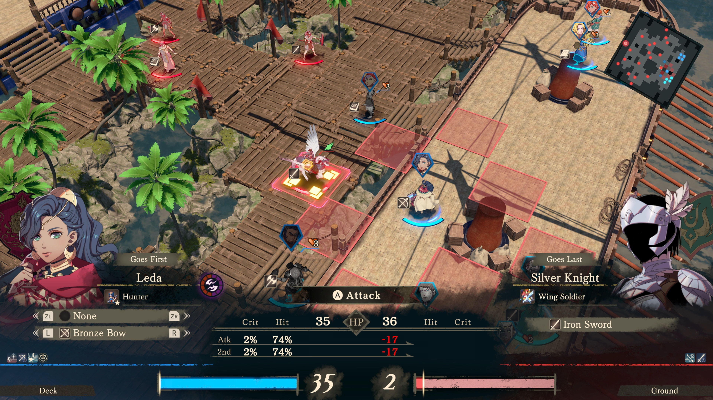
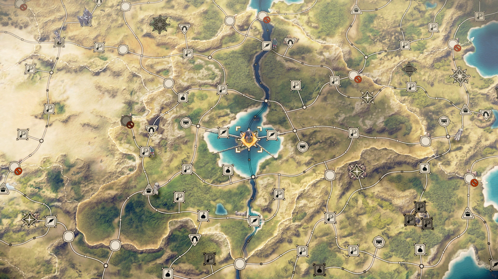

Fire Emblem: Fortune's Weave, la nueva entrega de la saga de estrategia por turnos de Nintendo, se estrena el **17 de septiembre de 2026** en **exclusiva para Nintendo Switch 2**. La fecha y la plataforma figuran en la ficha oficial del juego en la tienda de Nintendo, que confirma que no habrá versión para la consola anterior ni para otras plataformas.

A diferencia de otras entregas recientes, esta apuesta por una estructura coral. La acción se sitúa en Dagda, con Dagsion —su capital de inspiración clásica— como escenario central, y sigue a cuatro héroes cuyos relatos avanzan en paralelo y se entrecruzan. El combate mantiene la rejilla por turnos clásica de la serie, con sistemas nuevos como las Blaze Arts y las Bendiciones, además de mazmorras y un mapa de mundo para explorar entre combates.

## Las impresiones de CNET: un "libro de historias" muy amplio

Conviene aclarar de qué tipo de pieza hablamos. Lo que publica CNET no es una reseña con nota ni un análisis cerrado, sino las **impresiones personales** de su editor Scott Stein, que en el propio texto reconoce que nunca ha sido un gran seguidor de la saga. Sus valoraciones son, por tanto, suyas, y así deben leerse.

En su opinión, Fortune's Weave se parece a una "novela fantástica enorme" convertida en juego de estrategia: una propuesta que recupera el relato épico y, según él, despliega una red argumental mucho más amplia que la de Three Houses. El autor describe un arranque extraño, oscuro y futurista, con viajes en el tiempo, y sitúa el mayor atractivo en las historias de fondo de los cuatro protagonistas, a los que caracteriza como un chico impulsivo, un guerrero melancólico, una reina audaz y una bailarina con sed de venganza.

Stein también señala sus pegas. Cuenta que, después de unas 20 horas, empezó a notar que el interés decaía: hay cinemáticas que se alargan varios minutos y las cuatro tramas comparten momentos argumentales, lo que a su juicio vuelve al conjunto repetitivo. Como contrapeso, destaca que es posible saltar entre las cuatro historias paralelas en cualquier momento —algo que compara con leer cuatro libros entrelazados a la vez— y que el juego permite omitir las semanas entre combates de arena. Su conclusión, siempre atribuida a sus impresiones, es que si tuviera que elegir un Fire Emblem moderno se quedaría con este, y que puede disfrutarse sin conocer el resto de la serie.

## Por qué importa en el catálogo de Switch 2

El detalle relevante para el mercado de consolas es la condición de exclusivo. Nintendo sigue reservando sus franquicias principales para Switch 2, y esta entrega engrosa una lista de lanzamientos propios que la compañía necesita para sostener el atractivo de su nueva consola. A diferencia de los ports de catálogo que también llegan al sistema, aquí se trata de un título nuevo y de una saga con décadas de recorrido en las plataformas de Nintendo.

El autor recuerda que la serie llegó a Occidente en la época de Game Boy Advance, en paralelo a Advance Wars, y explica que entonces le atraía su estilo por turnos pero no su drama fantástico. Ese contraste sirve de contexto: Fortune's Weave busca precisamente recuperar el peso narrativo que, según su criterio, otras entregas recientes habían dejado en segundo plano frente a la batalla.

## Qué cambia para el jugador hispanohablante

- **Disponibilidad**: se pone a la venta el 17 de septiembre de 2026, en exclusiva para Nintendo Switch 2.
- **Idioma**: la ficha del juego incluye el español entre los idiomas soportados, junto a otros como inglés, francés, alemán, italiano o japonés.
- **Formato**: es un título para un solo jugador. Nintendo estima un tamaño de archivo de unos 29,5 GB y la clasificación por edades advierte de la presencia de compras dentro de la aplicación.
- **Punto de entrada**: según las impresiones de CNET, no hace falta haber jugado a entregas anteriores para seguir la historia, porque la mitología de esta entrega es propia.

Quien busque una referencia objetiva antes de comprar debería esperar reseñas completas con nota y análisis técnico del rendimiento en Switch 2. Esta pieza recoge, sobre todo, una primera impresión de la crítica, no un veredicto cerrado.
