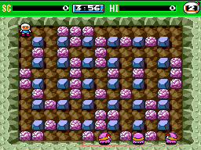
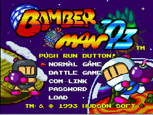

**NitroGrafx**, el emulador de **PC Engine y TurboGrafx-16 para Nintendo DS(i) y
3DS**, ha publicado la versión **0.9.1**, registrada en el historial del
repositorio con fecha del 20 de septiembre de 2026. La actualización añade
reproducción de muestras **PSG**, soporte de **ADPCM de CD-ROM** y fundido del
audio de CD, además de corregir los tiempos de búsqueda del lector virtual. El
detalle importante es que no se trata de un proyecto nuevo: su primera versión
apareció en 2010 y ha vuelto a moverse este año tras casi ocho años de pausa.

## Qué es la PC Engine y por qué importa

La PC Engine es la consola que **NEC y Hudson Soft** lanzaron en Japón en 1987 y
que en Norteamérica se vendió como **TurboGrafx-16** desde 1989. Su particularidad
es que combinaba una CPU de 8 bits (el HuC6280) con un chip de vídeo de 16 bits,
lo que permitía mover sprites y fondos con una soltura impropia de su generación;
NEC explotó esa diferencia en el marketing. Su otro gran golpe fue el add-on
**CD-ROM²**, presentado en 1988, el primer lector de CD conectado a una consola de
videojuegos. Ese formato dio a la máquina bandas sonoras orquestadas y voces en
juegos como *Ys*, *Dracula X* o *Lords of Thunder*, y convirtió el catálogo de CD
en su seña de identidad.

Para el lector hispanohablante, la PC Engine es sobre todo una desconocida: su
distribución en Europa fue mucho más limitada que en Japón y Norteamérica, y gran
parte de su biblioteca llegó por importación. Emularla bien en hardware modesto no
solo rescata un tramo poco transitado de la historia de los 16 bits, sino que
abre la puerta a los juegos de CD, que son precisamente los más difíciles de
reproducir por su combinación de BIOS, pistas de audio y datos comprimidos.

## Qué cambia en la versión 0.9.1

Según el historial de revisiones del propio proyecto, esta entrega se centra en el
sonido y en el soporte de CD:

- **Reproducción de muestras PSG**, el generador de sonido interno de la consola.
- **ADPCM de CD-ROM**, el formato de audio comprimido que usan muchos juegos en CD
  para voces y efectos.
- **Fundido del audio de CD**.
- **Corrección de los tiempos de búsqueda** del CD-ROM.
- **Migración de devkitARM a BlocksDS**, con un binario más pequeño.

No es un salto aislado. La versión **0.9.0**, publicada el 15 de febrero de 2026,
ya había arreglado el escalado sin filtrar y con relación de aspecto, el valor de
desplazamiento vertical, el centrado horizontal de pantalla, la amplitud y la
envolvente del sonido, el conteo del temporizador, el DMA de sprites y los estados
guardados, además de añadir el descifrado de ROM estadounidenses y un menú de
depuración nuevo.

## Un emulador de 2010 que volvió a la vida

El historial del repositorio deja claro que NitroGrafx no es una aparición
reciente. El desarrollo arrancó el 19 de enero de 2010 y la primera versión
pública, la 0.1.0, llegó ese mismo marzo con buena parte del trabajo heredado de
otro emulador de PC Engine para Game Boy Advance. El proyecto se mantuvo activo
hasta la 0.8.1, en julio de 2018, y después quedó en silencio. El regreso se
produjo con la 0.9.0 de febrero de 2026 y continúa ahora con la 0.9.1, en un
repositorio que acumula 79 confirmaciones de código.

La otra mitad de la historia está en el foro de GBAtemp, donde el autor,
**Fredrik Ahlström** (FluBBa), publica versiones de prueba y recoge los informes
de quienes juegan en hardware real. En ese hilo los usuarios han reportado
bloqueos en títulos como *Soldier Blade*, glitches gráficos en *Ginga Fukei
Densetsu Sapphire* y problemas de audio en varios juegos de CD. El propio
desarrollador reconoce que el ADPCM ya está prácticamente resuelto, pero que
**todavía queda mucho trabajo por hacer en la emulación de CD**.

## Qué se puede esperar hoy

Conviene ajustar las expectativas. NitroGrafx emula la PC Engine y la
TurboGrafx-16, y solo **una parte** de los sistemas (Super) CD-ROM² y Arcade Card;
**no** reproduce la SuperGrafx. Para los juegos en CD hace falta seleccionar una
BIOS de CD-ROM System —habitualmente el archivo `syscard3.pce`— y cargar la imagen
como `.iso` o como pareja `.bin`/`.cue`; por ahora solo admite volcados de un
único archivo, aunque el autor ha dicho que estudia añadir los de varios. El
propio archivo de texto del proyecto lista una docena de juegos con problemas
conocidos, entre ellos *Dragon Egg!*, *Cadash*, *Turrican* o *Fighting Run*.

A cambio, el emulador ofrece un menú bastante completo para lo que es una consola
portátil de doble pantalla: modo de pantalla escalado o sin escalar, salida
compuesta o RGB, ajustes de gamma y color, región estadounidense o japonesa,
mandos de 2 o 6 botones, autodisparo, avance rápido y guardado automático de
estados. Quien tenga una DS, una DSi o una 3DS con un cartucho de homebrew puede
probar la PC Engine —y, con paciencia, parte de su catálogo en CD— sin depender de
un PC. Los juegos en tarjeta funcionan de forma bastante sólida; los de CD siguen
siendo un terreno en construcción.
