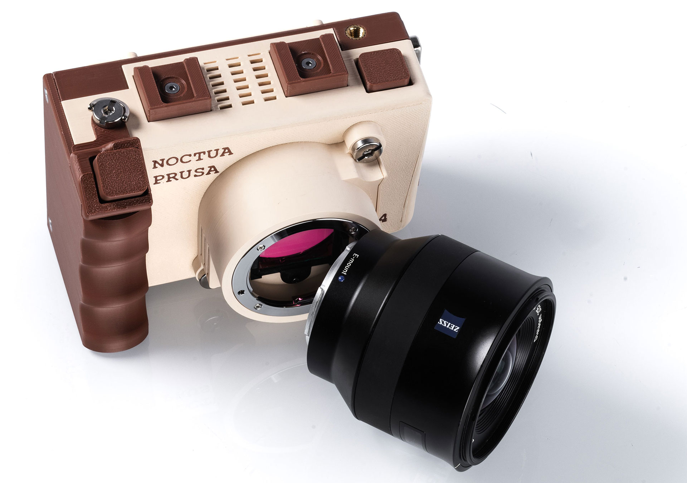
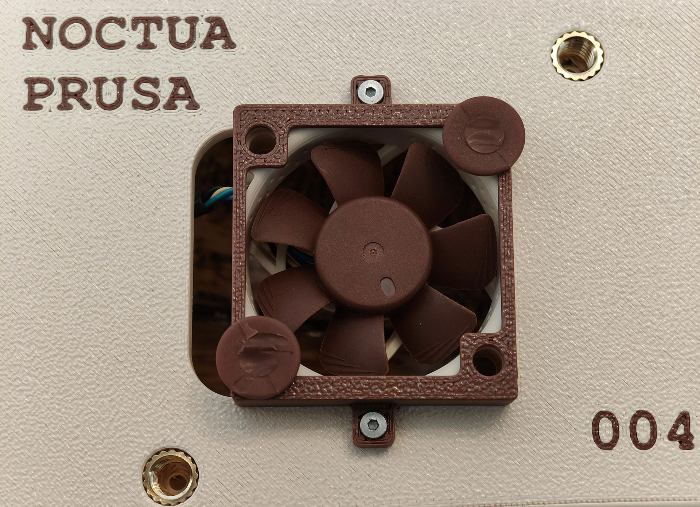
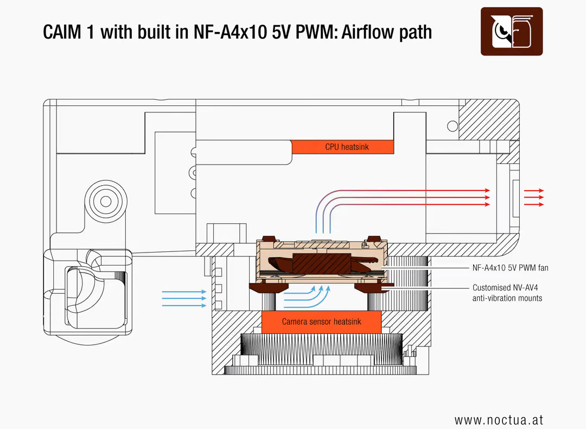

Noctua ha confirmado que su ventilador NF-A4x10 5V PWM forma parte de la CAIM1, una cámara portátil que graba vídeo 4K a 60 fotogramas por segundo mientras genera pruebas criptográficas para demostrar que lo capturado no ha sido alterado ni creado con inteligencia artificial. El fabricante austríaco resume el proyecto como "refrigerar una cámara construida para probar la realidad".

La CAIM1, cuyo nombre completo es Counter Artificial Intelligence Machine 1, no es un equipo de consumo al uso. Su planteamiento consiste en combinar lentes intercambiables y captura en alta resolución con un proceso de atestación por hardware integrado en la propia cámara y la generación de pruebas criptográficas en el borde. Esos datos de verificación se envían después a un almacenamiento descentralizado e inmutable, de modo que el origen del material pueda comprobarse de forma independiente.

## Una cámara que quiere demostrar que lo que graba es real

El problema que ataca la CAIM1 es cada vez más cotidiano: con generadores de imagen capaces de producir escenas indistinguibles de una fotografía, saber qué ha salido realmente de una cámara y qué no deja de ser una cuestión de confianza. La propuesta del equipo es firmar el material en el mismo momento en que se toma, para que la verificación no dependa de una plataforma externa ni de quién lo publique después.

Ese enfoque tiene un coste de ingeniería nada despreciable. La cámara debe procesar vídeo de alto bitrate a 60 fps y, a la vez, ejecutar los cálculos criptográficos que acompañan a cada captura. Según Noctua, ambas tareas simultáneas llevan al límite térmico tanto a los procesadores como al sensor de imagen.

## Por qué necesita refrigeración activa

El calor sería manejable si los componentes respiraran, pero van encerrados en una carcasa compacta y muy cerrada, pensada para resistir entornos duros y una exposición prolongada a la radiación ultravioleta. Noctua señala que los disipadores pasivos por sí solos no bastaban: sin flujo de aire activo, los procesadores entrarían en throttling y se perderían fotogramas, lo que impediría mantener el rendimiento de vídeo previsto.

Añadir cualquier ventilador tampoco era suficiente. Al tratarse de un dispositivo portátil alimentado por batería, la refrigeración debe activarse solo cuando haga falta. Además, cualquier ruido molesto interferiría en la captura de audio, y las microvibraciones transmitidas al sensor podrían provocar desenfoque de movimiento o artefactos de rolling shutter. Rendimiento térmico, consumo, acústica y suavidad de giro tenían que resolverse a la vez.

## Un ventilador de 5 V con control PWM

El elegido es el NF-A4x10 5V PWM, de apenas 40 x 40 x 10 mm. Noctua destaca su combinación de tamaño reducido, buena presión y caudal de aire, funcionamiento silencioso y control preciso de velocidad por PWM. Un detalle clave es su tensión nativa de 5 V: la CAIM1 trabaja enteramente en un dominio de baja tensión alimentado por batería.

Usar un ventilador convencional de 12 V habría exigido un convertidor elevador adicional. El equipo del proyecto quería evitarlo porque esa conversión consume espacio valioso en la placa, reduce la eficiencia de la batería e introduce ruido y rizado eléctrico que podrían afectar al sensor. El NF-A4x10 5V PWM se alimenta directamente de la placa principal, y su control PWM permite ajustar las revoluciones según la carga térmica del momento.

El compromiso entre tamaño, caudal y ruido era tan importante que el equipo de la CAIM1 rediseñó la placa principal al completo, reubicando componentes para hacer sitio al ventilador. El sistema de rodamiento SSO2 y su accionamiento de motor suave también encajaban con un equipo en el que hay que minimizar vibraciones y tonos audibles.

## Un único flujo de aire para sensor y CPU

En lugar de repartir el trabajo entre varios ventiladores, la CAIM1 usa un diseño de refrigeración de un solo flujo de aire. El NF-A4x10 5V PWM se sitúa justo detrás del sensor de imagen y va desacoplado del chasis mediante soportes antivibración.

El aire fresco entra primero por la placa trasera de aleación que disipa el calor del sensor, atraviesa después el ventilador, recorre los disipadores de la CPU y sale por el lateral de la cámara. Refrigerar con un único ventilador las dos fuentes principales de calor ahorra espacio interno y batería, y reduce el número de posibles focos de ruido y vibración.

Josh Cowell, creador de la CAIM1, resume así la decisión: "elegimos Noctua porque ofrecía la mejor relación entre caudal de aire y tamaño físico, lo que nos permitió prolongar la autonomía sin throttling térmico". Añade que sus ventiladores son lo bastante silenciosos y libres de vibraciones como para mantener los procesadores a máximo rendimiento sin interferir en la captura de audio o imagen.

## Prototipos impresos en 3D y llegada en 2027

La cámara sigue en fase de prototipo. Para la última tanda, la que se presentará durante la semana de Ethereum Tokyo y en Pragma Tokyo 2026, el equipo utilizó Prusament PETG en los tonos Noctua Beige y Noctua Brown para la carcasa exterior y el soporte del ventilador. De ahí que el cuerpo de las unidades muestre el logotipo de Prusa junto al de Noctua.

Noctua indica que el objetivo es tener el primer lote comercial disponible en el primer trimestre de 2027, aunque invita a seguir el proyecto por si surge la ocasión de probar el dispositivo antes. La información sobre la CAIM1 puede consultarse en caimera.one.

Para el lector hispanohablante, el interés va más allá de la anécdota: el caso muestra cómo la refrigeración deja de ser un accesorio de PC para convertirse en un componente crítico de cualquier dispositivo compacto que combine cómputo intensivo y captura de imagen. Que una cámara tenga que reservar espacio de placa, batería y presupuesto acústico para un ventilador de 40 mm es una señal de hacia dónde empuja la carga de trabajo en el borde.
