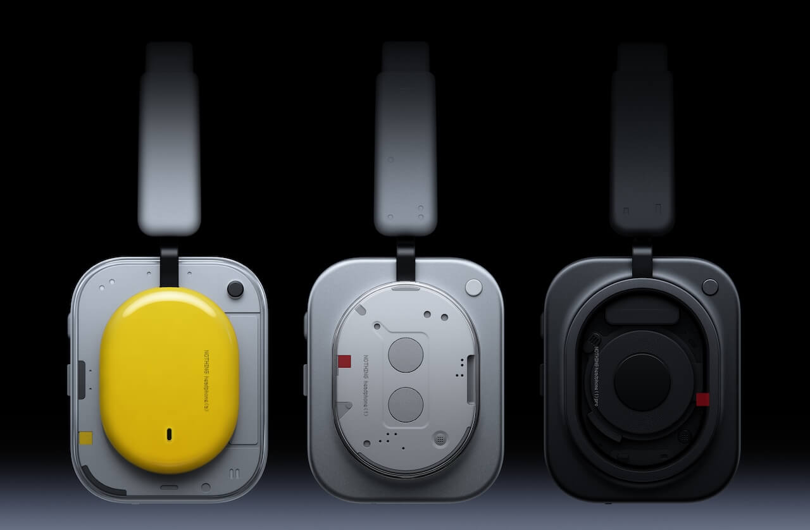

Nothing ha presentado el **Headphone (1) Pro**, su nuevo buque insignia de diadema con cancelación activa de ruido, a un precio de 399 dólares. El modelo se coloca por encima del Headphone (1) de 299 dólares y del Headphone (a) de 199, pero lo verdaderamente distinto no es el acabado ni la autonomía: es lo que ocurre dentro de cada copa, donde la compañía ha instalado tres transductores por lado.

## Tres drivers por auricular, una configuración poco habitual

Cada copa combina tres motores. El de graves es un driver dinámico de 40 mm con cúpula de PET, recubrimiento cerámico-metal electrodepositado y motor de doble imán. Le acompaña un segundo driver dinámico de 13 x 8 mm para los medios, con diafragma de PEN, y un tercer elemento mucho menos convencional: un driver de estado sólido xMEMS de 3,2 x 6,0 x 1,15 mm para los agudos, con diafragma de silicio. Nothing asegura que este último es bastante más rígido que los plásticos habituales, lo que se traduce en una respuesta transitoria más rápida en las frecuencias altas.

La marca cifra en un 15 % más de impacto en graves y un 26 % más de sensibilidad respecto al Headphone (1). Son datos de laboratorio de la propia empresa, pero apuntan a que el motor de bajos se ha rediseñado en profundidad y no se ha reutilizado sin más.

Mientras la mayoría de los auriculares ANC de este precio se apoyan en un único driver dinámico por lado y confían el ajuste final al DSP, Nothing reparte el trabajo entre tres transductores. Conviene recordar que tres motores mediocres pueden perder frente a uno excelente: la arquitectura abre posibilidades, no garantiza el resultado.

## Metropolis Studios sustituye a KEF

El Headphone (1) original se apoyó en el sello *Sound by KEF* para ganar credibilidad ante los oyentes que conocían a la firma británica de altavoces. El Pro cambia de socio: Nothing pone ahora el foco en el trabajo de afinado realizado con Metropolis Studios, el estudio londinense por el que han pasado generaciones de ingenieros de grabación y masterización. De esa colaboración salen varios perfiles de ecualización en la app Nothing X y un **Flat EQ** pensado para revisar, producir y mezclar música.

Lo interesante es que ese Flat EQ tiene su propio interruptor físico en los auriculares. En una posición se mantiene la ecualización habitual de Nothing; en la otra, el auricular pasa al perfil más plano de Metropolis sin abrir la aplicación, sin bucear en menús y sin recordar qué preset se guardó hace tres actualizaciones de firmware. Es una respuesta mecánica a un problema cotidiano, aunque si alguien debería mezclar un disco con unos auriculares Bluetooth con ANC es otra discusión.

## Conectividad, batería y lo que se queda fuera

En inalámbrico, el Pro maneja Bluetooth 6.1 con los códecs SBC, AAC y LDAC, además de conexión multipunto y recepción de emisiones Auracast mediante LC3. También admite uso por cable: USB Type-C con reproducción sin pérdidas de hasta 24 bits/192 kHz y una entrada analógica de 3,5 mm de hasta 24 bits/96 kHz. Está certificado Hi-Res Audio tanto por cable como en inalámbrico.

La ausencia que conviene señalar es el soporte de aptX Adaptive y aptX Lossless, algo que deja fuera a quienes tienen invertido su equipo en el ecosistema de Qualcomm, pese a que esa plataforma sigue avanzando, como muestra [la nueva generación de Snapdragon Sound](/noticias/qualcomm-snapdragon-sound-elite-gen-2/).

La batería de 1.060 mAh ofrece hasta 68 horas con la cancelación desactivada usando AAC y hasta 30 horas con ella activa. Con LDAC, esas cifras bajan a 53 y 28 horas respectivamente. Cinco minutos de carga dan hasta cuatro horas de reproducción sin ANC o dos horas con ANC. La carga completa ronda las dos horas. El detalle llamativo es que el Headphone (1) original llegaba a las 80 horas sin ANC, así que el Pro retrocede en autonomía máxima.

La cancelación de ruido adaptativa sube hasta los 46 dB, frente a los 42 dB del modelo anterior. El sistema recurre a 10 micrófonos —tres de alimentación directa y dos de realimentación por lado— y suma un nuevo muro de sellado de silicona de 8 mm junto a almohadillas de doble capa para mejorar el aislamiento pasivo. Incluye modo transparencia y procesado Clear Voice con cuatro micrófonos para llamadas y mensajes de voz. La respuesta en frecuencia declarada es de 20 Hz a 40 kHz.

En el plano físico mantiene el diseño industrial transparente que hizo reconocible al Headphone (1), pero con materiales más premium: copas de aluminio mecanizado, brazos de aleación de titanio —un 45 % más ligeros— y cristal 9H Panda Glass. Las almohadillas son un 50 % más suaves y la diadema es un 10 % más ancha con un 12 % más de relleno. El peso se queda en 327 gramos, prácticamente los mismos que los 329 gramos del Headphone (1). Los controles siguen siendo uno de sus puntos fuertes: una rueda para volumen y reproducción, una palanca para cambiar de pista, un botón personalizable, el interruptor de Flat EQ y un botón aparte para el emparejamiento Bluetooth. Tiene resistencia IP52, se vende en negro y blanco y no se pliega hacia dentro.

## Precio y disponibilidad

El **Nothing Headphone (1) Pro** cuesta 399 dólares en Estados Unidos y está disponible desde el 29 de septiembre de 2026 a través de Nothing, Amazon y Best Buy en Norteamérica. Eso lo sitúa por encima del Headphone (1) de 299 dólares y del Headphone (a) de 199, pero por debajo de los 449 dólares de los actuales buques insignia de Sony y Bose.

La competencia directa es exigente: el Sony WH-1000XM6 y el Bose QuietComfort Ultra de segunda generación son referencia en cancelación de ruido, comodidad y madurez de su procesado. Nothing responde con su arquitectura de tres drivers, audio sin pérdidas por USB-C, Auracast y controles físicos más completos, aunque la prueba real de su ANC tendrá que llegar con las primeras reviews y con un uso prolongado.

