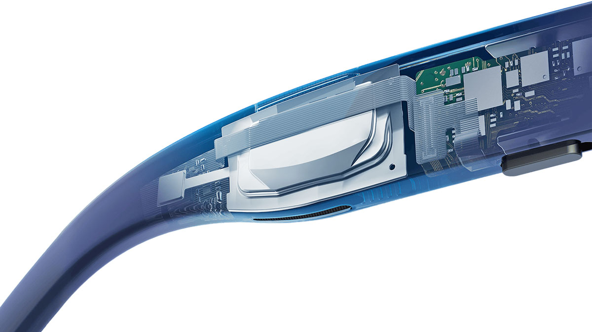
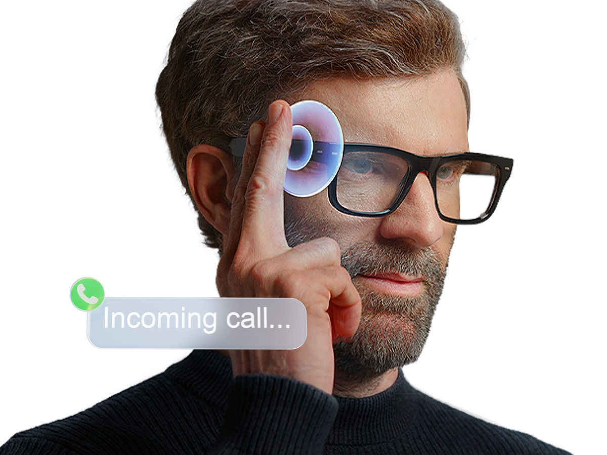
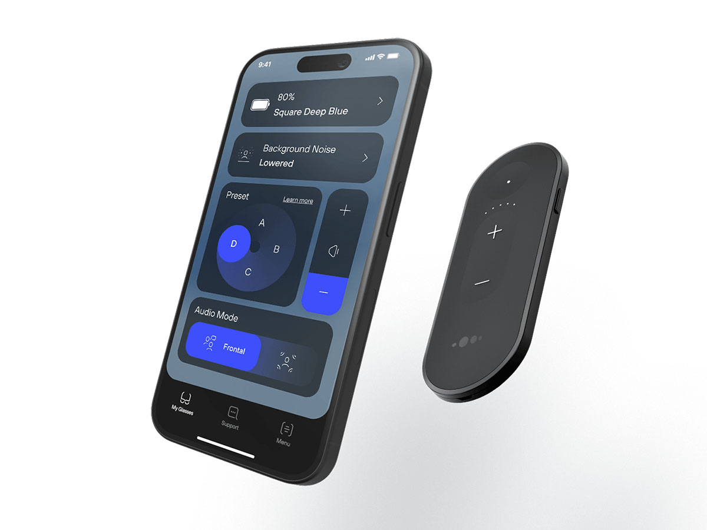
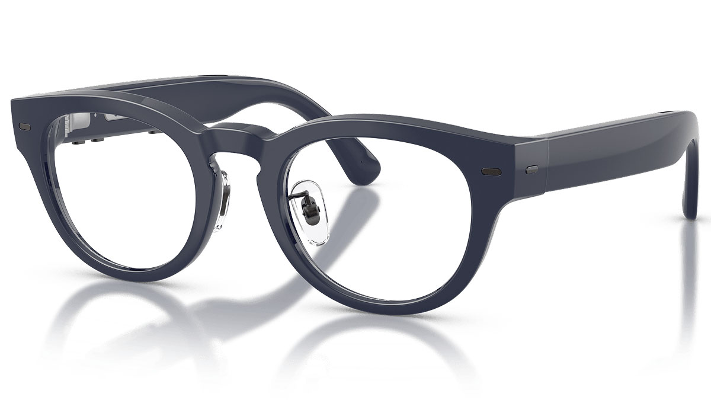

EssilorLuxottica ha presentado las Nuance Audio Plus, la segunda generación de sus gafas auditivas de tipo abierto para adultos con pérdida auditiva percibida de leve a moderada. El nuevo modelo mantiene el enfoque de la primera generación —asistencia auditiva integrada en una montura corriente— y añade tres novedades que amplían su uso más allá de amplificar la voz cercana: alrededor de 10 horas de autonomía, controles físicos en las patillas y llamadas manos libres para usuarios de iPhone. Las gafas ya están disponibles en Estados Unidos desde 829 dólares de precio recomendado, según la configuración de las lentes.

## Las Nuance Audio Plus estrenan controles físicos y más autonomía

La arquitectura acústica sigue apoyándose en micrófonos direccionales y formación de haces (beamforming) para reforzar las conversaciones que ocurren frente al usuario, con altavoces de tipo abierto integrados en las patillas. Los conductos auditivos permanecen libres, una de las señas de identidad del formato. Según EssilorLuxottica, la nueva generación mejora la amplificación, la claridad del habla en entornos con ruido y la percepción de la propia voz. El anuncio no cuantifica esas mejoras ni detalla la latencia de procesado.

Entre los cambios de uso diario destaca el control físico: un interruptor de encendido y botones de volumen en las patillas dan acceso directo a las funciones más usadas sin depender del teléfono. La compañía explica que, con el interruptor encendido, basta con plegar y desplegar las patillas para apagar y encender las gafas. El mando a distancia sigue disponible como accesorio opcional y la autonomía se especifica en unas 10 horas en condiciones medias de uso, una estimación del fabricante que variará según cómo se utilicen. El paquete estándar incluye una base de carga y un cable USB-C.

## Llamadas manos libres, por ahora solo con iPhone

Llamar sin tocar el teléfono es la incorporación más llamativa para un producto centrado en la audición. El usuario puede contestar o colgar con un doble toque en la montura. La función exige un iPhone compatible con iOS 16 o posterior, y EssilorLuxottica identifica las Nuance Audio Plus como un dispositivo con certificación MFi. Conviene separar ambas cosas: esa capacidad de llamada tiene un requisito de plataforma concreto que no afecta a las funciones de asistencia auditiva, disponibles con independencia del móvil.

## Modos de escucha y ajuste desde la aplicación

Los usuarios eligen entre dos modos de escucha desde la aplicación Nuance Audio. «Frontal» se centra en las conversaciones cara a cara, mientras que «All-Around» amplifica los sonidos del entorno. A ellos se suman cuatro ajustes de amplificación preconfigurados, etiquetados de la A a la D, tres niveles de reducción del ruido de fondo y cinco niveles de volumen de amplificación. El conjunto permite adaptar la experiencia a escenarios muy distintos, desde una comida en un restaurante hasta un paseo por la calle.

## Monturas, precios y disponibilidad

La colección ampliada incluye tres monturas —Square 53, Panthos 48 y Upturn 52— con cinco colores en toda la gama: Shiny Black, Shiny Burgundy, Deep Blue, Amber y Olive Green. Algunos estilos incorporan almohadillas nasales ajustables, y las gafas pueden equiparse con lentes graduadas a medida del usuario, incluidas las fotocromáticas Transitions.

EssilorLuxottica describe las Nuance Audio Plus como un producto con autorización de la FDA para adultos con pérdida auditiva percibida de leve a moderada. La distribución sigue siendo clave en su estrategia: se venden a través de profesionales ópticos y de cuidado auditivo autorizados en Estados Unidos, con venta en línea en algunos países. El modelo original, las Nuance Audio Glasses, permanece en el catálogo, de modo que la compañía ofrece ahora más opciones de prestaciones, estilos y precios.

## Por qué importa

La propuesta encaja en una tendencia que avanza en dos direcciones. Por un lado, los audífonos de venta sin receta se han abierto paso en el mercado de consumo y los dispositivos de audio generalistas asumen cada vez más tareas de asistencia auditiva: es el mismo terreno que pisó Meta con la [mejora auditiva avalada por la FDA](/noticias/meta-gafas-mejora-auditiva-fda/) para sus gafas inteligentes, y que otros fabricantes exploran con [gafas de audio sin cámara](/noticias/ray-ban-meta-audio-sin-camara/). Por otro, EssilorLuxottica aprovecha su red óptica para venderlas como un producto natural en la óptica de barrio, no como un dispositivo médico.

Stefano Genco, director global de Nuance Audio, afirma en el anuncio: «La respuesta a las Nuance Audio Glasses ha sido muy positiva, lo que confirma que los consumidores buscan una forma más natural y deseable de acceder al apoyo auditivo». La compañía afirma que su clientela es, de media, cinco años más joven que la de los audífonos tradicionales, y asegura que dos de cada tres compradores nunca habían explorado esos aparatos.

Queda por confirmar el detalle que el anuncio no da: cuánto mejoran la claridad del habla frente a la generación anterior y con qué latencia procesan el audio, dos cifras decisivas en un producto donde un retardo perceptible arruina la experiencia. Hasta que haya pruebas independientes, conviene tratar las mejoras acústicas como declaraciones del fabricante.
