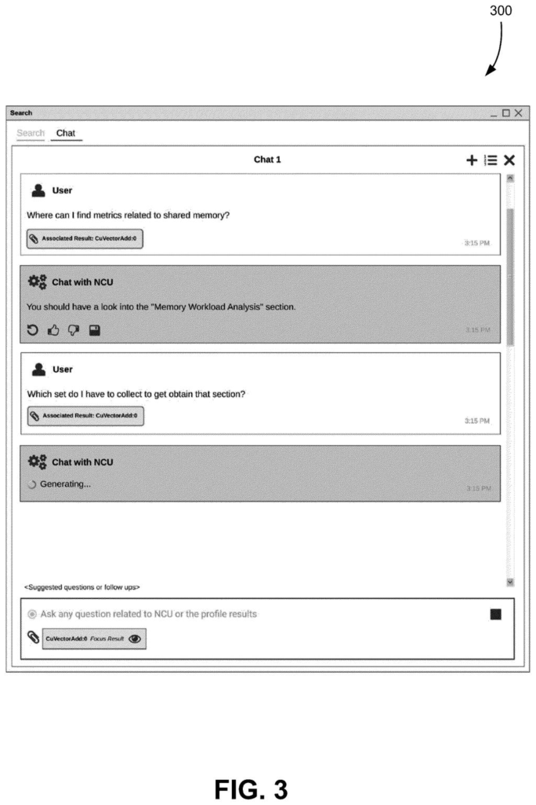
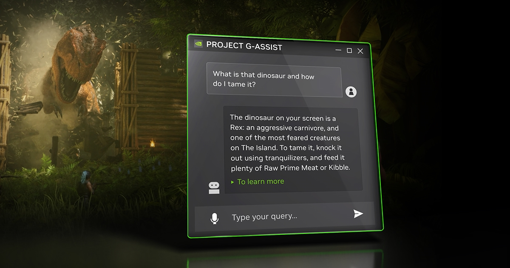

NVIDIA ha solicitado una patente para construir una interfaz de chat basada en un modelo grande de lenguaje que permita a los desarrolladores diagnosticar problemas de rendimiento de la GPU con preguntas en lenguaje natural. La idea es sencilla de enunciar: en lugar de bucear entre perfiles y contadores, el programador pregunta directamente por qué una carga va lenta y la IA investiga la respuesta.

Según recoge MyDrivers, el sistema conecta el modelo de lenguaje con las herramientas de análisis de rendimiento de GPU que NVIDIA ya ofrece. El desarrollador puede preguntar qué parte de un programa lastra el rendimiento o en qué se diferencian dos versiones del mismo código en términos de velocidad, y el asistente se encarga del trabajo de campo.

## Cómo funciona el asistente de diagnóstico de NVIDIA

El flujo descrito en la patente se parece a un flujo de trabajo con herramientas externas al estilo MCP: el modelo no responde desde su conocimiento memorizado, sino que consulta documentación relevante, revisa los datos de rendimiento ya recogidos de la GPU y genera scripts en Python u otros lenguajes para extraer la información que necesita antes de ofrecer una conclusión.

El alcance de la patente no se limita a la optimización de videojuegos. Cubre programas de cómputo general en GPU, núcleos de cálculo y otras cargas de trabajo, lo que la sitúa más cerca del mundo del desarrollo con CUDA y la computación acelerada que del ajuste de gráficos de un juego.

## Por qué importa: el análisis de GPU, al alcance de estudios pequeños

El sistema no corrige el código automáticamente: su función es localizar el cuello de botella más rápido. NVIDIA plantea la IA como una capa intermedia que rebaja la barrera de entrada al análisis de rendimiento, algo relevante porque las arquitecturas modernas de GPU son complejas y no todos los desarrolladores, sobre todo los independientes y los estudios pequeños, disponen de la experiencia o las herramientas para interpretar los datos de rendimiento.

## En qué se diferencia de Project G-Assist

NVIDIA ya ofrece un concepto parecido para el público general: Project G-Assist, integrado en [la aplicación NVIDIA App](/noticias/nvidia-app-overlay-cpu/), acepta preguntas por texto o voz e informa del uso de la GPU, la temperatura, la frecuencia, el consumo y la tasa de fotogramas, además de recomendar o ajustar la configuración gráfica de los juegos.

La diferencia está en el público y la profundidad. G-Assist se dirige al jugador y se limita a leer el estado del sistema y tocar ajustes, mientras que la patente apunta al desarrollador y desciende al nivel del código y los datos de rendimiento: analiza el cuello de botella de la propia carga de trabajo de la GPU, no se conforma con informar del estado del hardware.
