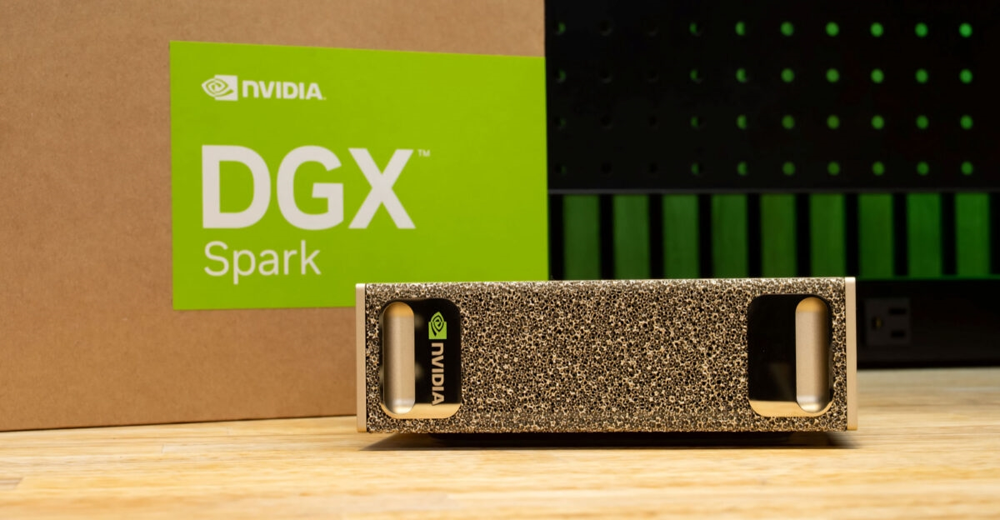
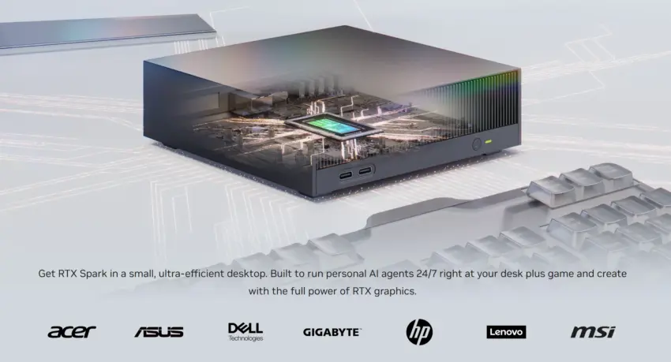

El DGX Spark, la estación de trabajo compacta de NVIDIA para inteligencia artificial, se vende ya por encima de su precio oficial en Estados Unidos. A falta de pocas semanas para que el RTX Spark llegue al mercado, la oferta más barata disponible ronda los 4.999,99 dólares —unos 33.550 yuanes—, alrededor de 300 dólares por encima de la tarifa que la compañía mantiene en su propia web.

## El DGX Spark ya se vende por encima de su tarifa oficial

La página oficial de NVIDIA sigue listando el DGX Spark Founders Edition a 4.699 dólares (unos 31.530 yuanes), pero el equipo figura agotado en su tienda. La opción más económica que puede comprarse en este momento procede de Amazon, donde lo vende y lo envía Micro Center por 4.999,99 dólares.

La cifra queda muy por encima de los 3.999 dólares (unos 26.833 yuanes) con los que el equipo se presentó. El encarecimiento no afecta solo al modelo de referencia: el Ascent GX10 de ASUS, basado en la misma plataforma, llegó a cotizarse a 8.299 dólares (unos 55.686 yuanes) en su versión de 1 TB y a 9.499 dólares (unos 63.738 yuanes) en la de 2 TB, en torno a un 50 % más que un mes antes.

## Un mercado de estaciones compactas cada vez más disputado

El movimiento de precios se produce en un segmento que se ha llenado de competidores en pocos meses. AMD presentó recientemente su plataforma para desarrolladores Ryzen AI Halo, con el Ryzen AI Max+ 395 y 128 GB de memoria unificada, y soporte oficial tanto de Windows 11 como de Linux. Apple compite en el mismo terreno con el Mac Studio, disponible con M4 Max y M3 Ultra y hasta 128 GB de memoria.

Ese contexto ayuda a entender por qué el precio del DGX Spark funciona como referencia para toda la categoría: quien busque ejecutar modelos de IA en el escritorio sin depender de la nube tiene cada vez más alternativas, y el coste de entrada pesa tanto como la potencia.

## RTX Spark llega en octubre con Windows 11

El siguiente paso de NVIDIA es el RTX Spark, cuya llegada está prevista para octubre. La compañía ha señalado que los sobremesas y portátiles compactos comenzarán a enviarse ese mes con CPU Grace, gráficos Blackwell RTX y hasta 128 GB de memoria LPDDR5X unificada. El RTX Spark N1X de sobremesa incorpora una CPU Grace de 20 núcleos y una GPU Blackwell RTX de 6.144 núcleos, mientras que la configuración más baja se queda en 64 GB de memoria.

El terreno de software ya está preparado: el DGX Spark funciona con DGX OS, una distribución basada en Ubuntu, y el RTX Spark contará con soporte oficial de Windows 11. NVIDIA no ha aclarado si ambos equipos admitirán sistemas operativos de forma cruzada. La compañía tampoco ha anunciado el precio de venta del RTX Spark, un dato que cobra más interés con el DGX Spark cotizando por encima de su tarifa. En esa línea trabajó la empresa con [CUDA 13.4 y el soporte para Windows on Arm](/noticias/cuda-13-4-windows-on-arm/), un paso previo pensado para que el software llegue listo al hardware.

## Qué cambia para el lector

Las cifras del artículo corresponden al mercado estadounidense y las equivalencias en yuanes son las que maneja la fuente original. Para quien valore comprar un equipo de este tipo, la conclusión práctica es que la horquilla de precios se ha ensanchado: el modelo de referencia apenas se encuentra por debajo de los 5.000 dólares, y las variantes de los fabricantes asociados se mueven en tramos bastante más altos. Si el RTX Spark hereda esa tensión de precios, la entrada a la IA local en escritorio seguirá siendo un desembolso considerable.
