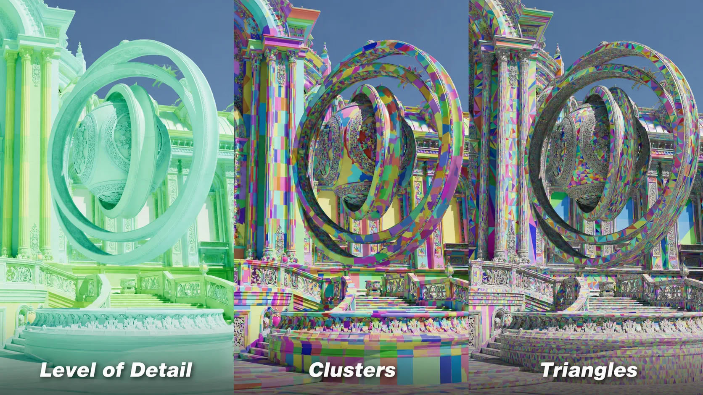
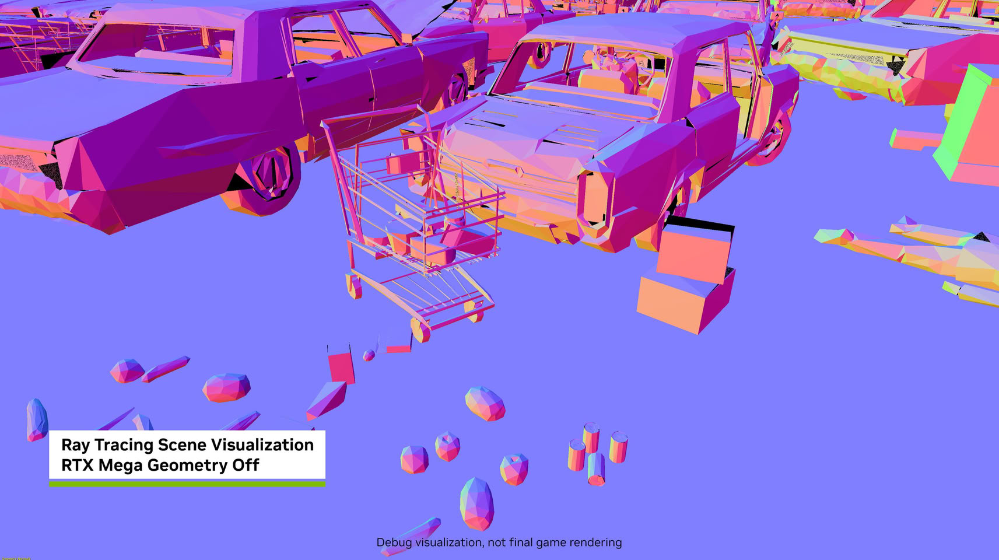
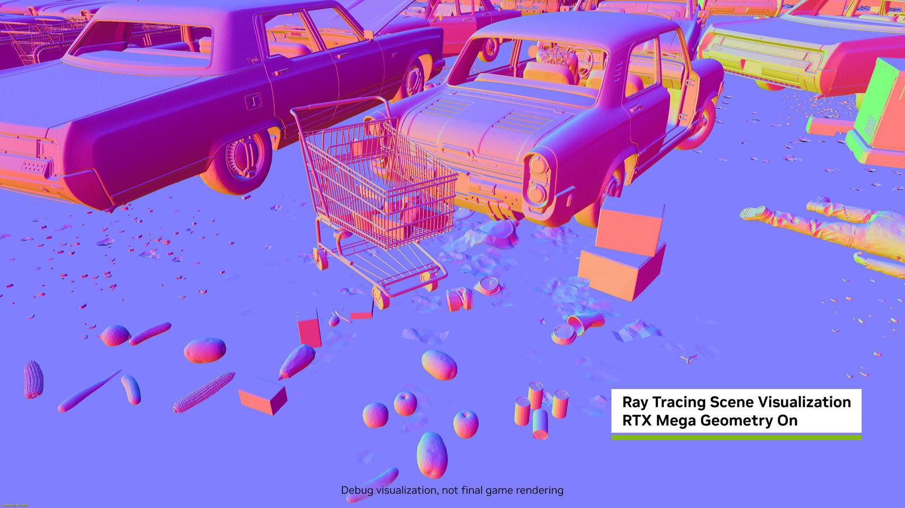

NVIDIA ha publicado RTX Kit 2026.3 junto con la versión 2.0 de su SDK RTX Mega Geometry, el conjunto de herramientas con el que los desarrolladores de videojuegos acceden a sus técnicas de renderizado neuronal y trazado de trayectorias. La novedad principal es el soporte para transmitir clústeres de nivel de detalle (LOD) continuo en mallas de altísima densidad, una función que la compañía muestra en una nueva versión con texturas en formato glTF de su demo Zorah.

## Qué incluye RTX Kit 2026.3

La actualización reparte sus novedades en varios módulos, cada uno centrado en una parte distinta del proceso de renderizado:

- **RTX Character Rendering 1.4**: mejora el muestreo BCSDF del cabello en campo lejano y la conservación de energía.
- **RTX Dynamic Illumination 3.1**: incorpora la integración con DLSS Ray Reconstruction y ajustes en ReSTIR PT.
- **RTX Neural Shading 1.4**: añade compatibilidad con la última cadena de herramientas en vista previa de DirectX Linear Algebra y actualiza las dependencias de sus shaders y ejemplos.
- **RTX Texture Filtering 1.3**: estrena el filtrado de texturas colaborativo (Collaborative Texture Filtering), pensado para mejorar la calidad de ampliación en el filtrado estocástico.

En paralelo, **RTX Neural Texture Compression** continúa en fase beta con su versión 0.10. Ahora admite la vista previa de DirectX 12 Agility SDK con Linear Algebra, lo que permite usar los Tensor Cores para acelerar la descompresión neuronal de texturas dentro de los shaders de DirectX. Tanto este módulo como RTX Texture Filtering 1.3 suman compatibilidad con Windows ARM64, un paso que NVIDIA prepara de cara a la llegada de los PC RTX Spark previstos para octubre.

## Mega Geometry 2.0 y los clústeres de LOD continuos

El SDK RTX Mega Geometry 2.0 ya está disponible y su aportación central es la transmisión de clústeres de LOD continuos para mallas de alta densidad, la tecnología que permite mantener el detalle geométrico a medida que la cámara se mueve por una escena. La compañía sostiene que el trazado de rayos sobre la geometría de Nanite de Unreal Engine 5 recurre hoy a una única malla estática de bajo detalle, y que Mega Geometry está pensado para corregir precisamente ese cuello de botella.

La primera prueba de fuego llegará con **Gears of War: E-Day**, que abre su acceso anticipado el 1 de octubre y se lanza por completo el 6 de octubre. Será la primera implementación de la técnica junto al sistema de transmisión de texturas de Nanite. NVIDIA añade que espera que la tecnología acabe adoptándose en el estándar DXR 2.0 de Microsoft, lo que la convertiría en una pieza de futuro para el ecosistema gráfico.

Las siguientes imágenes comparan una misma escena con la técnica desactivada y activada:

## Qué cambia para el jugador y para el desarrollador

Para el jugador, entre las ventajas que se atribuyen a Mega Geometry figuran una mayor tasa de fotogramas y un nivel de detalle superior sin renunciar al trazado de rayos. El medio que recoge el anuncio añade que la técnica también mejora los reflejos trazados, vuelve más exactas las superficies reflectantes y reduce el parpadeo en las sombras y los reflejos calculados por trazado de rayos.

Para el desarrollador, la noticia es doble. Por un lado, Mega Geometry 2.0 y las mejoras de RTX Kit amplían el catálogo de herramientas disponibles hoy para exprimir el renderizado neuronal y el trazado de trayectorias. Por otro, el soporte ampliado de ARM64 encaja con la estrategia de NVIDIA de tener listo el software antes de que aterrice el hardware: en esa misma línea trabaja con [CUDA 13.4 para Windows on Arm](/noticias/cuda-13-4-windows-on-arm/), un movimiento que apunta directamente a los equipos RTX Spark.

Quien siga de cerca esta tecnología puede consultar también los [requisitos para PC de Gears of War: E-Day](/noticias/gears-of-war-e-day-pc-requirements/), el primer título confirmado que estrena RTX Mega Geometry y que ya exige trazado de rayos por hardware. La conclusión práctica es que Mega Geometry deja de ser una promesa y entra en la fase en la que el usuario empieza a notarla en juegos concretos, siempre que cuente con una GPU GeForce RTX compatible.
