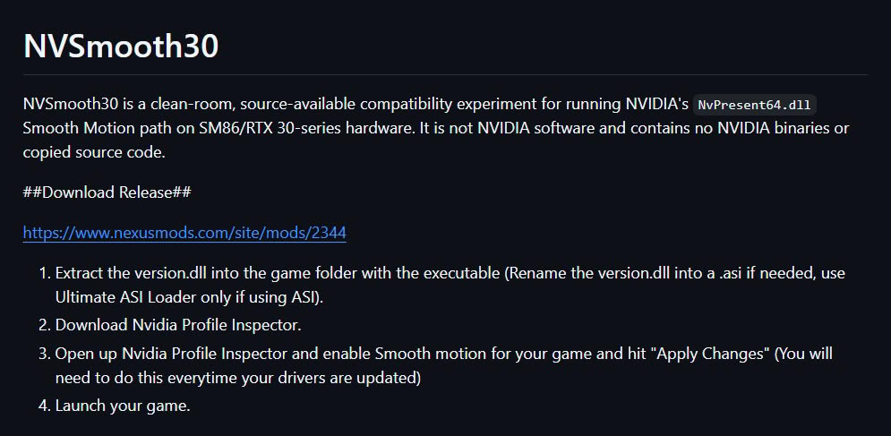

NVIDIA reserva **Smooth Motion**, su generación de fotogramas a nivel de controlador, para las GeForce RTX 40 y posteriores. La comunidad ha decidido saltarse esa frontera: el proyecto **NVSmooth30**, obra del desarrollador conocido como ItsAdeline, consigue activar la función en las RTX 30 (arquitectura Ampere) mediante una capa de compatibilidad que se apoya en el propio runtime del controlador. Conviene dejarlo claro desde el principio: es un mod de la comunidad, no soporte oficial de NVIDIA.

## Qué es Smooth Motion y por qué no llegaba a Ampere

Smooth Motion es la generación de fotogramas que NVIDIA ejecuta desde el controlador, con un enfoque parecido al AFMF de AMD. Su ventaja es que no exige que el juego integre el SDK de NVIDIA: basta con activarla y el controlador inserta un fotograma generado por IA entre cada fotograma renderizado, incluso en títulos que carecen de generación de fotogramas nativa.

No hay que confundirla con DLSS Frame Generation ni con Multi Frame Generation, que sí se apoyan en hardware presente en las RTX 40 y las RTX 50, respectivamente. De forma oficial, Smooth Motion solo aparece en las RTX 40 y más nuevas a través de la NVIDIA App, por lo que los propietarios de una tarjeta Ampere quedaron fuera de la función.

## Dos proyectos independientes para llegar al mismo sitio

El primer intento llega de la mano del desarrollador pipotoufikxyz-lgtm, que amplió el proyecto `dlssg_for_sm86`, una adaptación previa del runtime DLSS-G de NVIDIA para la arquitectura SM86 que usan las RTX 30. Su actualización añade Smooth Motion y compatibilidad con Vulkan, se publicó el 19 de septiembre y se probó en una RTX 3070.

NVSmooth30 toma un camino distinto. En lugar de reaprovechar el paquete DLSS-G existente, es una capa de compatibilidad de desarrollo propio dirigida directamente a la ruta de Smooth Motion de `NvPresent64.dll`. El mod modifica el comportamiento de ese runtime para sortear las comprobaciones de arquitectura y capacidad que impiden que Smooth Motion arranque en Ampere, e intercepta la carga de módulos CUDA para redirigir código pensado para GPUs Ada Lovelace (SM89) hacia Ampere (SM86). El autor subraya que no redistribuye binarios propietarios de NVIDIA: usa la versión de `NvPresent64.dll` que ya viene con el controlador instalado del usuario.

NVSmooth30 se ha probado en una RTX 3050 para portátiles y, por separado, en una RTX 3070. Además, en el hilo de Reddit del proyecto algunos usuarios reportan que funciona en una RTX 3080, con resultados que en un caso llegarían a duplicar los fotogramas mostrados. Son impresiones preliminares de la comunidad, no pruebas independientes.

## Qué significa para quien tiene una RTX 30

El mod no es plug-and-play. Su instalación pasa por colocar el archivo proxy `version.dll` junto al ejecutable del juego y habilitar Smooth Motion para ese título desde NVIDIA Profile Inspector. El propio autor advierte de que el ajuste puede tener que reactivarse después de cada actualización del controlador.

Antes de probarlo conviene tener presentes los riesgos: el proyecto está en fase alfa, la compatibilidad entre juegos, controladores y modelos de RTX 30 no está garantizada, y los fallos pueden incluir cierres inesperados, fotogramas corruptos o pantallas en negro. Tampoco es recomendable usarlo en juegos competitivos con sistemas antitrampas, porque cualquier herramienta que toque los archivos del juego puede activar una sanción.

Ya vimos algo parecido con [el mod que desbloqueó la generación múltiple de fotogramas de DLSS en Ampere](/noticias/dlss-multi-frame-gen-rtx-30/): la comunidad lleva tiempo demostrando que las fronteras generacionales de NVIDIA no siempre son tan rígidas como el marketing quiere hacer creer. Que dos equipos independientes hayan llegado a implementaciones funcionales sugiere que Smooth Motion no está bloqueado por hardware en Ampere, al menos a nivel técnico. Otra cosa es que NVIDIA decida convertirlo en soporte oficial para las RTX 30: nada apunta a que vaya a ocurrir a corto plazo.
