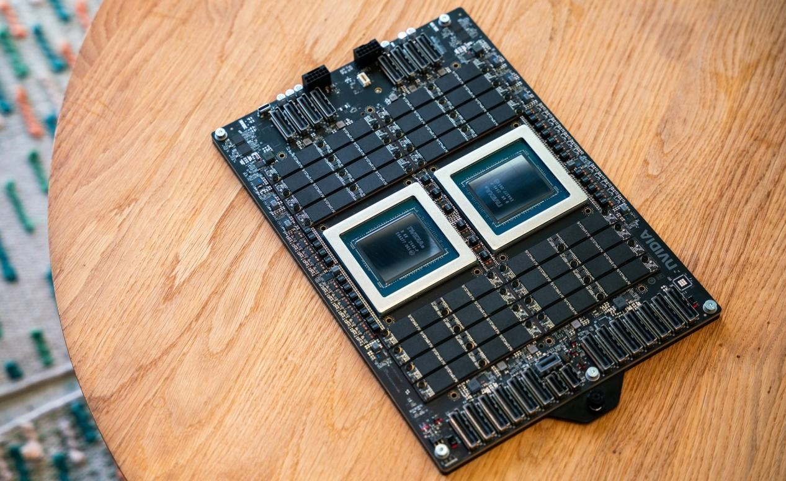

El equipo de DuckDB publicó el 15 de septiembre los resultados de una comparativa en la que sometió a la CPU NVIDIA Vera a la carga completa del benchmark TPC-H. En la prueba, el chip de 88 núcleos de NVIDIA superó a una Intel Xeon 6 de 96 núcleos en consultas analíticas, con una ventaja de entre el 46 % y el 48 % en la métrica de rendimiento. La comparación se difundió después a través de medios como Wccftech, pero los datos originales y la metodología están en la publicación de DuckDB.

## Qué mide TPC-H y por qué no es una prueba de IA

TPC-H es un benchmark de apoyo a la decisión mantenido por el Transaction Processing Performance Council. Consiste en un conjunto de consultas ad-hoc orientadas a negocio y modificaciones concurrentes de datos, pensadas para representar cargas que examinan grandes volúmenes de información y ejecutan consultas de alta complejidad.

La métrica que reporta se llama QphH@Size (consultas por hora) y combina varios aspectos: el tamaño de la base de datos sobre la que se ejecutan las consultas, la potencia de procesamiento cuando llegan en un único flujo y el caudal cuando las lanzan múltiples usuarios a la vez. Es decir, no es una prueba de entrenamiento ni de inferencia de inteligencia artificial, sino una carga tradicional de bases de datos analíticas y soporte a decisiones. Eso es justamente lo relevante del resultado: la ventaja de Vera no aparece solo en cargas de IA.

## Cómo rinde Vera: 88 núcleos frente a 96

DuckDB ejecutó el benchmark con el proyecto `duckdb-tpch` sobre el conjunto de datos completo, con factor de escala 1.000, y lo probó con dos versiones de su motor: la estable v1.5.5 y la alpha v2.0.0. En ambas plataformas se usó Ubuntu 26.04.

- **Línea base x86 (Intel Xeon 6):** 96 núcleos con Hyper-Threading, 768 GB de memoria, una SSD NVMe de más de 3 TB y las banderas de DuckDB configuradas para 96 hilos.
- **NVIDIA Vera:** 88 núcleos con Spatial Multithreading, montada en un sistema de dos sockets pero con DuckDB restringido a uno solo, 768 GB de memoria LPDDR5x, la misma capacidad de almacenamiento y 88 hilos.

La metodología descartó una primera ejecución de calentamiento y tomó la mediana de tres ejecuciones posteriores. Estos son los valores medianos de la puntuación compuesta:

| Plataforma | DuckDB 1.5.5 | DuckDB 2.0.0-alpha |
| --- | --- | --- |
| Intel Xeon 6 (96 núcleos) | 1.673.422,48 | 2.109.782,19 |
| NVIDIA Vera (88 núcleos) | 2.482.589,73 | 3.073.292,99 |

Con la versión estable, Vera rinde un 48 % más que la Xeon 6; con la alpha, la diferencia se mantiene en el 46 %. El segundo hallazgo es transversal: DuckDB 2.0.0-alpha mejora entre un 24 % y un 26 % a la versión 1.5.5 en las dos CPUs, un salto que beneficiará a todos los usuarios cuando la versión final esté disponible.

## Qué cambia para el usuario

El caso de NVIDIA Vera es interesante porque rompe una asociación habitual: un chip presentado para la era de la IA agéntica, con núcleos Olympus orientados al rendimiento de un solo hilo, también compite en bases de datos clásicas. Sobre la misma memoria y el mismo almacenamiento, y con menos núcleos y Spatial Multithreading, entrega más caudal de consultas, lo que lo sitúa como una opción a considerar en análisis y soporte a decisiones.

Conviene leerlo con contexto. La propia DuckDB explica que recibió acceso anticipado a una CPU Vera, por lo que la prueba parte de una muestra cedida por el fabricante y se limita a una única carga de trabajo. Es un dato sólido y reproducible —la metodología y las cifras están publicadas—, pero no sustituye a una auditoría independiente con varios escenarios. Para quien dimensiona infraestructura, sirve como señal de que la competencia entre arquitecturas x86, Arm y las propuestas de NVIDIA para centros de datos está dejando de medirse solo en cargas de IA; [otra CPU para centros de datos, la AGI de Arm](/noticias/arm-agi-cpu-lab/), apunta en la misma dirección.
