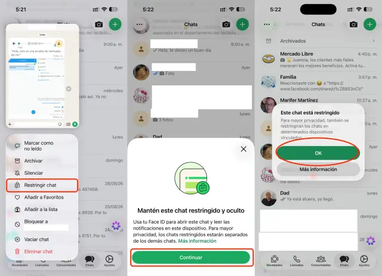
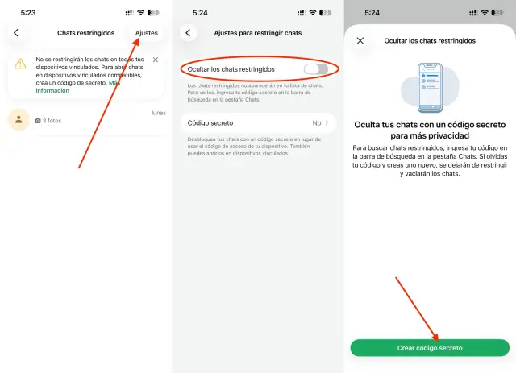

Basta con dejar el móvil desbloqueado unos minutos para que una conversación privada de WhatsApp quede expuesta: cualquier persona con el teléfono en la mano puede abrir la aplicación y leer los mensajes, e incluso una notificación en pantalla puede revelar nombres o fragmentos que deberían permanecer privados. Esta guía explica cómo ocultar conversaciones de WhatsApp con la función de bloqueo de chats y el código secreto, pensada para quien comparte el dispositivo o quiere una capa extra de privacidad.

## Requisitos previos

- Tener configurado un método de desbloqueo en el teléfono, como un código, la huella dactilar o Face ID. Si no existe ninguno, WhatsApp pedirá configurarlo antes de continuar.
- La función sirve tanto para conversaciones individuales como para grupos, incluidos los chats silenciados.

## Paso 1: Restringir el chat que se quiere proteger

1. Abre WhatsApp y localiza la conversación que quieres proteger.
2. En Android, mantenla pulsada y toca el menú de los tres puntos. En iPhone, desliza hacia la izquierda sobre el chat o mantenlo pulsado para mostrar sus opciones.
3. Busca la opción **Restringir chat**, que puede aparecer dentro de Más.
4. Confirma la activación con el método de desbloqueo que te solicite.

Los chats seleccionados se trasladan a una carpeta independiente, **Chats restringidos**, cuyo acceso requiere autenticación. Restringir un chat no bloquea al contacto: se puede seguir hablando con normalidad y la otra persona no recibe ningún aviso del cambio.

## Paso 2: Crear el código secreto para ocultar la carpeta

Si además se quiere ocultar la propia carpeta de Chats restringidos, es posible configurar un código secreto distinto del que desbloquea el móvil. De ese modo, conocer el PIN del teléfono no equivale a conocer esta segunda clave.

1. Desliza hacia abajo la lista de chats para encontrar la carpeta de **Chats restringidos**.
2. Entra en ella con el método de acceso configurado.
3. Abre los ajustes de bloqueo de chats. En Android, toca primero los tres puntos.
4. Selecciona **Código secreto**, escribe la clave y pulsa **Siguiente**.
5. Vuelve a introducirla para confirmarla y completa la configuración.
6. Activa la opción para ocultar los chats restringidos o bloqueados.

Tras activarlo, la carpeta deja de aparecer en la lista de conversaciones. Para localizarla hay que escribir el código secreto en el buscador de WhatsApp.

## Paso 3: Consultar los mensajes ocultos o devolver un chat a la lista normal

Después de escribir la clave en el buscador, pulsa sobre la carpeta que aparezca y completa la autenticación si se solicita. Desde ahí es posible abrir la conversación que se necesite.

Si se prefiere devolver un chat a la lista habitual, basta con acceder a sus opciones y elegir desbloquearlo. Conviene no confundir esta acción con la opción de desbloquear y vaciar los chats bloqueados: esta última elimina mensajes, fotos y vídeos, por lo que no debe usarse como recuperación sin consecuencias si se olvida el código.

## Cómo verificar que funcionó

- La conversación protegida ya no aparece en la lista principal de chats, sino en la carpeta de Chats restringidos (o en ningún sitio visible, si se activó el código secreto).
- Al llegar un mensaje de un chat restringido, la notificación muestra un aviso genérico de WhatsApp, sin identificar al remitente ni mostrar el contenido.
- Para más contexto sobre las funciones de restricción de chats, también se puede consultar la [novedad de WhatsApp para limitar ciertas conversaciones al teléfono principal](/noticias/whatsapp-limit-chats-primary-phone/).

## Advertencias y limitaciones

- Las llamadas de esos contactos siguen llegando: la función no las bloquea.
- Estos ajustes están disponibles en 2026, pero no son una novedad de este año ni garantizan una protección absoluta frente al espionaje. Su utilidad está en controlar mejor el acceso desde el propio móvil.
- Si se olvida el código secreto, no existe recuperación sin consecuencias: la opción de vaciar los chats bloqueados borra su contenido.
