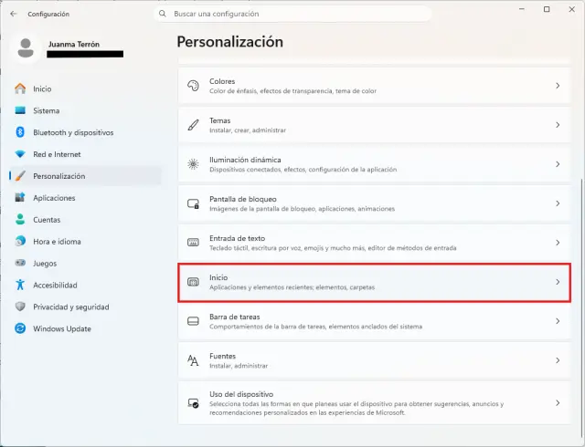
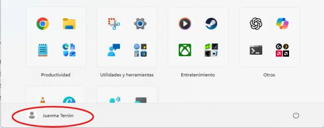

Windows 11 muestra el nombre y la foto de perfil de la cuenta en la zona inferior del menú Inicio. Para quien graba tutoriales, comparte pantalla en videollamadas o publica contenido desde el PC, esos datos personales pueden acabar apareciendo en pantalla sin querer. Desde la actualización KB5120998, Microsoft incluye un ajuste que oculta ambos elementos del menú Inicio sin borrar la foto, sin cambiar el nombre de la cuenta y sin crear otro usuario.

Esta guía explica cómo activar la opción de ocultar el nombre y la foto de perfil en el menú Inicio de Windows 11 y qué hay que tener en cuenta si todavía no aparece en el equipo.

## Requisitos previos

- Un equipo con Windows 11 en versión 24H2 o 25H2.
- Tener instalada la actualización KB5120998 (compilaciones 26100.9278 para 24H2 y 26200.9278 para 25H2).
- Ten en cuenta que Microsoft distribuye esta novedad mediante un despliegue gradual: aunque el equipo esté actualizado, la opción puede tardar en aparecer.

## Pasos

### 1. Abrir Configuración

Abre la aplicación **Configuración** de Windows 11.

### 2. Entrar en Personalización y luego en Inicio

Dentro de Configuración, entra en el apartado **Personalización** y, desde ahí, selecciona **Inicio**.

### 3. Activar la opción de ocultar los datos del perfil

Localiza la opción **Ocultar tu nombre y foto de perfil en Inicio** y activa su interruptor. No hace falta recurrir al Registro, a PowerShell, a ViVeTool ni instalar aplicaciones de terceros: es un ajuste normal del sistema.

## Cómo verificar que el nombre y la foto quedaron ocultos

Abre el menú Inicio y mira la zona inferior: el nombre y la foto de perfil ya no se muestran directamente, y en su lugar aparece un avatar genérico. El efecto es inmediato y la cuenta sigue funcionando exactamente igual: el icono conserva el acceso a las opciones del usuario.

Al pulsar sobre el avatar, el panel de la cuenta continúa mostrando los datos originales. El ajuste solo oculta el nombre y la imagen de la vista del menú Inicio; no elimina esa información del equipo.

## Advertencias y limitaciones

- **La opción puede no aparecer todavía.** Forma parte de la actualización preliminar KB5120998, publicada a finales de agosto, y Microsoft la distribuye de forma gradual. Si no la encuentras en Configuración, no significa que las instrucciones sean incorrectas ni que Windows tenga un problema: la función puede tardar en llegar mientras se amplía el despliegue.
- **No es una función de protección de la cuenta.** No borra la información personal ni la elimina del PC; solo la retira de la vista del menú Inicio. Quien abra el panel de la cuenta seguirá viendo los datos originales.
- **No cambia nada más del perfil.** El nombre de la cuenta, la foto y el resto de opciones del usuario quedan intactos.

Si además necesitas preparar el equipo para una instalación limpia antes de compartirlo o grabar con él, consulta la guía para [crear un USB de arranque de Windows 11 con la Media Creation Tool](/noticias/windows-11-bootable-usb/).
