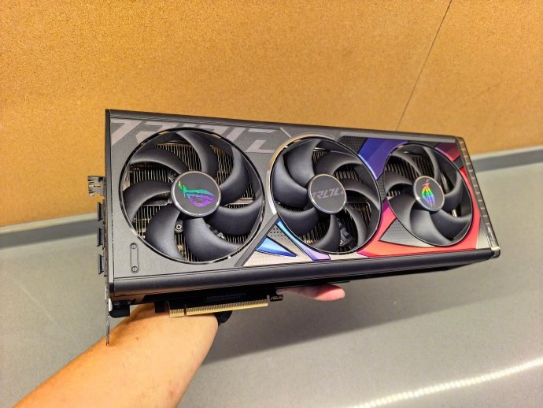

La escalada de precios de la memoria RAM ha cambiado por completo la forma de comprar un PC. Según recoge MyDrivers a partir de la experiencia del bloguero Han Lu, la empresa donde trabaja ha pasado de equipar sus ordenadores de oficina con un mínimo de 64 GB de memoria hace dos años a comprar los equipos básicos nuevos con solo 16 GB, por el coste disparado de la memoria.

## De 64 GB a 16 GB: la memoria RAM recorta el PC de oficina

Hace dos años, con los precios de la memoria, los SSD y las gráficas en niveles bajos, el estándar mínimo en esa compañía eran 64 GB de RAM incluso en los puestos de oficina. El propio Han Lu cuenta que por entonces reutilizaba hardware antiguo de la empresa para montar equipos aprovechables que regalaba a amigos y colegas, sin que nadie le diera mayor importancia.

La situación actual es la contraria: en el último año son muchos quienes le piden hardware usado, porque todos los componentes se han revalorizado. Dentro de esa subida, la memoria, las unidades de estado sólido y las tarjetas gráficas son lo que más se ha encarecido, con algunos modelos multiplicando su precio entre cinco y ocho veces. El resultado es que el presupuesto solo alcanza para 16 GB en un PC de oficina nuevo, una cantidad ajustada para ofimática básica que se queda corta en multitarea exigente, edición de material audiovisual o ejecución de IA en local.

## La lógica de compra se ha invertido

Antes, al montar un equipo se elegían primero el procesador y la tarjeta gráfica, y con el resto del presupuesto se completaban la memoria y el almacenamiento. Ahora el orden se ha dado la vuelta: hay que reservar primero el dinero para la memoria y el SSD, y con lo que queda se eligen los demás componentes.

Las cifras que maneja la fuente ilustran el deterioro: un kit de 64 GB de memoria ronda actualmente los 7.000 yuanes, casi la mitad del presupuesto de un sobremesa de gama media-alta, y un equipo de 10.000 yuanes ofrece hoy un rendimiento comparable al de uno de 5.000 yuanes de hace dos años. El autor resume el momento con ironía: que hoy alguien te regale un ordenador es una muestra de aprecio sincero.

## Qué cambia para quien renueve su equipo en España

El caso describe una empresa china, pero la presión sobre los precios de la [memoria DDR5](/noticias/asus-am5-bios-cxmt-memory/) es global y afecta igual a pymes y usuarios domésticos en España: conviene revisar si los 16 GB, antes considerados el punto de partida holgado, bastan para el uso previsto durante toda la vida útil del equipo. Quien trabaje con muchas aplicaciones abiertas, edición o herramientas de IA en local debería priorizar la memoria desde el principio, aunque eso obligue a moderar otras partidas como ya hacen las empresas que describe la noticia. Y en el mercado de segunda mano, piezas que antes se regalaban entre conocidos hoy conservan un valor que compensa aprovechar.
