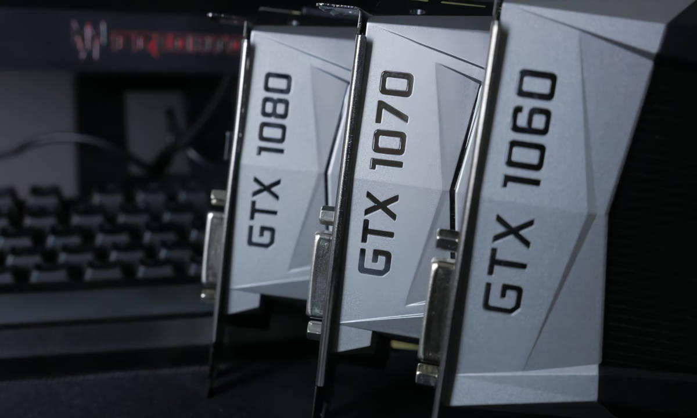
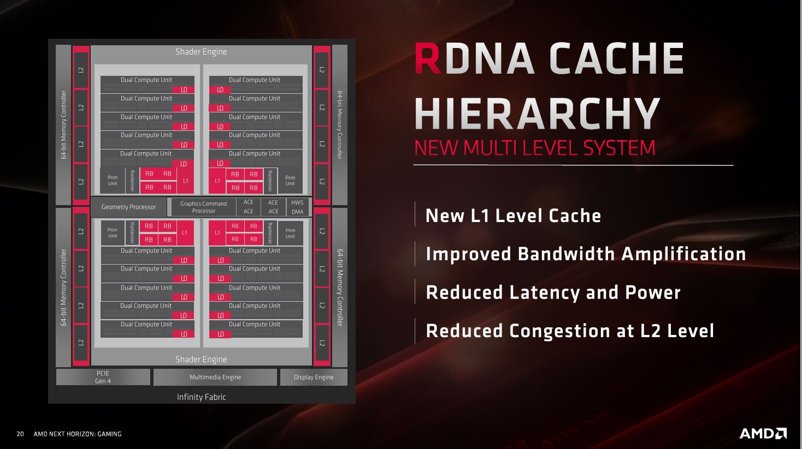
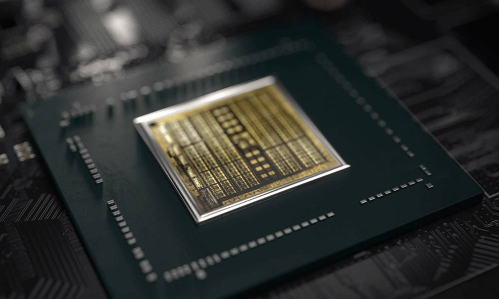
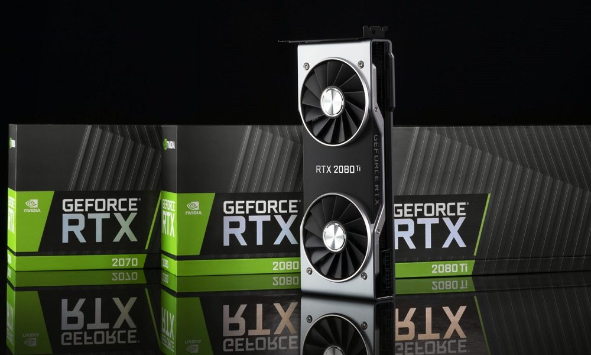
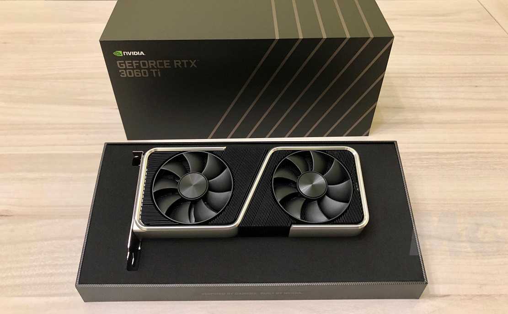
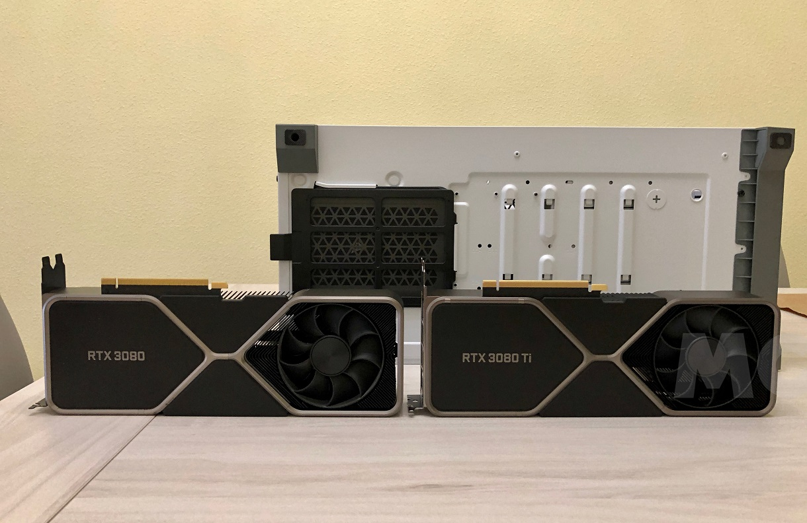
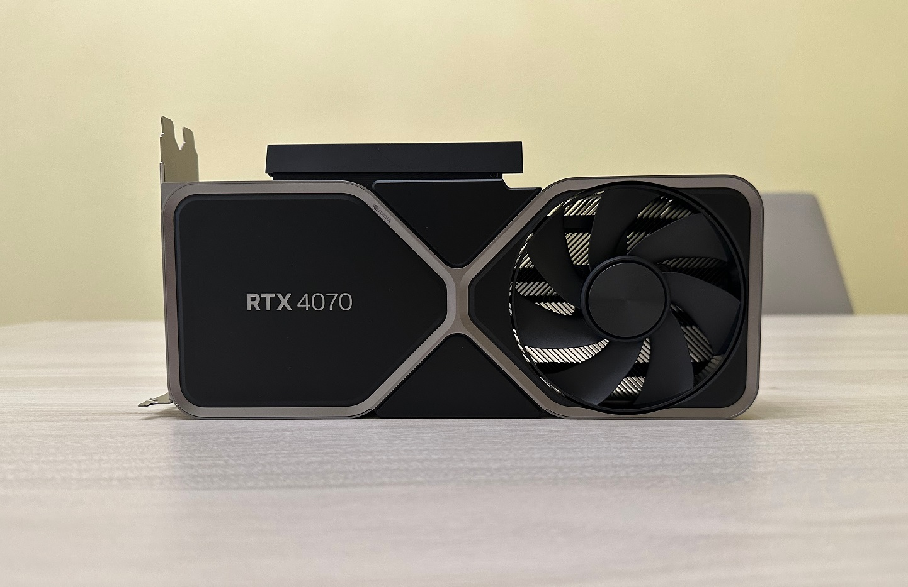
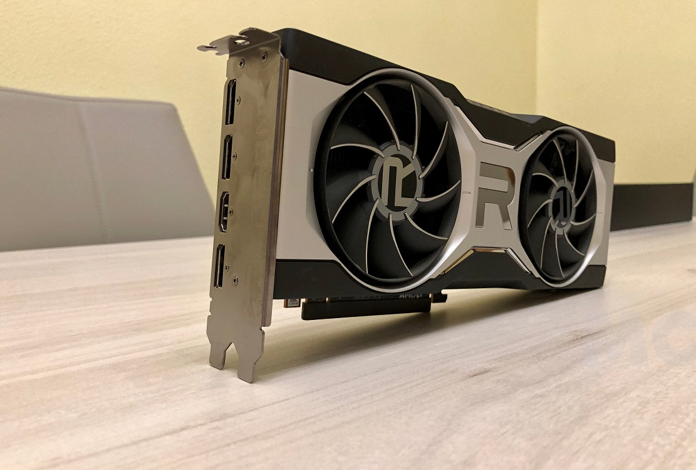
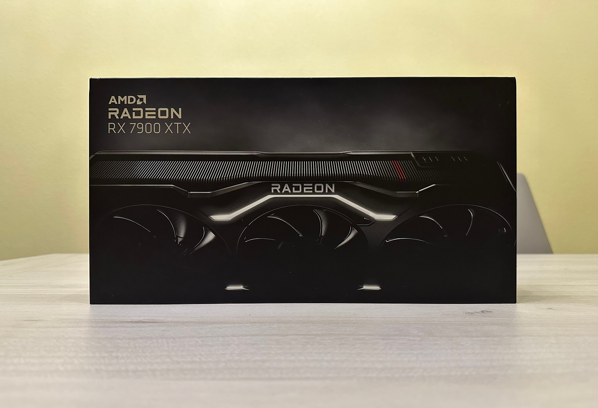

El encarecimiento de la memoria DRAM ha empujado al alza el precio de las tarjetas gráficas nuevas y ha dejado un mercado en el que cada vez cuesta más encontrar una buena relación precio-rendimiento. El ejemplo que cita MuyComputer en su guía es elocuente: una GeForce RTX 5060 que llegó a venderse por debajo de los 300 euros ahora supera los 400 euros. Ante este panorama, el mercado de segunda mano vuelve a ser una alternativa realista para quien quiera jugar sin arruinarse, aunque no cualquier GPU usada sirve.

Según ese mismo análisis, la situación no empezará a mejorar hasta finales de 2027 y, en el peor de los casos, hasta mediados de 2028, porque la recuperación de la DRAM será lenta. Esperar, por tanto, es una opción a largo plazo.

## Qué debe cumplir una tarjeta gráfica de segunda mano

Para que una tarjeta gráfica usada compense, la guía señala cinco condiciones:

1. No pertenecer a una generación obsoleta.
2. Soportar las tecnologías que hoy son un estándar básico.
3. Tener un precio ajustado tanto a su potencia como a la calidad del ensamblado.
4. Ofrecer rendimiento suficiente para lo que queremos jugar.
5. Estar en buen estado y, a ser posible, contar con garantía.

El precio y la calidad del modelo pesan tanto como la potencia bruta. Una RTX 3060 Ti Founders Edition por 200 euros es una buena compra; esa misma GPU a 250 euros en un ensamblado más modesto deja de serlo. En el extremo opuesto, una GTX 1060 de 6 GB por 50 euros no vale la pena: no mueve juegos exigentes actuales con garantías, ya no recibe controladores Game Ready y carece de hardware para acelerar trazado de rayos. Solo tendría sentido para títulos de la generación anterior, juegos actuales poco exigentes o como solución de emergencia hasta que el mercado mejore.

## Las generaciones que conviene descartar

### Radeon RX 5000 y anteriores

Los modelos altos de esta generación, como las RX 5700 y RX 5700 XT, todavía mueven juegos en 1080p con calidades altas e incluso máximas en algunos casos, pero arrastran carencias de arquitectura difíciles de salvar: no tienen hardware dedicado de trazado de rayos, así que títulos que lo exigen —DOOM: The Dark Ages, Indiana Jones and the Great Circle o Gears of War: E-Day— quedan fuera, y lo mismo ocurrirá con lanzamientos futuros que lo requieran. Tampoco soportan shaders mallados ni reescalado mejorado por IA, y su relación rendimiento-consumo es pobre frente a alternativas de precio parecido como la RX 6600. Los modelos anteriores a las RX 5000 llevan mucho tiempo sin actualizaciones de controladores.

### GeForce GTX 16 y anteriores

La GTX 1080 Ti, con sus 11 GB de memoria, sigue defendiéndose en 1080p, pero acusa el paso del tiempo. Las GTX 10 y anteriores no reciben soporte de controladores desde hace tiempo, carecen de hardware de trazado de rayos y de aceleración de IA y no soportan shaders mallados. Las GTX 16, basadas en Turing, sí admiten shaders mallados y otras funciones de DirectX 12, aunque de forma mucho más limitada que las RTX 20, y solo se lanzaron con 4 o 6 GB de memoria gráfica.

## Los modelos que sí merecen la pena

Si se encuentran a buen precio, en buen estado y con ensamblados acordes a lo que cuestan, estas son las familias que la guía considera interesantes en el mercado de segunda mano para jugar a títulos actuales.

### GeForce RTX 20

Han envejecido bien gracias a una arquitectura con núcleos de trazado de rayos y núcleos tensor para IA, soporte de DirectX 12 Ultimate y compatibilidad con DLSS 4.5 casi completa, con la generación de fotogramas como única excepción.

- **GeForce RTX 2070 SUPER**: rinde en potencia bruta como una RTX 3060 y sirve para jugar en 1080p sin sobresaltos. Precio máximo razonable: 130 euros.
- **GeForce RTX 2080 SUPER**: algo por debajo de la RTX 3060 Ti en bruto, sigue ofreciendo 1080p con calidades altas o máximas. Entre 150 y 160 euros.
- La RTX 2080 Ti queda fuera porque su precio de segunda mano está demasiado inflado.

### GeForce RTX 30

La arquitectura Ampere mantiene un rendimiento excelente en juegos actuales y se lleva mejor con motores modernos como Unreal Engine 5. Nvidia incluso decidió relanzar la RTX 3060 de 12 GB.

- **GeForce RTX 3060 Ti**: sus 8 GB no impiden que sea el requisito recomendado de muchos juegos exigentes; ajustando el consumo de memoria supera el nivel de PS5 y Xbox Series X. Lo ideal es pagar menos de 200 euros.
- **GeForce RTX 3080 de 10 GB**: gran potencia para 1440p, siempre que no se exceda la memoria disponible. Entre 300 y 340 euros.
- **GeForce RTX 3080 Ti de 12 GB**: sus 12 GB abren la puerta al 4K con un gasto razonable. Por debajo de 450 euros es una compra excelente.
- La RTX 3070 (hasta 250 euros) y la RTX 3090 (por debajo de 700 euros) también valdrían la pena, aunque esos precios son difíciles de ver.

### GeForce RTX 40

No son tarjetas «viejas», pero la guía las incluye por su presencia en el mercado de segunda mano. Suponen un salto grande en potencia y eficiencia frente a las RTX 30, admiten generación de fotogramas y son más recomendables si la fuente de alimentación es modesta. El problema es que muchos vendedores piden más de lo que costaban nuevas.

- **GeForce RTX 4060**: buen 1080p, bajo consumo y DLSS 4.5 con generación de fotogramas. Hasta 200 euros.
- **GeForce RTX 4070**: rinde muy bien en 1440p, con consumo contenido y 12 GB que permiten incluso 4K ajustando calidad. Hasta 400 euros.
- **GeForce RTX 4080 SUPER**: cómoda en 4K y una de las que menos se ha inflado. Entre 900 y 1.000 euros.

### Radeon RX 6000

La arquitectura RDNA 2 no ha envejecido bien en trazado de rayos ni en IA aplicada al gaming, pero aguanta el tipo en rasterización, soporta DirectX 12 Ultimate y recibirá FSR 4 el año que viene. Los modelos más potentes, como las RX 6800 XT y RX 6900 XT, están demasiado inflados.

- **Radeon RX 6600**: casi al nivel de una RTX 2070 con menos consumo, ideal para 1080p. Por debajo de 120 euros.
- **Radeon RX 6700 XT**: rinde en raster como una RTX 3060 Ti y suma 12 GB de VRAM, lo que marca diferencias en 1440p. Entre 200 y 220 euros.
- **Radeon RX 6800**: 16 GB de GDDR6 para jugar en 4K ajustando calidad. Por debajo de 300 euros.

### Radeon RX 7000

Tampoco son «viejas», pero tienen bastante presencia en el mercado de segunda mano y sus precios también están inflados. Su trazado de rayos no llega al de las RTX 40, aunque su rasterización es excelente y han recibido FSR 4.1, un reescalado acelerado por hardware que hasta hace poco era exclusivo de las RX 9000. Eso ha revalorizado la generación.

- **Radeon RX 7800 XT**: rinde como una RTX 4070 y tiene 16 GB de VRAM; se defiende incluso en 4K. Entre 400 y 430 euros.
- **Radeon RX 7900 XT**: algo más rápida que la RX 9070 y con 20 GB de memoria, perfecta para 4K. Por debajo de 600 euros.
- **Radeon RX 7900 XTX**: superior a la RX 9070 XT en raster y con 24 GB, versátil para unificar trabajo y ocio. Por debajo de 1.000 euros.

### Resumen de precios objetivo

| Modelo | Precio objetivo | Uso |
| --- | --- | --- |
| GeForce RTX 2070 SUPER | Hasta 130 € | 1080p |
| GeForce RTX 2080 SUPER | 150-160 € | 1080p |
| GeForce RTX 3060 Ti | Menos de 200 € | 1080p |
| GeForce RTX 3080 (10 GB) | 300-340 € | 1440p |
| GeForce RTX 3080 Ti (12 GB) | Menos de 450 € | 4K |
| GeForce RTX 4060 | Hasta 200 € | 1080p |
| GeForce RTX 4070 | Hasta 400 € | 1440p |
| GeForce RTX 4080 SUPER | 900-1.000 € | 4K |
| Radeon RX 6600 | Menos de 120 € | 1080p |
| Radeon RX 6700 XT | 200-220 € | 1440p |
| Radeon RX 6800 | Menos de 300 € | 4K |
| Radeon RX 7800 XT | 400-430 € | 4K |
| Radeon RX 7900 XT | Menos de 600 € | 4K |
| Radeon RX 7900 XTX | Menos de 1.000 € | 4K |

## Qué cambia para el comprador

No corren buenos tiempos para estrenar tarjeta gráfica: la subida de precios también se ha dejado notar en China, donde los fabricantes han vuelto a ajustar tarifas [por el giro de Nvidia hacia la IA](/noticias/gpu-prices-china-rise/). La crisis de memoria tampoco se resolverá de un día para otro, como recordó [el CEO de Acer al descartar un escenario catastrófico hasta 2030](/noticias/acer-ceo-ram-crisis/).

En ese contexto, el mercado de segunda mano ofrece margen, pero exige criterio: comprobar el ensamblado, confirmar que la tarjeta no pertenece a una generación sin soporte y no pagar de más por modelos con precios inflados. Y si el equipo anfitrión es antiguo, conviene recordar que [la ranura PCIe no es motivo para cambiar de plataforma](/noticias/gpu-legacy-pcie-slot/): el cuello de botella suele estar en otras piezas.
