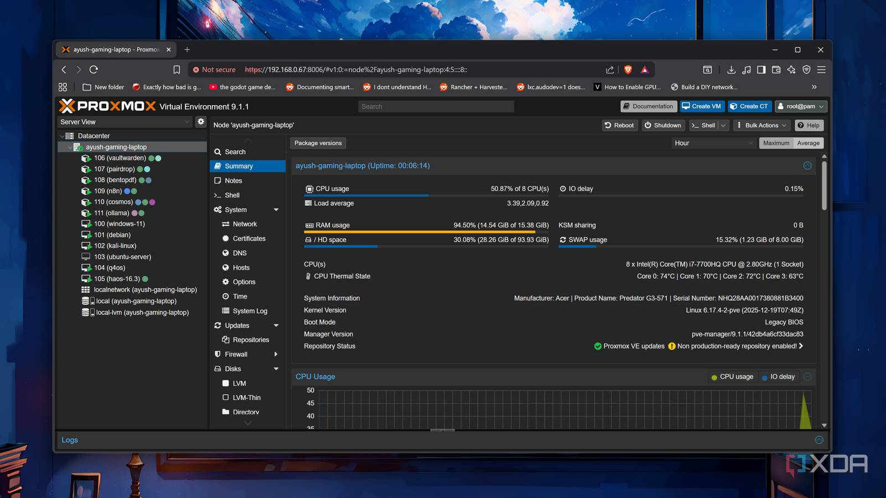
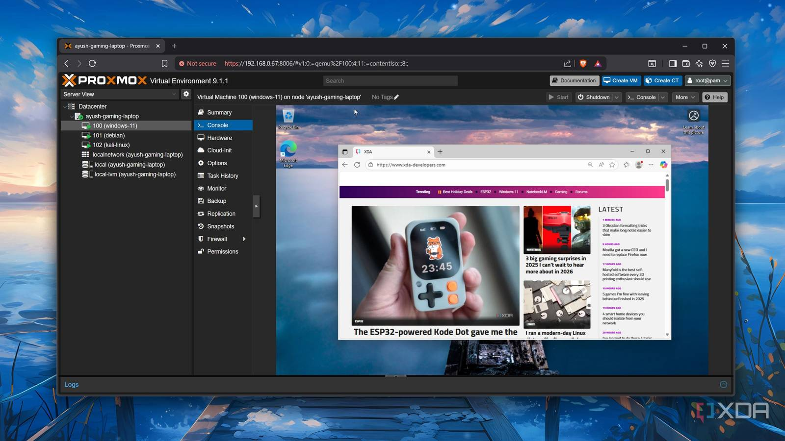
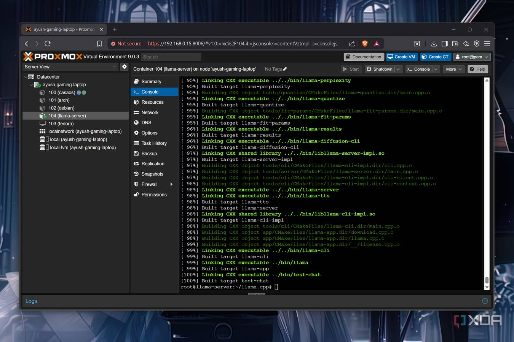
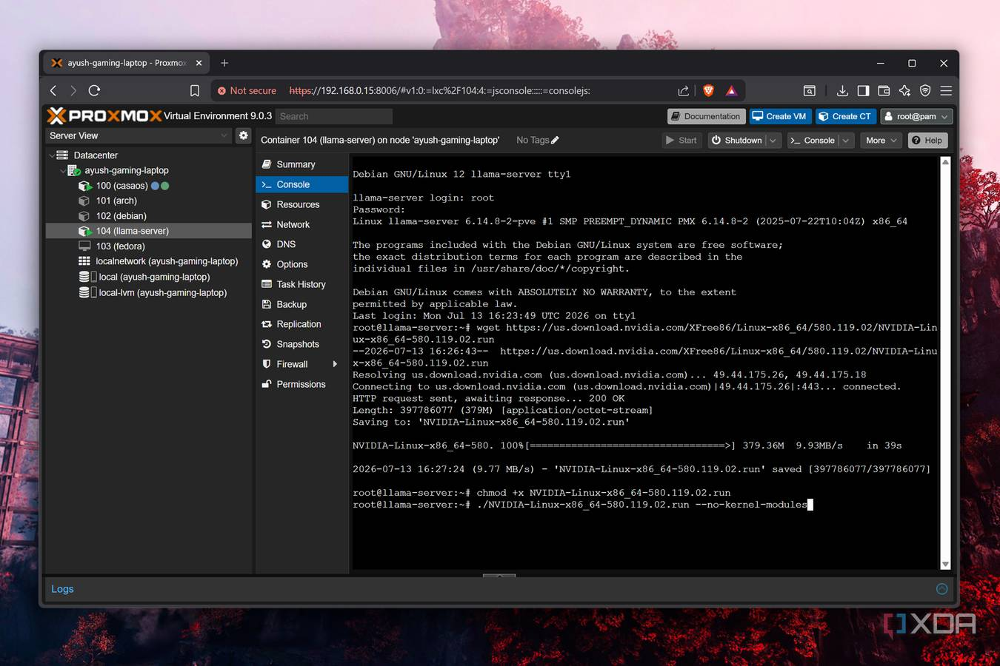
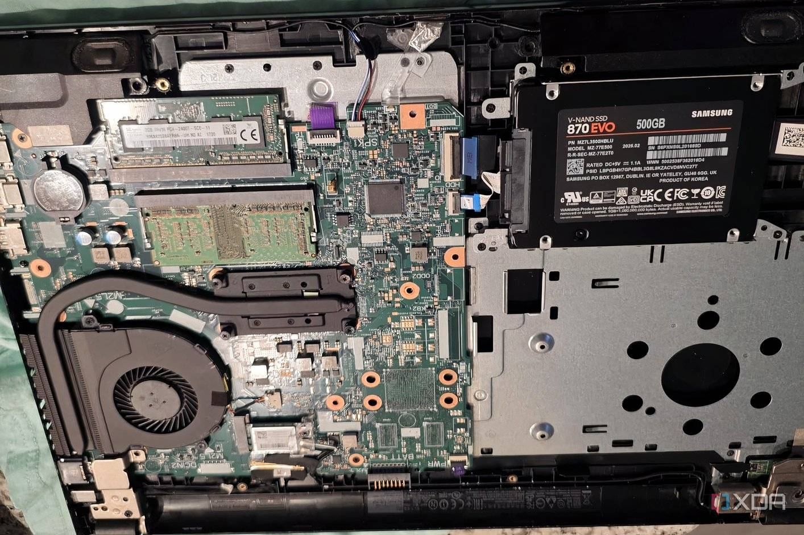
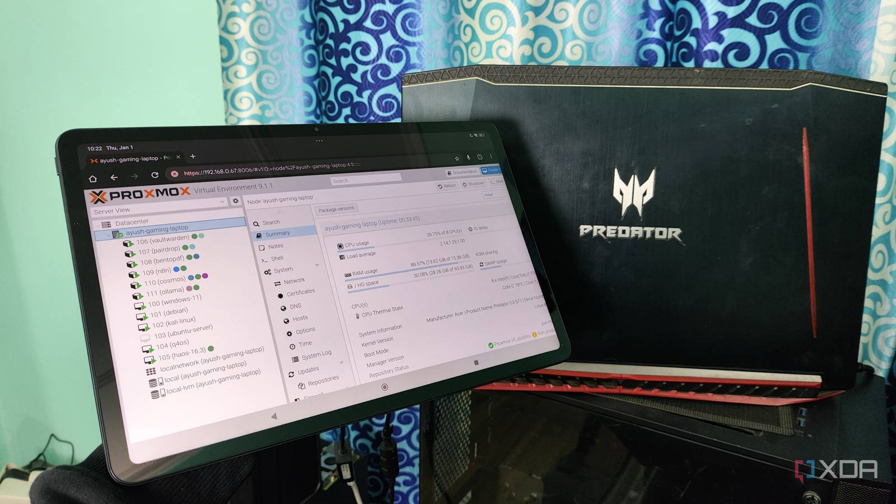
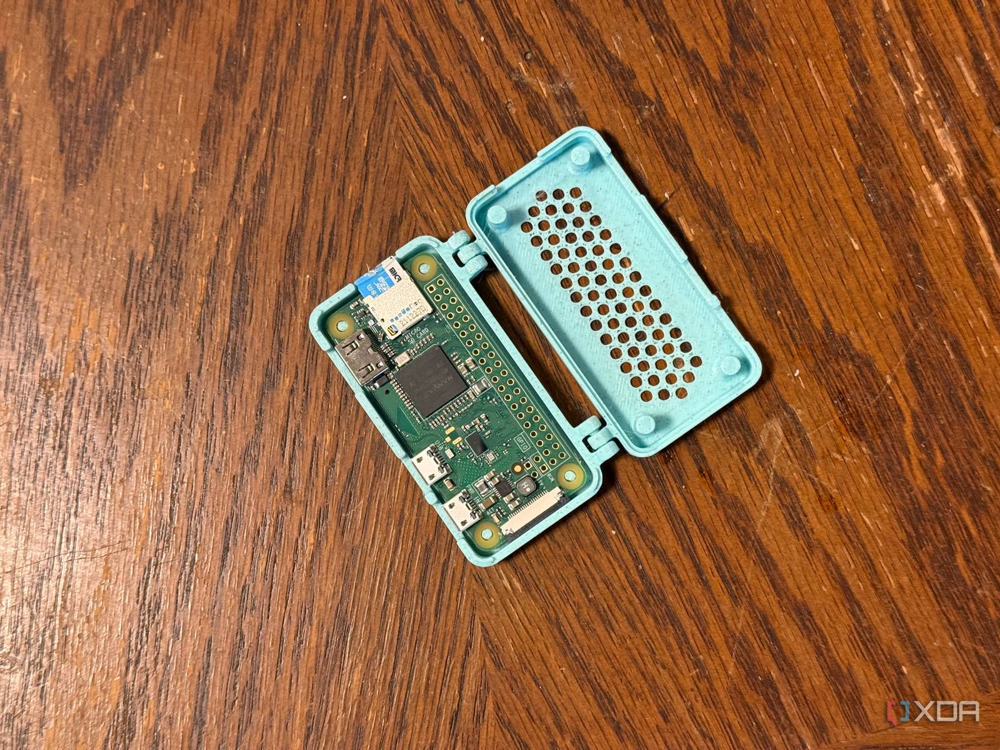

Durante años, la Raspberry Pi fue la puerta de entrada natural al servidor doméstico: barata, silenciosa y con una comunidad enorme detrás. Ese consenso se está resquebrajando. Según el análisis publicado por XDA Developers, el repunte de precios de la memoria RAM ha disparado el coste de casi todas las placas SBC de la familia —salvo la veterana Raspberry Pi Zero—, y con ello se ha vuelto más sensato rescatar un portátil antiguo que comprar una placa nueva con sus accesorios. El ahorro es el argumento más obvio, pero no el único.

## Una Raspberry Pi ya no es la opción barata

El autor del artículo, Ayush Pande, sostiene que el problema de las Raspberry Pi modernas va más allá del precio. La Raspberry Pi 5, por ejemplo, llegó en 2023 con un SoC Broadcom BCM2712 que integra núcleos Arm Cortex-A76, un diseño de 2018: para un lanzamiento de esa fecha, una base de cómputo notablemente antigua.

A eso se suma el coste de la arquitectura ARM en el terreno del *self-hosting*. Instalar la imagen ARM de Proxmox en una Raspberry Pi exige ciertos apaños, y su rendimiento queda lejos de lo deseable. En el frente NAS, OpenMediaVault es prácticamente la única opción que funciona sin sobresaltos, mientras que el port comunitario de TrueNAS arrastra limitaciones importantes. Plataformas habituales en cualquier home lab, como XCP-ng o Unraid, sencillamente no están soportadas.

Docker en una Raspberry Pi sigue siendo un caso de uso perfectamente válido. El problema aparece cuando se quieren desplegar máquinas virtuales completas, y ahí un portátil x86 parte con ventaja estructural.

## Lo que gana un portátil reciclado

El propio autor pone su caso sobre la mesa: un Acer Predator Helios 300 de 2017 que sigue funcionando como servidor. Ese equipo, ya veterano, mueve varias máquinas virtuales a la vez —incluida una instancia de Windows 11— y además aprovecha su tarjeta gráfica con llama.cpp para ejecutar modelos de lenguaje locales cuando su equipo principal está ocupado.

El almacenamiento es otro punto decisivo. Las tarjetas microSD, cómodas para proyectos ligeros, tienen una resistencia a la escritura limitada, lo que las convierte en un mal compañero para tareas intensivas. La alternativa —un SSD externo o una unidad NVMe conectada mediante un HAT— encarece todavía más la factura. Un portátil de los últimos años, en cambio, ya incorpora su propia unidad SSD, y los modelos antiguos suelen añadir espacio para un segundo disco de 2,5 pulgadas. A esto se suma una distribución de puertos que, en la práctica, supera a la de una Raspberry Pi típica.

Hay también una ventaja de mantenimiento que a menudo se pasa por alto. Un servidor headless basado en Raspberry Pi funciona bien hasta que algo se rompe y no se puede arreglar por SSH: en ese momento hay que buscar teclado, ratón y monitor para diagnosticar el problema. Un portátil lleva pantalla, teclado y touchpad integrados, así que basta con abrirlo para acceder al sistema.

## Los riesgos que conviene controlar

Reciclar un portátil como servidor 24/7 no está exento de trampas, y el artículo las señala con claridad. La primera es la tentación de cerrar la tapa para dejar el equipo "recogido": la mayoría de los portátiles tienen las rejillas de ventilación junto a la bisagra, de modo que mantenerla cerrada obstruye el flujo de aire. En el peor de los casos, el calor puede acabar dañando el teclado, la pantalla y los componentes internos.

La segunda es la batería. Aunque parezca un sistema de alimentación ininterrumpida improvisado, mantener el portátil enchufado de forma permanente al 100 % desgasta la celda y con el tiempo puede convertirse en un riesgo de seguridad. Lo ideal, apunta el autor, es retirarla por completo; cuando no es posible, ciertos ajustes de BIOS e incluso automatizaciones de Home Assistant permiten limitar el nivel de carga y alargar su vida útil.

## Cuándo sigue ganando la Raspberry Pi

Sería un error leer este análisis como una condena de las placas SBC. Hay escenarios en los que una Raspberry Pi sigue siendo la elección correcta: cualquier proyecto que dependa de conectividad GPIO no es viable en un portátil sin accesorios especializados, y en consumo energético ninguna máquina x86, por eficiente que sea, compite con una placa ARM de bajo perfil. El propio autor reserva la Raspberry Pi Zero para proyectos ligeros donde la eficiencia pesa más que cualquier otra cosa, y recurre a microcontroladores ESP32 y Raspberry Pi Pico para experimentos con sensores.

La conclusión práctica para quien esté montando un home lab es sencilla: antes de comprar una placa nueva, conviene mirar el cajón de los portátiles retirados. Para virtualización, almacenamiento y servicios pesados, un equipo viejo con x86 ofrece hoy más recorrido por menos dinero; para sensores, bajo consumo y proyectos de electrónica, la Raspberry Pi —sobre todo la Zero— mantiene su trono. La decisión no es ideológica, sino de encaje: cada plataforma brilla en un terreno distinto, y el error es tratar a cualquiera de las dos como solución universal.
