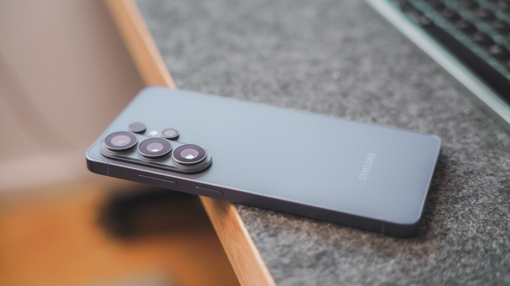
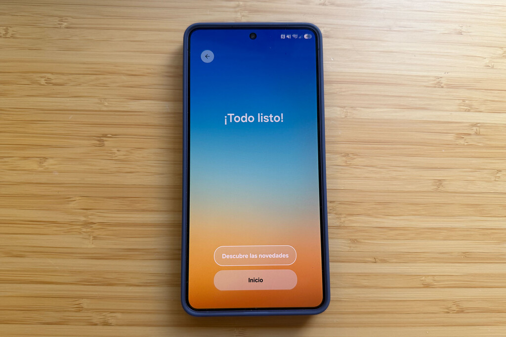
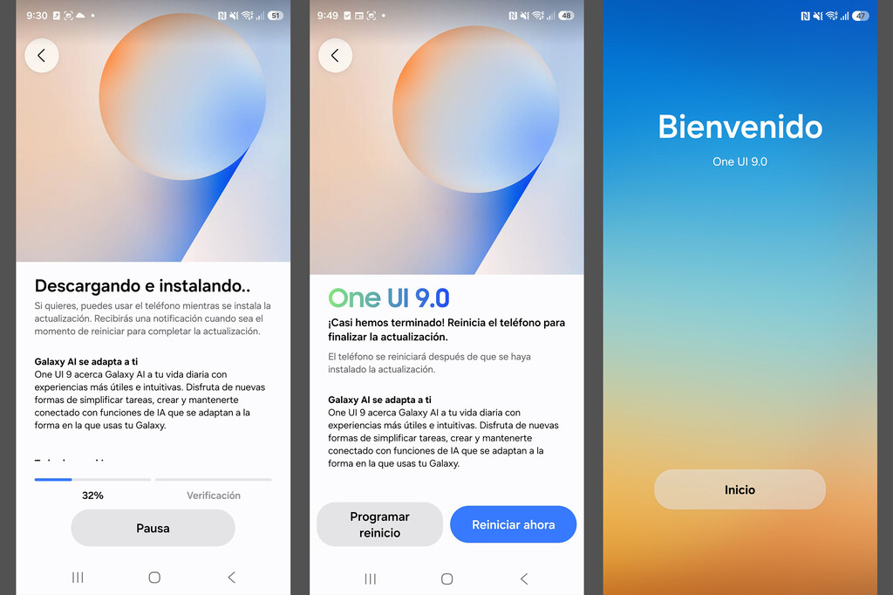
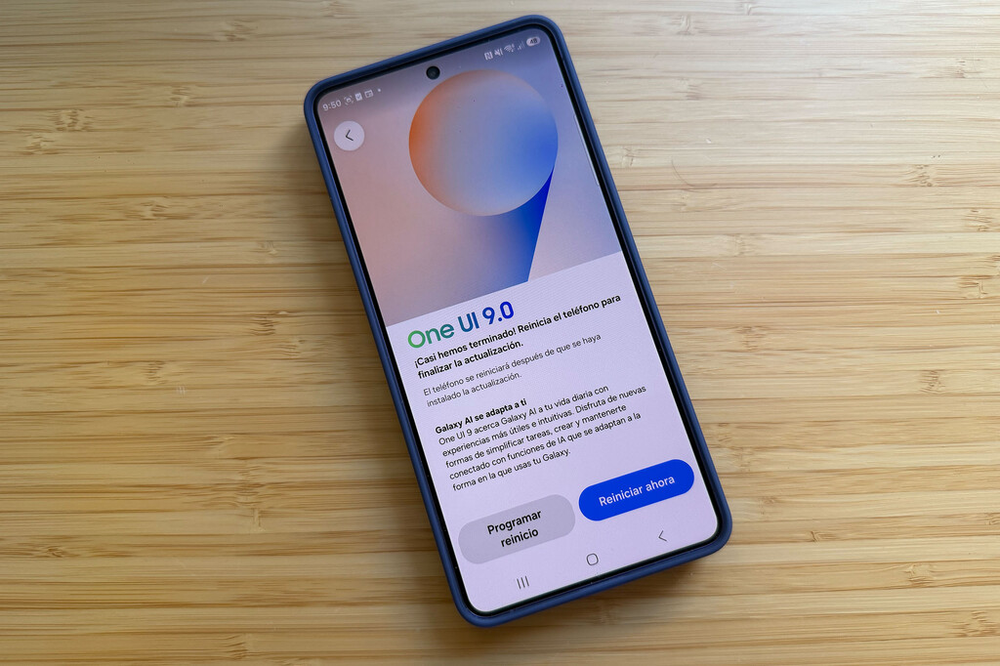

One UI 9, la capa de personalización de Samsung sobre Android 17, deja de estar reservada a Corea del Sur y Estados Unidos: el 29 de septiembre el paquete estable comenzó a repartirse en Europa, con el Galaxy S26, el Galaxy S26+ y el Galaxy S26 Ultra como primeros destinatarios del continente. El despliegue no es un experimento aislado, sino la continuación del rollout oficial que Samsung anunció el 16 de septiembre, después de abrir la versión estable en sus dos mercados prioritarios y de aplazar levemente la fecha que había previsto.

## One UI 9 llega a Europa con Android 17

El paquete que circula por Europa (y también por la India) llega bajo la compilación **S94xBXXU4BZI6** e incluye el parche de seguridad de septiembre de 2026. Como ocurre habitualmente con las actualizaciones mayores de Samsung, la primera oleada está reservada a quienes participaron en el programa de beta: los servidores se validan con esos equipos antes de abrir la descarga a todo el mundo.

Se trata de un salto de versión de verdad, no de una actualización menor: One UI 9 corre sobre **Android 17**, mientras que One UI 8.5 y One UI 8 seguían sobre Android 16. One UI 9 estrenó la versión estable en los plegables Galaxy Z Fold8 Ultra, Z Fold8 y Z Flip8, y sobre esa base Samsung amplió el reparto a la gama Galaxy S26.

El calendario de los próximos días es el siguiente: la descarga se irá completando durante las primeras semanas de octubre, tanto en terminales libres de fábrica como en las versiones gestionadas por operadoras, y una vez asentada la familia S26 el foco pasará a la serie Galaxy S25, a los plegables y a los escalones intermedios de la familia Galaxy A. Es decir, si tu Galaxy no es un S26, todavía te toca esperar, pero la cola ya está en marcha.

## Qué incluye One UI 9: IA, seguridad y utilidades

Samsung presenta One UI 9 como una versión centrada en hacer menos trabajo al usuario. En el apartado de inteligencia artificial destaca **Now Nudge**, que ofrece sugerencias según el contexto —por ejemplo, guardar una ubicación o una reserva mientras conversas por mensajería—, y **Estudio Creativo**, que propone imágenes ligadas a eventos próximos, como un cumpleaños. El **Intérprete** incorpora una vista de hilos para seguir las conversaciones traducidas sin perder el hilo y mejora su comportamiento con los auriculares Galaxy Buds.

También mejoran herramientas más cotidianas: el **escáner de documentos** digitaliza páginas curvadas o dobladas y elimina los dedos que aparecen en la foto; la **grabadora de voz** resume lo grabado con encabezados y tablas; **My FanCam** mantiene centrado a la persona que elijas mientras grabas; y el **resumen de llamadas** presenta los datos de la conversación en curso en forma de tarjetas, sin necesidad de salir de la pantalla de llamada. A esto se suma la priorización de notificaciones por IA, que antepone las alertas importantes al resto.

En seguridad, One UI 9 introduce el **Security Brief** dentro de Now Brief, con avisos sobre malware, aplicaciones de origen desconocido y permisos innecesarios; los **Privacy Alerts**, que usan la IA del propio teléfono para detectar accesos sospechosos; y una **detección de estafas** que llega a más países e idiomas. Entre las funciones generales figuran el **bloqueo seguro** (que exige PIN, contraseña o patrón tras activarse desde el panel rápido), la activación de Bixby hablando con el teléfono en la oreja y **Garantía y cuidado**, que reúne los datos de garantía, el diagnóstico del equipo, una estimación del coste y el tiempo de una reparación y la gestión de Samsung Care+.

Un matiz que conviene tener presente: no todas las funciones de IA llegarán a todos los Galaxy. Las novedades más completas se dirigen, como mínimo, a los modelos más recientes de las series S y Z, de modo que un equipo de gama media recibirá One UI 9 sin el mismo reparto de novedades.

## Cómo actualizar tu Galaxy a One UI 9

Si tienes uno de los Galaxy S26, comprobar si el paquete ya está disponible para tu terminal solo lleva unos segundos:

1. Entra en **Ajustes** del teléfono.
2. Baja hasta **Actualización de software**.
3. Toca **Descargar e instalar** (o «Buscar actualizaciones»).

Antes de dar «inicio» conviene tener cubiertas tres casillas, porque el salto de sistema operativo es grande: el archivo supera los 4 GB, así que la descarga debe hacerse sobre una red Wi-Fi estable; hace falta al menos un 30 % de batería, con el teléfono cargando si es posible; y merece la pena hacer una copia de seguridad de fotos y conversaciones por si la instalación se interrumpe.

Cuando la actualización termine, la pantalla de bienvenida de One UI 9.0 dará paso al escritorio con las novedades ya instaladas.

Y si tu equipo aún no aparece en la lista, ten en cuenta que el reparto es escalonado: hasta ahora One UI 9 solo se había probado en programas de pruebas concretos, como la [beta de One UI 9 para el Galaxy A16](/noticias/galaxy-a16-one-ui-9/) o la [beta de One UI 9 para el Galaxy A54](/noticias/galaxy-a54-one-ui-9/), y esa misma cola es la que ahora avanza hacia el resto de la gama.

