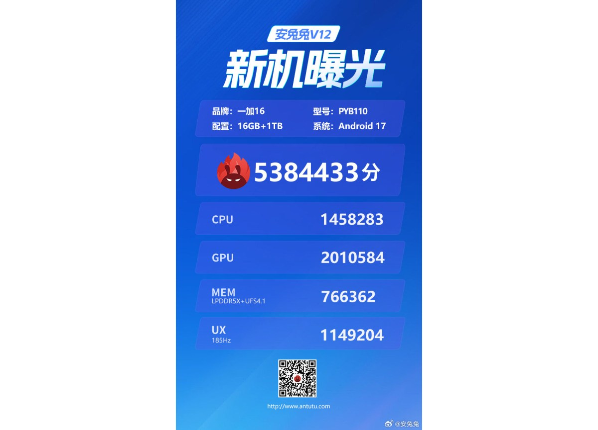

OnePlus ha ido dosificando las claves del OnePlus 16, que se presentará en China el próximo octubre. Después de confirmar detalles de su pantalla y su chipset, la compañía ha desvelado ahora las especificaciones de su cámara y los nuevos modos profesionales de imagen. El conjunto apunta a un salto considerable respecto al OnePlus 15 en materia fotográfica.

## Una cámara principal de 200 MP

El OnePlus 16 contará con un sensor principal de 200 megapíxeles, de formato 1/1.4 pulgadas y apertura f/1.6. Lo acompañan un teleobjetivo periscópico de 50 MP con zoom óptico 3x y zoom sin pérdida 6x, además de un ultra gran angular de 50 MP con un campo de visión de 116 grados. La cámara frontal también sube a 50 MP e incorpora autofoco.

El cambio de enfoque frente al OnePlus 15 es notable: aquel modelo recurría a tres sensores traseros de 50 MP, mientras que ahora OnePlus apuesta por un sensor principal mucho más grande y por opciones de disparo que otorgan al usuario más control sobre el resultado final.

## Tres modos de imagen con más control

La marca ha confirmado tres modos nuevos para el teléfono:

- **Master Mode**: busca un aspecto inspirado en el cine, con una representación más natural de la luz.
- **High-Pixel Mode**: prioriza el máximo detalle y la nitidez de la imagen.
- **Modo panorámico 65:24**: adopta un formato mucho más ancho para una presentación de aire cinematográfico.

## Rendimiento y autonomía: lo que ya se sabe

El OnePlus 16 apareció en AnTuTu con una puntuación de 5.384.433 puntos. La configuración probada montaba el Snapdragon 8 Elite Extreme Gen 6 —el chip de 2 nm que [Qualcomm presentó hace unos días](/noticias/qualcomm-snapdragon-8-elite-extreme-gen-6-oficial/)— junto a 16 GB de RAM LPDDR5X, 1 TB de almacenamiento UFS 4.1 y ColorOS 17 sobre Android 17. La prueba también identificó una pantalla con una tasa de refresco de 185 Hz, aunque OnePlus ya confirmó que el sistema funciona de forma global a 165 Hz, por lo que esos 185 Hz probablemente se reserven a juegos concretos.

Conviene tomar la cifra con cautela, porque procede de una ejecución preliminar sobre un prototipo. En autonomía, la información disponible apunta a una batería de 9.000 mAh, mientras que la certificación china 3C ha confirmado compatibilidad con carga por cable de 100 W. Se espera además que mantenga la carga inalámbrica de 50 W de su predecesor, esta vez con una capacidad muy superior.

## Qué cambia para el comprador

El OnePlus 16 se perfila como una evolución centrada en tres frentes: fotografía, potencia y autonomía. Pasar de tres sensores de 50 MP a un principal de 200 MP no solo cambia la ficha técnica, sino el tipo de foto que el teléfono puede capturar con poca luz y cuánto margen de recorte ofrece después. Los modos Pro añaden ese control manual que hasta ahora quedaba reservado a la gama más alta.

La presentación está prevista para octubre en China, y el fabricante aún no ha confirmado su disponibilidad ni su precio en otros mercados. Para quien esté pensando en renovar el móvil, la recomendación sigue siendo la de siempre: esperar a las pruebas independientes del modelo final antes de dar por buenas las cifras prometidas.
