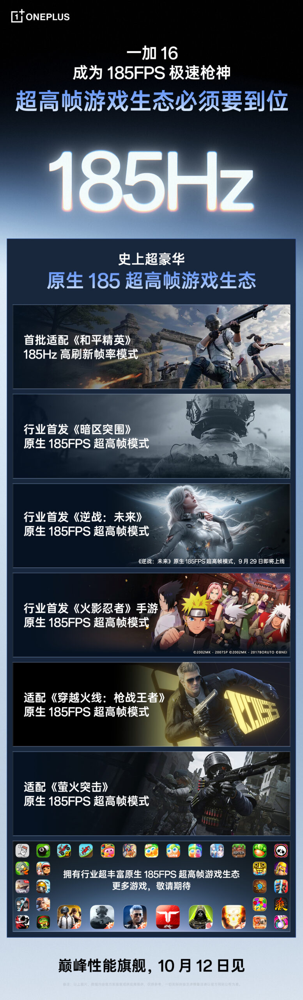

El OnePlus 16 ya tiene fecha de presentación: el presidente de OnePlus en China, Li Jie Louis, confirmó en Weibo que el nuevo buque insignia se desvelará el 12 de octubre. El anuncio llegó durante la Conferencia de Juego de OnePlus de 2026, donde la compañía detalló tres grandes tecnologías de juego desarrolladas para su próximo teléfono.

## Un núcleo de juego que coordina todo el hardware

La principal novedad del OnePlus 16 es el nuevo núcleo de juego Fengchi, que según OnePlus coordina por primera vez los recursos de hardware de todo el dispositivo. La compañía afirma que esto permite que los juegos con soporte nativo de 185 FPS mantengan su tasa máxima de fotogramas durante periodos prolongados, con la idea de mejorar el rendimiento sostenido sin necesidad de cambiar de chipset.

## Tres chips propios y una pantalla de 185 Hz

La otra gran apuesta es un nuevo sistema de tres chips para eSports desarrollado por la propia compañía, que se encarga del procesamiento de red, de la respuesta táctil y de la pantalla. OnePlus promete mejoras en la estabilidad de la conexión, en la capacidad de respuesta del táctil y en la claridad visual. El teléfono incorporará además una pantalla de 185 Hz, en línea con su enfoque en el juego a alta tasa de refresco.

## Juegos a 185 FPS y resto del equipo del OnePlus 16

OnePlus asegura que el OnePlus 16 soportará desde su lanzamiento un amplio catálogo de juegos a 185 FPS nativos, con títulos confirmados como Peace Elite, Arena Breakout, Nizhan: Future y Naruto Mobile. La compañía también mostró su ventaja de respuesta en una prueba con diez dispositivos: según sus datos, el OnePlus 16 disparó y derrotó a los rivales primero cuando un brazo robótico controlaba todos los terminales bajo las mismas condiciones de red y de partida.

Más allá del juego, el terminal llegará con el Snapdragon 8 Elite Extreme Gen 6 y mantendrá la apuesta fotográfica con [la cámara principal de 200 megapíxeles ya confirmada](/noticias/oneplus-16-camara-200mp/), acompañada de un teleobjetivo periscópico de 50 megapíxeles. OnePlus ya ha adelantado varias opciones de color y configuraciones de memoria, y se esperan más detalles a medida que se acerque el evento del 12 de octubre.
