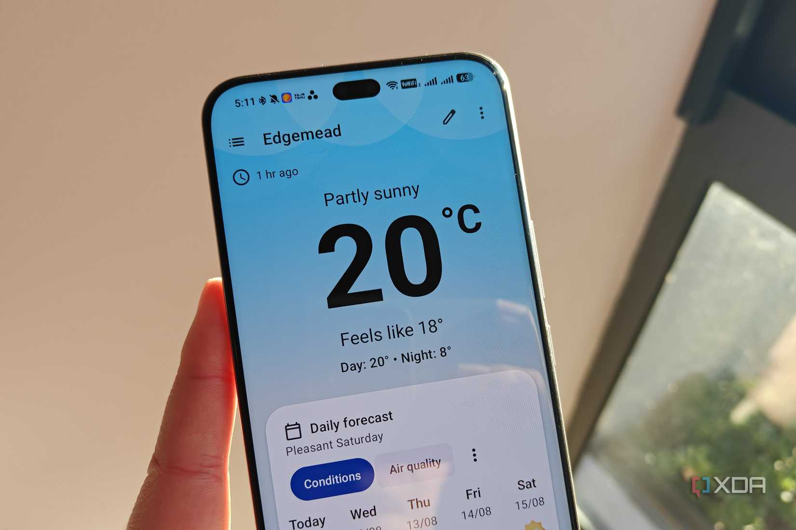
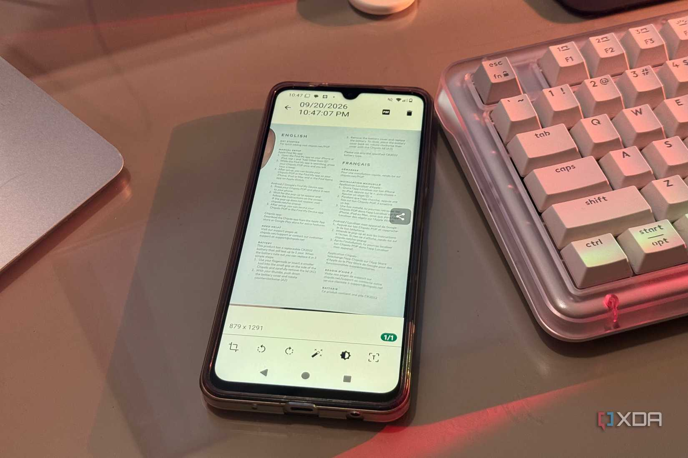
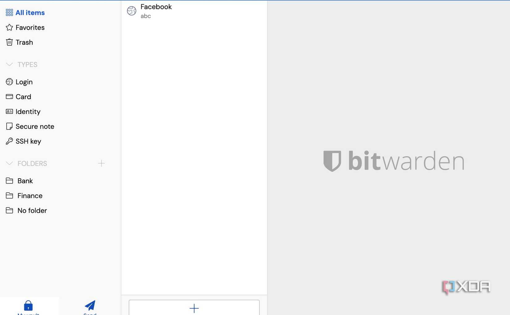
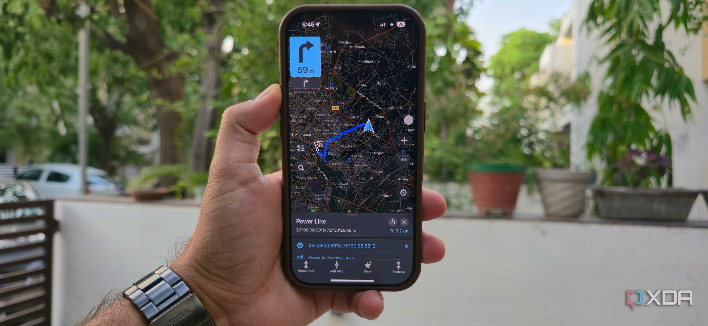
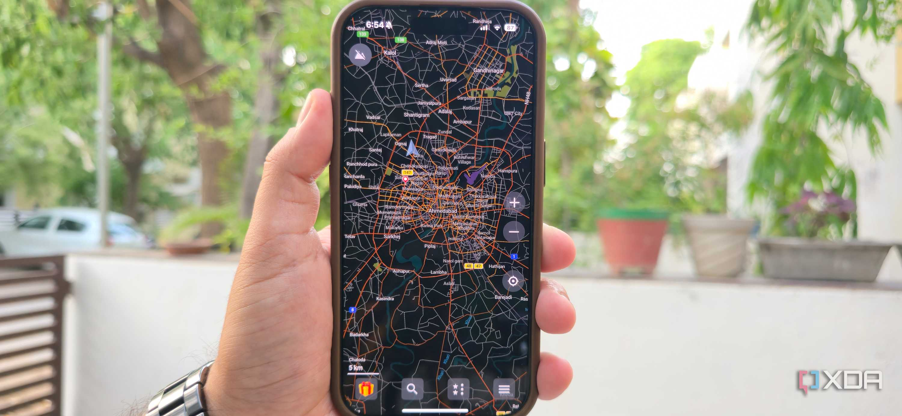
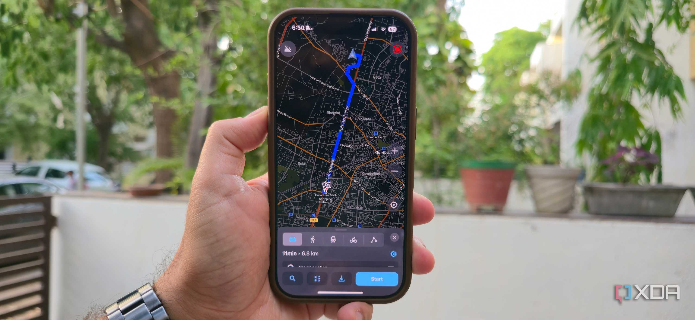
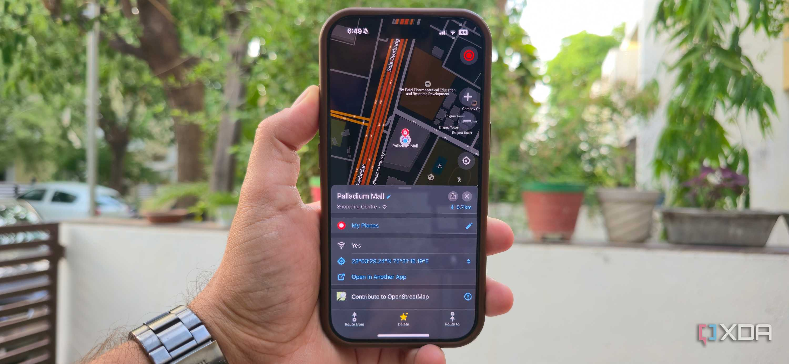
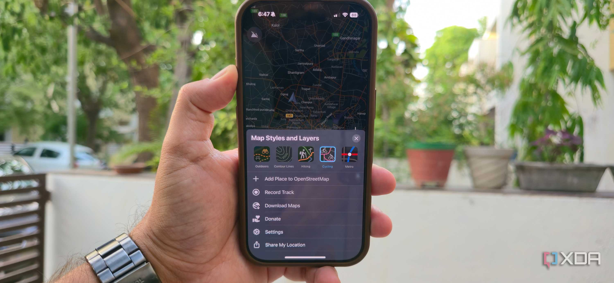
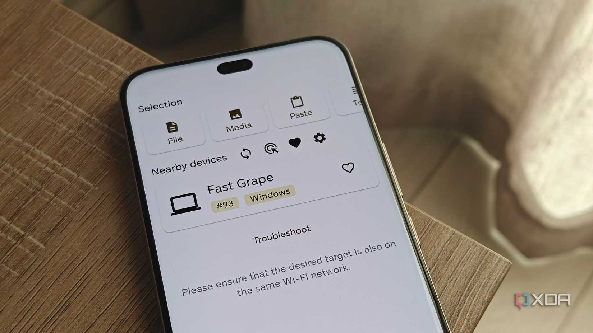

Las suscripciones se han convertido en la forma habitual de acceder incluso a funciones básicas del software, y cada vez es más común que una aplicación sencilla esconda lo útil detrás de un pago mensual. En ese contexto, la comunidad de código abierto sigue ofreciendo una alternativa para el ecosistema Android: aplicaciones mantenidas durante años, gratuitas y sin convertir cada función en una nueva cuota.

La periodista de XDA Mahnoor Faisal ha reunido cinco apps Android de código abierto que, según su propia experiencia, han sustituido por completo a sus rivales de masas. No son proyectos experimentales: son herramientas con funciones de sobra para el uso diario y, en varios casos, con más control sobre los datos que las opciones comerciales.

## Apps Android de código abierto que reemplazan al software de masas

La primera pareja de aplicaciones cubre dos necesidades cotidianas —saber qué tiempo hará y digitalizar un documento— sin anuncios ni planes de pago de por medio.

### Breezy Weather

Para Faisal, consultar si va a llover no debería implicar publicidad, suscripciones ni un flujo de noticias. Breezy Weather elimina todo eso: es gratuita, de código abierto y no incluye anuncios ni rastreadores.

Su rasgo más distintivo es que permite elegir de dónde proceden los datos meteorológicos. Admite más de 50 fuentes, entre ellas Open-Meteo, AccuWeather, OpenWeather y varios servicios meteorológicos nacionales, y se puede asignar un proveedor distinto para el pronóstico, las condiciones actuales, la calidad del aire, el polen, las precipitaciones o las alertas. Eso resulta útil cuando una fuente acierta más que otra en una zona concreta.

La app muestra pronósticos por horas y por días, precipitación, viento, humedad, índice UV, calidad del aire, polen, visibilidad, presión atmosférica e información solar y lunar. Además, los bloques se pueden reordenar u ocultar, de modo que toda esa información no se convierte en una pantalla saturada.

También tiene sus contrapartes: no está en Play Store, así que hay que instalarla desde GitHub, F-Droid u otra fuente compatible, y no ofrece radar meteorológico. Para la autora es un intercambio aceptable a cambio de no encontrarse una capa premium ni publicidad.

### OSS Document Scanner

OSS Document Scanner hace exactamente lo que su nombre indica: escanear recibos, notas, formularios y documentos de varias páginas, y exportarlos como PDF o como imagen.

Detecta automáticamente los bordes de la página, recorta y endereza el escaneo, aplica filtros de mejora y usa OCR para que el texto de un PDF escaneado se pueda buscar. Los modelos de OCR se pueden descargar para trabajar sin conexión, de modo que todo el proceso permanece en el dispositivo.

Sus ajustes ofrecen un control poco habitual en este tipo de apps: calidad y compresión del PDF, sensibilidad de la detección automática, comportamiento de la captura automática, plantillas de nombre de archivo, bloqueo con biometría y ubicación de almacenamiento. También admite escaneo por lotes y permite combinar, reordenar y editar páginas antes de exportarlas.

Frente a Adobe Scan, la conclusión de la autora es que la versión comercial tiene ventajas si se depende de Acrobat y de sus funciones en la nube o con IA. Para apuntar el móvil a un papel y obtener un PDF limpio, en cambio, la opción abierta le sobra.

## Privacidad y control: contraseñas y mapas

Las otras dos aplicaciones de la lista atacan dos de los servicios más difíciles de abandonar: el gestor de contraseñas y la navegación.

### Bitwarden

Bitwarden es la propuesta de la autora para no pagar una suscripción por gestionar contraseñas. Su plan gratuito permite guardar contraseñas ilimitadas, usarlas en dispositivos ilimitados, rellenar formularios automáticamente, generar credenciales, gestionar claves de acceso (passkeys), exportar el contenido cifrado y compartir elementos de la bóveda con otra persona.

Lo que la distingue, en su opinión, es que el cliente y el servidor son de código abierto: cualquiera puede revisar cómo funcionan y, si no se quiere depender de la infraestructura de la empresa, se puede alojar el servidor en un equipo propio. La bóveda está protegida con cifrado de extremo a extremo y conocimiento cero, de modo que el propio Bitwarden no puede ver lo que guarda el usuario.

La app para Android cubre lo esencial: guarda y rellena contraseñas en aplicaciones y webs, almacena tarjetas, identidades y notas seguras, genera credenciales y admite passkeys en versiones compatibles. La capa Premium —autenticador TOTP integrado, archivos adjuntos cifrados, acceso de emergencia e informes de salud de la bóveda— sí requiere suscripción, pero la gestión de contraseñas en sí queda muy completa en el plan gratuito. La alternativa cobra especial sentido en Android, donde el malware sigue evolucionando: casos como el de [un troyano para Android que se reinstala solo si lo borras](/noticias/android-ai-malware-self-healing/) recuerdan que la seguridad del móvil no es un detalle menor.

### Organic Maps

Organic Maps es una app de navegación gratuita y de código abierto construida sobre datos de OpenStreetMap, con mapas descargables que funcionan sin conexión. No incluye anuncios, rastreadores ni cuentas obligatorias, y no recopila datos.

El uso sin conexión no se limita a mirar el mapa: ofrece navegación giro a giro con indicaciones por voz para coche, a pie y en bicicleta, rutas de transporte público, búsqueda sin conexión, senderos, carriles para bicicletas, curvas de nivel y perfiles de elevación. También permite importar y exportar marcadores y rutas en formatos como GPX, KML, KMZ y GeoJSON.

Sus límites son claros: no ofrece información de tráfico en directo ni las opiniones detalladas de negocios de Google Maps, así que la autora sigue abriendo Google Maps cuando quiere saber qué restaurante cercano merece la pena. Para llegar de un punto a otro, sobre todo sin conexión fiable, la alternativa abierta le ha demostrado que no necesita tanto de la app de Google.

## Compartir archivos sin depender de la nube

### LocalSend

LocalSend es la herramienta de intercambio de archivos que la autora quería que fueran AirDrop y Quick Share. Funciona en Android, iOS, Windows, macOS y Linux, sin atarse a un ecosistema: permite enviar un archivo desde cualquiera de esos dispositivos a cualquier otro.

El funcionamiento es deliberadamente simple. Si los dos equipos están en la misma red local y tienen la app abierta, se descubren automáticamente; se elige el archivo, se toca el dispositivo de destino y se acepta la transferencia en el otro extremo. En sus pruebas, el proceso le pareció más fluido y a veces más rápido que AirDrop, sobre todo porque no tiene que esperar a que aparezca el equipo de destino.

Lo que más valora es que no hay nube de por medio: el descubrimiento y la transferencia ocurren en la red local, con protocolo HTTPS para cifrar el envío y sin necesidad de cuenta ni de conexión a internet. Eso elimina la costumbre de pasarse archivos a uno mismo por Slack, WhatsApp o Google Drive cuando los dos dispositivos usan sistemas distintos.

## Qué cambia para el lector

Cinco aplicaciones no cubren todo el software que se usa a diario, pero el ejercicio de la autora de XDA sirve como recordatorio de una tendencia: el código abierto ya no es solo una opción para entusiastas, sino una alternativa realista para tareas básicas. En varios de estos casos la gratuidad no es una versión recortada, sino el producto completo.

Conviene asumir algunos matices. No todas las apps están en Google Play; Breezy Weather, por ejemplo, se distribuye a través de GitHub o F-Droid, lo que exige confiar en esas fuentes o compilarla uno mismo. Tampoco hay que esperar radar meteorológico o tráfico en directo, y las capas de pago siguen existiendo para funciones avanzadas. Quien priorice la simplicidad de la tienda oficial y las funciones en la nube encontrará menos fricción en las opciones de siempre; quien valore el control, la ausencia de anuncios y el mantenimiento a largo plazo tiene aquí un punto de partida sólido.
