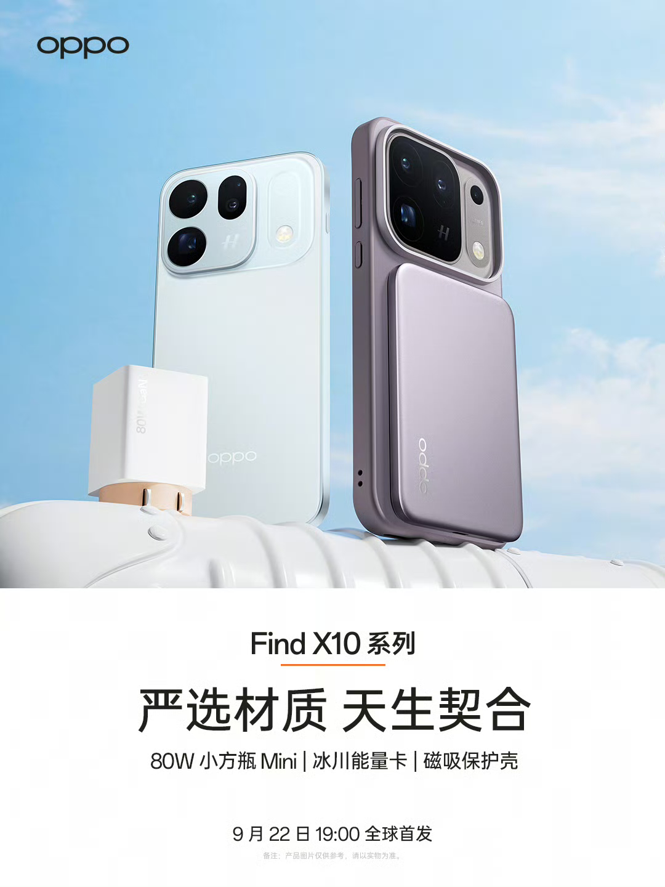

OPPO ha publicado el catálogo de accesorios que acompañará a la serie Find X10, el mismo día en que la compañía confirmaba la fecha de salida de sus nuevos buques insignia. El desembarco está fijado para el **22 de septiembre a las 19:00, hora de China** (13:00 en la España peninsular), cuando el fabricante dará a conocer los modelos y pondrá a la venta, o al menos anunciará, el ecosistema de complementos que los rodea.

La lista de novedades es corta, pero muy concreta, y se reparte entre energía y protección. Estos son los accesorios confirmados.

## Baterías externas: cuatro formatos y un estándar nuevo

El bloque más numeroso es el de las baterías portátiles. OPPO ha presentado cuatro propuestas, ordenadas de menor a mayor capacidad según la denominación de cada modelo:

- **33W Pocket Charge 10000**, una batería compacta pensada para llevarse en el bolsillo.
- **80W Travel Charge 15000**, con carga más rápida y algo más de reserva.
- **67W Travel Charge 20000**, la opción de mayor capacidad de la lista.
- **Glacier Energy Card**, una tarjeta de energía de formato plano que se ancla al teléfono por imán.

La nota que acompaña a estas baterías es que se presentan bajo el **nuevo estándar nacional chino** para baterías externas, un sello que apunta a criterios de seguridad y certificación más estrictos para este tipo de productos. En los tres primeros casos, los números que figuran en el nombre (10000, 15000 y 20000) remiten a la capacidad en miliamperios-hora, mientras que las cifras iniciales indican la potencia de carga en vatios.

## Un cargador de pared Mini y una funda imantada

A la energía se suman dos piezas de uso diario. Por un lado, el **80W Small Square Bottle Mini**, un cargador de pared de formato pequeño —de ahí el apelativo de "botella cuadrada"— que se aparta de los cargadores de viaje voluminosos para quedarse enchufado sin estorbar. Por otro, la **funda protectora con imanes**, diseñada para encajar con el teléfono y servir de anclaje a los accesorios magnéticos, como la propia tarjeta de energía.

Ese enfoque magnético es la pista más clara de por dónde quiere moverse OPPO: en lugar de vender piezas sueltas, ofrece un pequeño ecosistema en el que la funda hace de conector entre el móvil y las baterías.

## Por qué importa y qué esperar

Para el comprador, el interés de este anuncio no está en las especificaciones de cada accesorio, sino en la fecha: saber que OPPO cerrará el telón el **22 de septiembre** y que lo hará con el catálogo de complementos ya definido. Tampoco es menor que las baterías se acojan al nuevo estándar nacional chino, una señal de que la compañía quiere desmarcarse de la mala reputación que arrastran las baterías externas de bajo coste.

Conviene recordar que la serie se ha ido desvelando por entregas en las últimas semanas, con información sobre su cámara y su procesador. Este anuncio no añade detalles sobre el teléfono en sí, sino sobre lo que lo rodea. La disponibilidad, los precios y si estos accesorios llegan a Europa son, por ahora, incógnitas que el fabricante deberá resolver en la presentación del próximo día 22.
