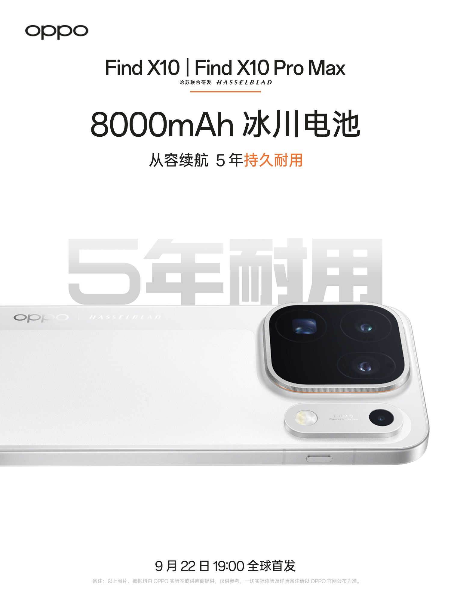
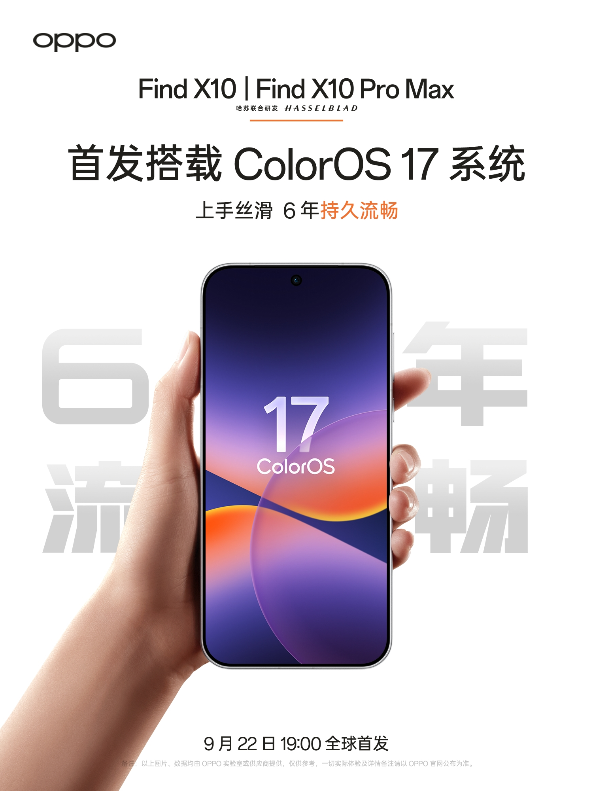
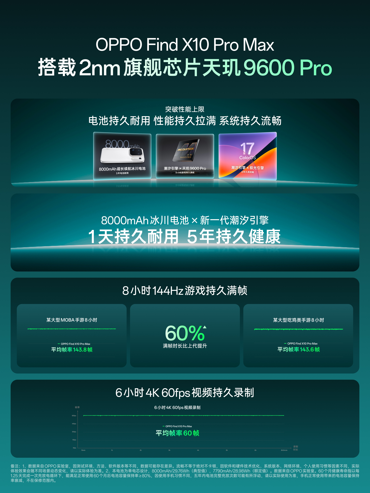

OPPO ha dado el paso que faltaba tras los adelantos de las últimas semanas: confirmar qué cerebro moverá su próxima generación de buques insignia. Zhuo Shijie, responsable de producto de la serie Find, anunció que el Find X10 será el primero en equipar el Dimensity 9600 Pro, un procesador desarrollado conjuntamente entre OPPO y MediaTek y fabricado con un proceso de 2 nm. La marca lo presenta como un salto "generacional" tanto en eficiencia energética como en rendimiento.

## Un procesador de 2 nm nacido de una colaboración

La clave del anuncio no está solo en la nomenclatura, sino en el proceso de fabricación. El salto al nodo de 2 nm es lo que, según el fabricante, permite esa mejora de eficiencia y rendimiento que describe como un cambio de época. El dato relevante es el modelo de colaboración: no se trata de un chip estándar de MediaTek adaptado por OPPO, sino de un desarrollo conjunto en el que ambas compañías han participado desde el diseño.

Ese enfoque tiene consecuencias prácticas. Al participar en la definición del silicio, OPPO puede ajustar el software y la gestión de recursos a las características exactas del procesador, en lugar de limitarse a optimizar sobre una pieza cerrada. Es la misma lógica que Apple lleva años aplicando con sus chips propios, trasladada ahora a una alianza entre un fabricante de móviles y un diseñador de procesadores.

## Rendimiento que se sostiene en el tiempo

Para aprovechar el chip, OPPO introduce una nueva generación de su motor de programación de recursos, encargada de repartir la carga de forma dinámica. La promesa es que tanto los juegos de alta tasa de refresco como la inferencia de modelos de lenguaje en local sean más rápidos y se mantengan estables durante más tiempo.

A esto se suma un planificador propio, denominado Falcon, diseñado para resolver el histórico tira y afloja entre fotografía y rendimiento. En la práctica, la marca asegura que la ráfaga de la cámara de 200 megapíxeles responde al dedo en todo momento y que la grabación prolongada de vídeo en 4K a 60 fps se mantiene sin calentamiento excesivo. En sus pruebas, el Find X10 aguantaría ocho horas seguidas ejecutando a plena velocidad los grandes juegos más exigentes.

## Batería y software pensados para durar

El discurso de OPPO gira en torno a lo que denomina la experiencia "tres veces duradera": rendimiento estable, fluidez que se conserva durante seis años y una batería con cinco años de vida útil declarada. El Find X10 integra una batería Glaciar de 8000 mAh con una densidad energética de 867 Wh/L, apoyada en una patente propia de silicio-carbono esférico, algoritmos de larga duración y estrategias de carga inteligente.

El software acompaña la apuesta. ColorOS 17 llega como primera versión del sistema, con un diseño fluido que, según la compañía, mantiene su agilidad con el paso de los años. Incluso con la batería al límite, un chip interno elevaría el voltaje de forma automática para seguir alimentando la placa base y exprimir la última carga disponible.

## Qué significa para el mercado

El anuncio refuerza una tendencia que se ha ido asentando en la gama alta: la diferenciación ya no se juega solo en la ficha técnica, sino en la capacidad de mantener el rendimiento a lo largo del tiempo. OPPO intenta trasladar la conversación de los picos de potencia en un benchmark a la experiencia de uso meses después de estrenar el teléfono.

Quedan, eso sí, las incógnitas habituales. OPPO no ha detallado precio, fecha exacta de lanzamiento ni disponibilidad en Europa, y todas las cifras de rendimiento proceden de mediciones internas del fabricante. Conviene leer el avance como lo que es: una declaración de intenciones bien argumentada, pendiente aún de contrastarse con pruebas independientes cuando el dispositivo llegue al mercado.
