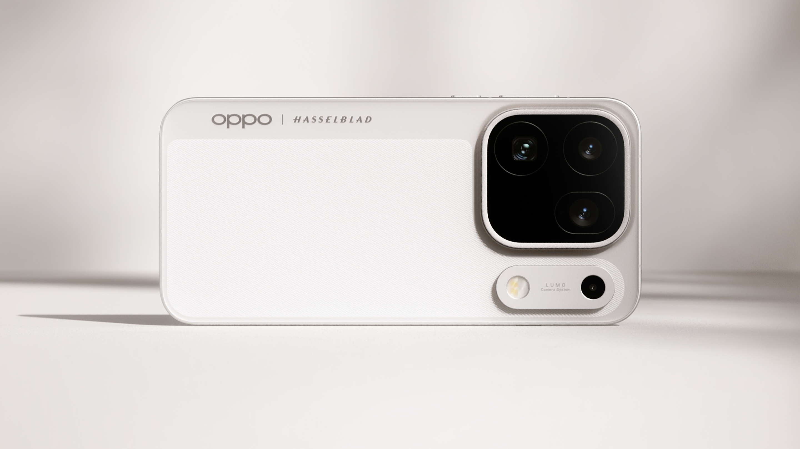

OPPO ha añadido una pieza nueva al rompecabezas del Find X10 a pocos días de su presentación. Zhuo Shijie, responsable de producto de la serie Find, anunció que tanto el Find X10 como el Find X10 Pro Max contarán con un kit de teleconvertidor Hasselblad, un accesorio óptico que la compañía describe como certificado por Hasselblad y orientado a escenas de teleobjetivo, con los conciertos como caso de uso destacado. El anuncio llega después de varias semanas de adelantos centrados en la cámara y el rendimiento, y coloca el foco en algo que esos avances no cubrían: la óptica externa.

## Un accesorio Hasselblad para los dos modelos tope

Según la marca, el kit estará disponible en los dos modelos más capaces de la gama, el Find X10 y el Find X10 Pro Max, y no en el resto de la familia. Los carteles oficiales lo muestran como una lente cilíndrica de acabado blanco que se acopla al módulo trasero del teléfono mediante un soporte específico, con la denominación Hasselblad visible en el cuerpo del dispositivo.

Zhuo Shijie insiste en que un teleconvertidor solo rinde si la base óptica acompaña. En ese sentido, afirma que la serie Find X10 parte de un teleobjetivo potente y de gran apertura, y que añade una estabilización de nivel profesional de hasta CIPA 7.5. La idea que transmite el fabricante es que el accesorio no compensa una lente mediocre, sino que amplía el alcance de una que ya parte de una base sólida.

A eso se suma un modo de captura pensado para el directo: un preset de escenario que, según OPPO, mantiene el ambiente incluso con iluminaciones complejas. La compañía también menciona la grabación de vídeo 4K con fotos en vivo, de forma que un mismo clip permita obtener el vídeo completo y una serie de imágenes fijas sin interrumpir la grabación.

## Qué aporta un teleconvertidor frente al zoom digital

Para el lector que no sigue la fotografía móvil, conviene aclarar la diferencia. Un teleconvertidor es una lente física que se interpone entre el sensor y el sujeto para aumentar la distancia focal efectiva sin recortar la imagen, es decir, sin perder resolución como ocurre con el zoom digital o con un recorte posterior. Ese es el argumento de estos kits: acercar escenas lejanas conservando detalle.

El enfoque no es nuevo en OPPO. La marca ya comercializó un kit modular con lente Hasselblad para el Find X9 Pro, lo que convierte a la serie Find X10 en la continuación de esa apuesta por la fotografía "seria" mediante accesorios, en lugar de resolverlo todo con software. La diferencia aquí es que el accesorio pasa a estar anunciado para dos modelos a la vez y se presenta ligado a un escenario concreto, el de los conciertos y espectáculos en directo, donde el público suele grabar a distancia y con poca luz.

## Un avance oficial, con incógnitas por resolver

Conviene medir bien el grado de confirmación. No se trata de un rumor de terceros: el anuncio proviene del propio responsable de producto de la serie y va acompañado de carteles oficiales de OPPO. Eso confirma la existencia del kit y los modelos compatibles, pero no resuelve las preguntas que más importan al comprador.

OPPO no ha detallado el aumento óptico del teleconvertidor, ni su precio, ni si se venderá por separado o formará parte de alguna edición especial. Tampoco hay confirmación de disponibilidad fuera de China. Los propios carteles advierten de que las imágenes son material de referencia creativa y que el producto final puede variar, un aviso habitual en este tipo de avances.

El contexto ayuda a situar la expectativa: la serie Find X10 está fijada para el 22 de septiembre, con el Find X10 Pro Max como tope de gama y la fotografía como eje principal. Quien esté interesado en el accesorio hará bien en esperar a la presentación para conocer sus especificaciones reales y, sobre todo, para ver muestras sin editar. Hasta entonces, lo que hay es una confirmación oficial de producto, no una ficha técnica cerrada.
