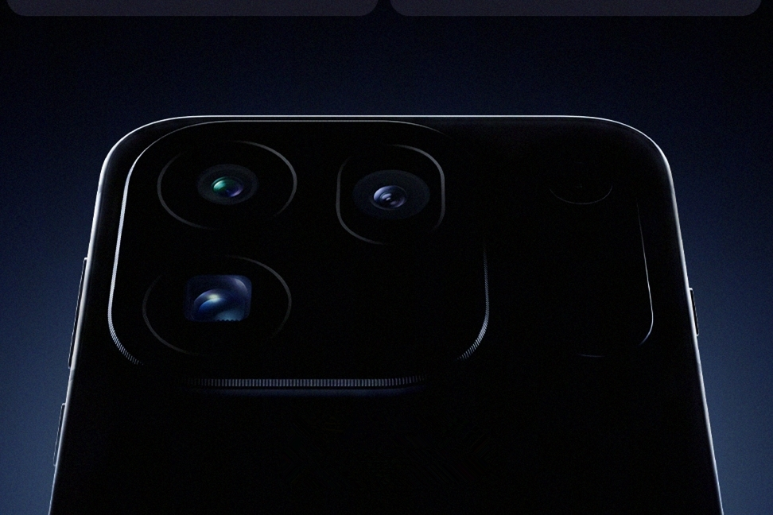

OPPO ha empezado a calentar el terreno del Find X10 sin esperar a la presentación oficial. El responsable de la serie Find, Zhuo Shijie, ha desvelado los principales argumentos del que la compañía presenta como el "buque insignia estándar más potente de 2026". No hay fecha de lanzamiento, precio ni ficha técnica completa: se trata de un avance de producto, no de un anuncio cerrado, así que conviene leer cada dato como una declaración del fabricante y no como una especificación verificada de forma independiente.

## Fotografía: dos sensores de 200 MP y sello Hasselblad

El apartado que más protagonismo recibe es la cámara. Según la compañía, el Find X10 será el primer modelo estándar de gama alta con un conjunto de dos lentes de 200 megapíxeles. El teleobjetivo, además, contaría con el sensor más grande de su segmento, una apertura muy luminosa y un sistema de estabilización de gama alta, con soporte para el teleconvertidor de Hasselblad.

A nivel de software, OPPO menciona la cámara Hasselblad "ultra clara", una segunda generación de la restauración de color Danxia, el motor de luz nativa LUMO y el panel de ajuste LUMO. En la práctica, la marca quiere que el usuario note la mejora tanto en el momento de disparar como en el procesado posterior, un terreno donde la fotografía computacional pesa cada vez más.

## Diseño y pantalla: bordes de 0,99 mm y mínimo de 1 nit

En diseño, el Find X10 recurre a un marco de cuatro lados iguales de 0,99 milímetros, el más estrecho de la historia de la serie Find según el fabricante. Es una cifra que busca diferenciar el modelo estándar del resto de la gama, donde el protagonismo suele recaer en las versiones Pro o Ultra.

La pantalla también recibe atención específica: OPPO habla de una nueva generación con brillo mínimo de 1 nit y enfoque de protección ocular, con mayor proporción de luz roja beneficiosa y menor emisión de luz azul dañina. A ello se suma compatibilidad con el espacio de color BT.2020. Para quien usa el móvil de noche o durante horas, estos ajustes importan más que un pico de brillo alto en una ficha técnica.

## Batería de 8000 mAh y ColorOS 17

La autonomía es otro de los pilares del avance. OPPO asegura que el Find X10 integra una batería Glaciar de 8000 mAh, la mayor de la historia de la serie Find, con una vida útil declarada de cinco años y un rendimiento fluido incluso con poca carga. Si la cifra se confirma, colocaría al modelo por delante de buena parte de la competencia en capacidad bruta.

El sistema operativo también será novedad: el Find X10 será el primer dispositivo en estrenar ColorOS 17, la próxima versión de la capa de personalización de OPPO.

## Qué implica para el lector

El avance dibuja un estándar de gama alta que renuncia a reservar lo mejor para sus versiones más caras: doble sensor de 200 MP, 8000 mAh y un marco mínimo llegan a la variante base. Es una señal de la presión competitiva en el segmento premium, donde cada fabricante intenta justificar el salto de precio con argumentos visibles.

Conviene mantener la cautela: son datos ofrecidos por la propia marca, sin muestras de cámara ni pruebas de autonomía independientes. Quedan además incógnitas clave para el mercado español, como el precio y la disponibilidad real en Europa, que OPPO no ha detallado en este avance.

