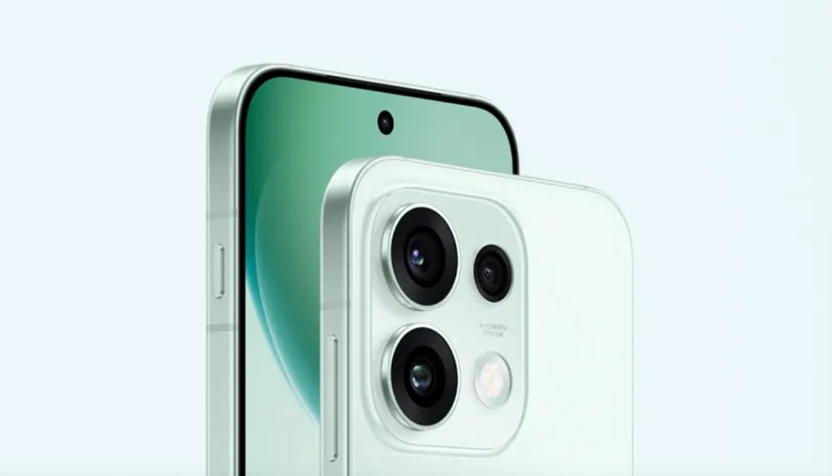
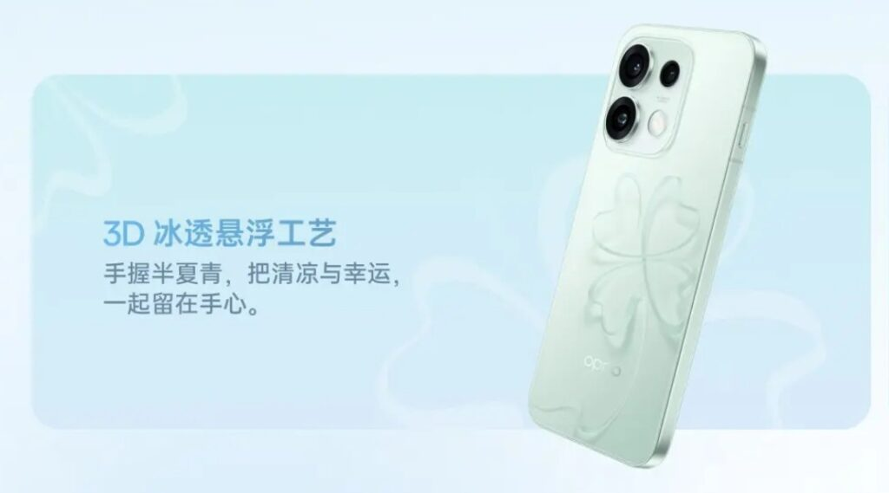

El **Oppo Reno 16t** ya es oficial en China: un terminal que intenta conciliar dos objetivos que rara vez conviven, un cuerpo compacto con pantalla de 6,32 pulgadas y una batería de 6.700 mAh. El equipo se apoya en un chip MediaTek Dimensity 8550 Super y en un sistema de tres cámaras traseras cuyo sensor principal llega a los 200 megapíxeles. El precio de lanzamiento en el mercado chino parte de los 3.699 yuanes.

## Ficha técnica del Oppo Reno 16t

| Característica | Detalle |
| --- | --- |
| Pantalla | AMOLED flexible de 6,32 pulgadas, 2.640 × 1.216 px, 460 ppp, 120 Hz y 1.070 millones de colores |
| Muestreo táctil | Hasta 240 Hz |
| Procesador | MediaTek Dimensity 8550 Super |
| Memoria | 12 GB de LPDDR5X/LPDDR5 |
| Almacenamiento | Hasta 512 GB UFS 3.1 |
| Batería | 6.700 mAh |
| Carga | 80 W SuperVOOC y 80 W UFCS |
| Cámaras traseras | 200 MP principal con OIS, 50 MP ultra gran angular (116°) y 50 MP teleobjetivo con OIS |
| Zoom | Hasta 3,5× óptico y 120× digital |
| Cámara frontal | 50 MP con enfoque automático y vídeo 4K a 60 fps |
| Conectividad | Wi-Fi 6, Bluetooth, NFC, USB Type-C y doble nano-SIM |
| Desbloqueo | Lector de huella óptico bajo la pantalla |
| Medidas | 8,36 mm de grosor y hasta 191 g (varía según el color) |
| Resistencia | IP68 / IP69K frente al agua y el polvo |

Sobre el brillo hay dos cifras en circulación: la ficha oficial declara 1.800 nits de pico global, mientras que el material promocional del fabricante habla de 3.600 nits. Conviene citar ambas y esperar mediciones independientes antes de dar cualquiera por buena.

## Triple cámara de 200 MP en un cuerpo de 8,36 mm

El argumento de venta del Reno 16t es la combinación de autonomía y formato reducido. Un panel de 6,32 pulgadas coloca al teléfono en el terreno de los móviles compactos, pero OPPO ha metido dentro una celda de 6.700 mAh con carga de 80 W, tanto por SuperVOOC como por el estándar UFCS.

En fotografía, la isla trasera reúne un sensor principal de 200 MP con estabilización óptica, un ultra gran angular de 50 MP con 116 grados de campo de visión y un teleobjetivo de 50 MP también con OIS, capaz de alcanzar 3,5× de zoom óptico y 120× digital. La frontal de 50 MP enfoca automáticamente y graba en 4K a 60 fps, además de admitir vídeo en HDR y en doble vista.

Completan el equipamiento una **tecla AI Plus** en el borde izquierdo, reservada para abrir Mind Space, el espacio de funciones de inteligencia artificial del terminal.

## Precio y disponibilidad del Oppo Reno 16t

El Reno 16t arranca en **3.699 yuanes** (aproximadamente 550 dólares, según el cambio que recoge la fuente) en su versión de 12 GB de memoria y 256 GB de almacenamiento. También existe una variante superior con 16 GB de RAM. Se trata de un precio de lanzamiento en China: OPPO no ha anunciado fecha de salida ni tarifa para España u otros mercados europeos, y cualquier conversión a euros sería, de momento, una estimación sujeta al mercado final.

La marca comercializa el terminal en tres colores —Heartbeat, Galaxy Purple y Moonlight Black— y lo orienta de forma especialmente al canal tradicional, el de tiendas físicas. Según GizmoChina, el Reno 16t no se aleja del Reno 16 que ya se vende en el país: la diferencia principal son los 200 yuanes de recargo y ese enfoque en la venta en tienda.

## Qué significa para el lector

El Reno 16t refuerza la línea que OPPO está siguiendo este año: baterías de hasta 6.700 mAh sin renunciar a un formato manejable, una apuesta que comparte con el [OPPO K14 Plus, con sus 8.000 mAh](/noticias/oppo-k14-plus-8000mah-144hz/). Para quien busca un teléfono de una mano con autonomía de dos días, es una propuesta concreta; para el comprador europeo, de momento, sigue siendo una novedad de catálogo ajeno, hasta que OPPO confirme si el modelo cruza fronteras.
