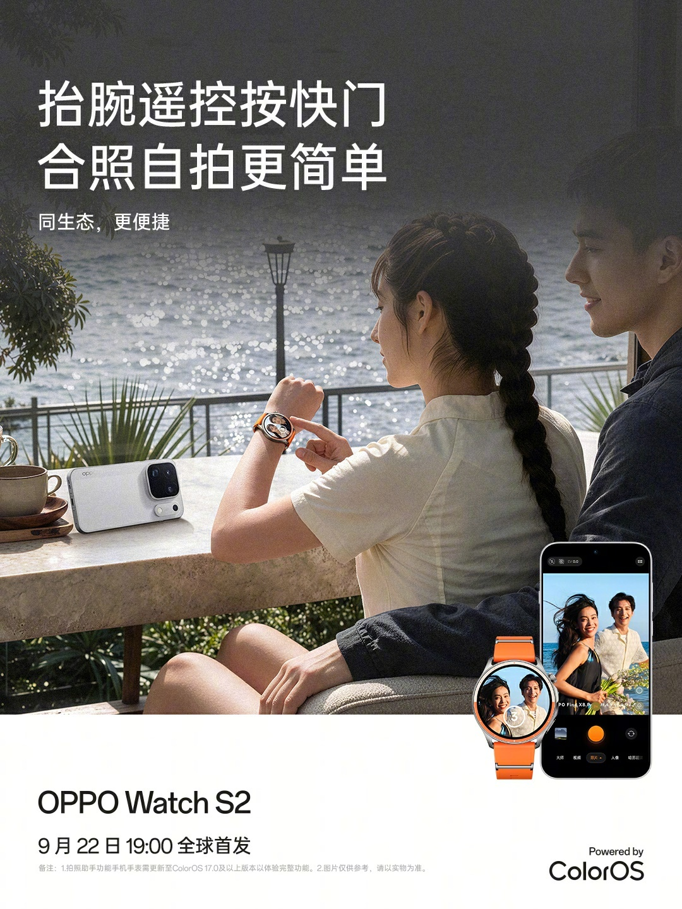
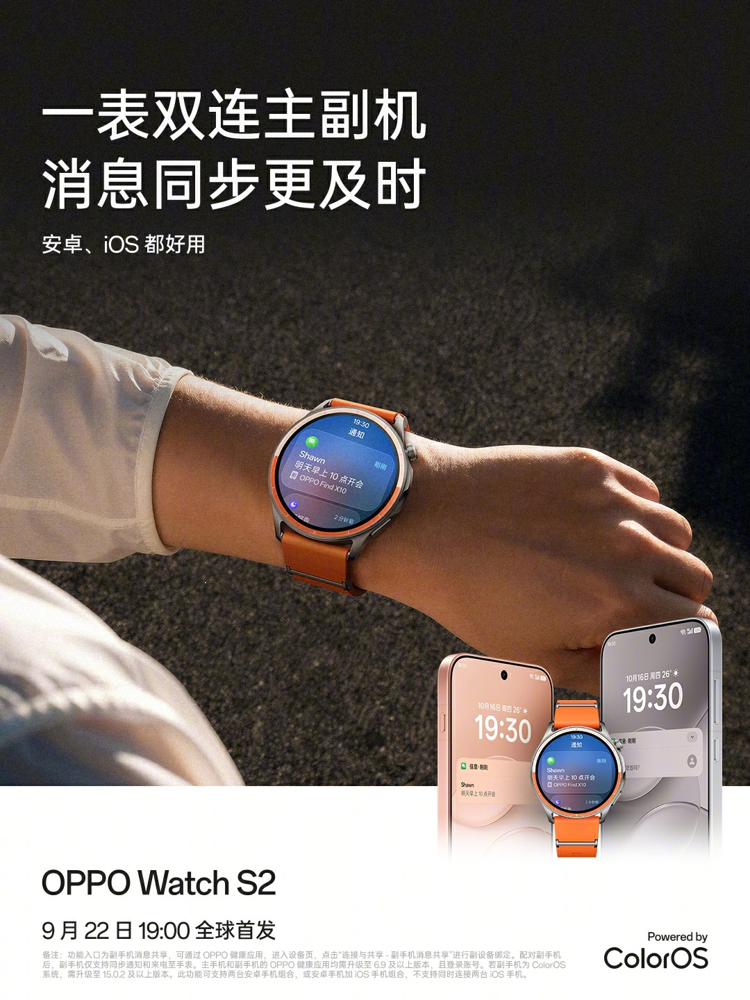
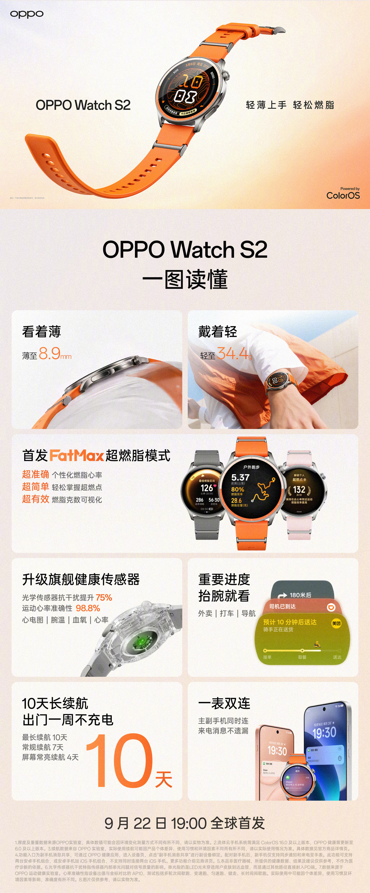

OPPO presentará el próximo **22 de septiembre** su nuevo reloj inteligente, el **Watch S2**, y lo hará acompañado de **ColorOS Watch 17**, la última versión de su sistema para wearables. La compañía ha adelantado algunas de las funciones de conectividad que llegarán con el dispositivo, centradas en la relación del reloj con el teléfono.

Entre las novedades anunciadas destaca la **retransmisión de la frecuencia cardíaca al móvil**, de modo que las mediciones tomadas desde la muñeca se pueden consultar en la pantalla del teléfono. A esto se suma la posibilidad de **disparar la cámara del teléfono a distancia** mediante un gesto de muñeca, sin necesidad de tocar el terminal.

## Un reloj, dos teléfonos a la vez

Otra de las capacidades confirmadas es la **doble conexión principal y secundaria**: el Watch S2 puede mantenerse vinculado a dos teléfonos de forma simultánea. Según OPPO, se admiten dos combinaciones:

- Dos teléfonos **Android**.
- Un teléfono **Android** y otro **iOS**.

La limitación está en el segundo caso: **no es posible conectar el reloj a dos teléfonos iOS a la vez**. Es un planteamiento pensado para quien reparte su día a día entre dispositivos de ecosistemas distintos.

## Salud y diseño, según lo ya adelantado

La compañía ya había desvelado antes parte del apartado técnico del Watch S2. El reloj mide **8,9 mm de grosor y pesa 34,4 gramos**, y estrena un **sensor de salud de gama alta** capaz de medir electrocardiograma, temperatura de la muñeca, oxígeno en sangre y frecuencia cardíaca.

OPPO también cifra en un **75 % la mejora de inmunidad al ruido del sensor óptico** y sitúa en un **98,8 % la precisión de la frecuencia cardíaca en deporte**, datos que conviene tomar como cifras del fabricante hasta que el producto llegue a las pruebas independientes.

## Qué cambia para el usuario

Más que una revolución, lo anunciado apunta a **mejorar la integración entre reloj y teléfono**. Poder ver la frecuencia cardíaca en la pantalla grande y disparar la cámara desde la muñeca son comodidades concretas, y la doble conexión resuelve un problema habitual para quien usa un Android de trabajo y un iPhone personal, o al revés.

El movimiento de OPPO encaja además en una estrategia más amplia: **ColorOS Watch 17** se convierte en el sistema que unificará la experiencia del fabricante en sus wearables. Habrá que esperar al 22 de septiembre para conocer el precio, la disponibilidad y el resto de especificaciones, que todavía no han sido desvelados.

