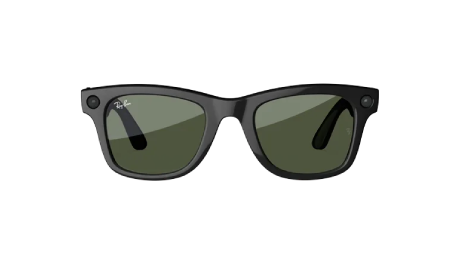

La fiscalía de París ha abierto al menos una investigación penal por un posible caso de acoso sexual cometido con gafas inteligentes. El Ministerio Público francés confirmó la existencia del expediente a la agencia Reuters, y precisó que las denuncias se enmarcan en una tendencia de redes sociales: grabar a mujeres en la calle sin su consentimiento y difundir después los vídeos. La fiscalía no ha identificado la marca de los dispositivos implicados ni ha dado más detalles del caso.

Conviene fijar el estado procesal antes de seguir: se trata de una investigación abierta, no de una condena. Ninguna resolución judicial ha declarado responsable a persona alguna, y la presunción de inocencia se mantiene intacta mientras el proceso avance.

## Qué ha confirmado la fiscalía sobre las gafas inteligentes

El Ministerio Público no ha detallado cuántos expedientes ha abierto ni a quién investiga, pero sí ha confirmado que al menos uno deriva de denuncias por acoso relacionadas con el uso de gafas con cámara para filmar a mujeres en la vía pública. La unidad de ciberdelincuencia del organismo probó dos semanas antes un par de estos dispositivos, con el objetivo de entender qué delitos podrían cometerse con ellos, según explicó a Reuters.

El origen del fenómeno es un patrón que se repite en redes: el usuario lleva unas gafas con cámara y graba a personas que no saben que están siendo filmadas, o que no han dado su permiso, y publica el material después. La fiscalía no ha vinculado el caso con ninguna marca concreta, pese a que el producto más conocido de esta categoría lleva el sello de Meta y EssilorLuxottica.

## Una ley que existe, pero es difícil de aplicar

Francia ya cuenta con herramientas legales para perseguir estas conductas. Grabar la imagen de una persona en un lugar privado sin su consentimiento puede castigarse con hasta un año de prisión o una multa de 45.000 euros, unos 51.700 dólares. El problema, según la CNIL —la autoridad francesa de protección de datos— y otras fuentes jurídicas, está en la aplicación: un vídeo se comparte y se vuelve a compartir mucho antes de que una denuncia avance.

Las gafas de esta categoría incorporan una pequeña luz en la montura que se enciende mientras graban. Los grupos de derechos consideran que ese aviso no resuelve el problema, sino que traslada la carga de evitar la cámara a quien tiene delante. Ines Legendre, experta jurídica de la organización de seguridad en internet e-Enfance, lo resume así: «Ver que se enciende una luz no significa que consientas que te graben, ni que tu imagen se distribuya después a miles de personas».

## La industria responde y la presión crece fuera de Francia

La CNIL ha declarado que ha recibido menos de diez denuncias por el uso de gafas inteligentes en el entorno laboral, sin desvelar las marcas, y que cada vez más empresas le preguntan si pueden prohibirlas en el trabajo. Nacera Bekhat, responsable de asuntos económicos del organismo, sostiene que estos dispositivos plantean «retos reales» a la hora de informar a las personas de que están siendo grabadas y de obtener su consentimiento. En la Unión Europea, los wearables con IA quedan bajo el paraguas del Reglamento de IA y del RGPD.

Un portavoz de Meta defendió el enfoque de la compañía: «hemos integrado la privacidad en nuestras gafas con IA desde el principio» y «seguiremos reforzando nuestras protecciones a medida que las gafas sean más capaces». EssilorLuxottica, que fabrica las gafas junto a Meta, declinó hacer comentarios. El producto conjunto domina el mercado: concentra alrededor del 76 % de la cuota global de gafas inteligentes y vendió siete millones de unidades el año pasado, mientras las últimas cifras de ventas de EssilorLuxottica apuntan a un crecimiento «exponencial» en 2026. Es la misma dinámica que ya analizamos al hablar del [crecimiento del mercado de gafas inteligentes y el dominio de Meta](/noticias/smart-glasses-market-doubles-meta/).

La presión no es exclusiva de Francia. Algunos cines del Reino Unido han prohibido estas gafas, un grupo de consumidores alemán presentó una denuncia penal contra Meta y otros vendedores de los dispositivos por vulnerar la normativa de privacidad, y Australia estudia vetarlas en dependencias gubernamentales, como recogimos al detallar la [ampliación del veto australiano a las gafas inteligentes](/noticias/australia-smart-glasses-ban-expansion/).

## Qué cambia para el lector

El caso sitúa el debate en una fase nueva: ya no se discute solo si estas gafas incomodan, sino si su uso puede perseguirse penalmente. Para quien las lleva, la consecuencia práctica es que grabar en la UE exige informar y, cuando corresponde, obtener consentimiento; el RGPD y el Reglamento de IA marcan ese terreno. Para quien se cruza con ellas, la vigilancia no basta como respuesta: el propio caso francés muestra que la vía es denunciar y que la ley, aunque lenta, existe.

En paralelo, el ecosistema de herramientas para detectar estos dispositivos sigue creciendo. Aplicaciones como [ZuckOff localizan gafas con cámara por Bluetooth](/noticias/zuckoff-detects-camera-glasses-bluetooth/), aunque no pueden confirmar si están grabando, y el [debate sobre la cámara como lastre de la categoría](/noticias/smart-glasses-camera-privacy-opinion/) explica por qué el sector afronta cada lanzamiento con más cautela. Con la fiscalía de París como precedente, la línea entre lo molesto y lo delictivo empieza a quedar más clara.
