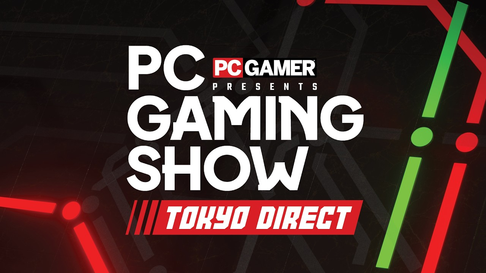

El PC Gaming Show Tokyo Direct 2026 es la entrega del evento de PC Gamer que se emite desde el Tokyo Game Show. El equipo de la publicación viajó a Japón para grabar contenido desde la propia feria y ha anunciado más de 30 juegos, con estrenos mundiales, lanzamientos sorpresa, DLC y fechas de salida.

Esta guía sirve para quien quiera verlo en directo y no llegar tarde: reúne la fecha, los cuatro husos horarios que da la organización y la lista completa de plataformas por las que se puede seguir. No hace falta instalar nada especial, solo elegir un canal y conectarse a la hora correcta.

## Antes de empezar

- Necesitas un dispositivo con conexión a internet: navegador de escritorio, aplicación móvil o la aplicación de la plataforma que elijas.
- Ten a mano el huso horario en el que estás para convertir la hora de emisión antes del domingo.
- Elige de antemano uno de los canales oficiales que se listan más abajo, para no perder tiempo buscándolo cuando arranque el directo.

## Paso 1: confirma la fecha y la hora

La emisión está fijada para el **domingo 20 de septiembre de 2026**. Estos son los horarios oficiales:

| Zona horaria | Hora de emisión |
| --- | --- |
| Pacífico (PT) | 9:00 |
| Este (ET) | 12:00 |
| Reino Unido (BST) | 17:00 |
| Japón (JST) | 1:00 |

En Japón la retransmisión cae técnicamente en la madrugada del **lunes 21 de septiembre**, porque el horario local va por delante. Las cuatro referencias corresponden al mismo momento de emisión: para un espectador en la España peninsular, todas equivalen a las 18:00 del domingo 20 (hora de verano, CEST).

## Paso 2: elige por dónde verlo

PC Gamer ha confirmado una lista amplia de canales. Puedes seguirlo por cualquiera de estos:

- [YouTube](https://www.youtube.com/@pcgamer)
- [Twitch](https://www.twitch.tv/pcgamer)
- [X](https://x.com/pcgamer)
- [GamesRadar+](https://www.youtube.com/gamesradar)
- Steam
- [Bilibili](https://b23.tv/CfqPVQO)
- [eCLUTCH](https://eclutch.tv/)
- [Ginx.tv](http://ginx.tv)
- [ESR Network](https://www.esrevolution.com/)
- [Kuaishou](https://v.kuaishou.com/K8Ecd05y)

Si vas a verlo en YouTube, el directo está publicado en el canal de PC Gamer. La miniatura del vídeo es la que aparece a continuación.

## Paso 3: sigue el contenido del programa

El espectáculo dura alrededor de **90 minutos** y está presentado por Frankie Ward, presentadora premiada y habitual del PC Gaming Show. Además, el editor sénior Wesley Fenlon firma entrevistas rápidas grabadas en el propio evento.

Entre lo anunciado hay más de **10 estrenos mundiales** y contenidos concretos ya confirmados:

- Un nuevo tráiler de *Let's Build a Dungeon*, de Springloaded.
- El anuncio en exclusiva de la fecha de lanzamiento de *Virtue and a Sledgehammer*, de Devolver Digital.
- Un nuevo tráiler del juego de estrategia en tiempo real *Stronghold 4*, de Firefly Studios.
- Un análisis en profundidad de *Tenebris Somnia*, la aventura de terror de supervivencia retro con escenas de acción real de New Blood Interactive.

Los juegos presentes vienen de estudios como Arcane Ermine, Caldera Interactive, Chorus Worldwide, City From Naught, Clear River Games, Devolver Digital, Firefly Studios, Fireshine Games, HABBY.FUN, KO_OP, Loftia, Megabit, New Tales, Skystone Games, The Game Bakers, Total Mayhem Games, Veewo Games y WuselFaktory.

Puedes consultar el catálogo completo en la [página de Steam del evento](https://store.steampowered.com/curator/1850/sale/PCGamingShowTokyoDirect).

## Paso 4 (opcional): retransmítelo con tu comunidad

El evento se puede co-retransmitir. Si tienes canal propio y quieres seguirlo junto a tu audiencia, PC Gamer habilita el alta a través de [un formulario de inscripción](https://docs.google.com/forms/d/e/1FAIpQLSe9MiF94ThNFT3UjblkWT42cBsBPWHRYuoNSKUFGgWoytpDlA/viewform). También hay creadores que emitirán el directo en paralelo, por si prefieres verlo con comentario en directo.

## Cómo verificar que funciona

Abre el canal de YouTube o de Twitch de PC Gamer a la hora indicada. Si la emisión está activa, verás la señal en directo en la parte superior de la lista de vídeos. Como comprobación previa, puedes entrar en el canal unos minutos antes: cuando el directo arranca, el vídeo en vivo aparece destacado y va sumando espectadores en tiempo real.

## Advertencias y limitaciones

- Comprueba tu zona horaria antes de conectarte. El error más habitual es asumir el horario de la costa este o del Reino Unido, que en España se traducen a las 18:00 del domingo.
- La lista de plataformas es la que ha publicado la organización; la disponibilidad de cada servicio puede variar según la región y el dispositivo.
- Los horarios son los oficiales de la convocatoria. Si hay cambios de última hora, la referencia válida es el canal de PC Gamer en el que se emite el directo.
