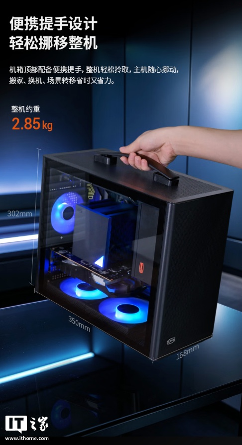
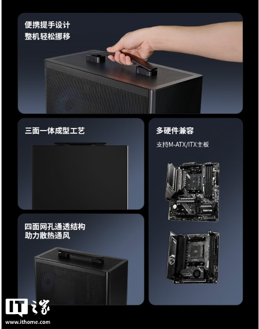
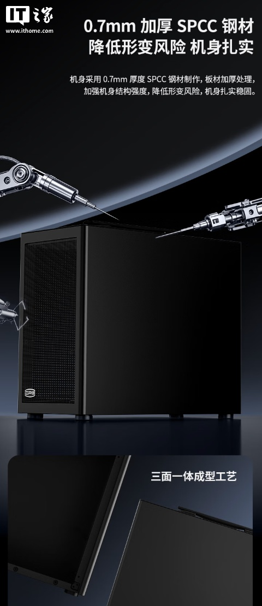
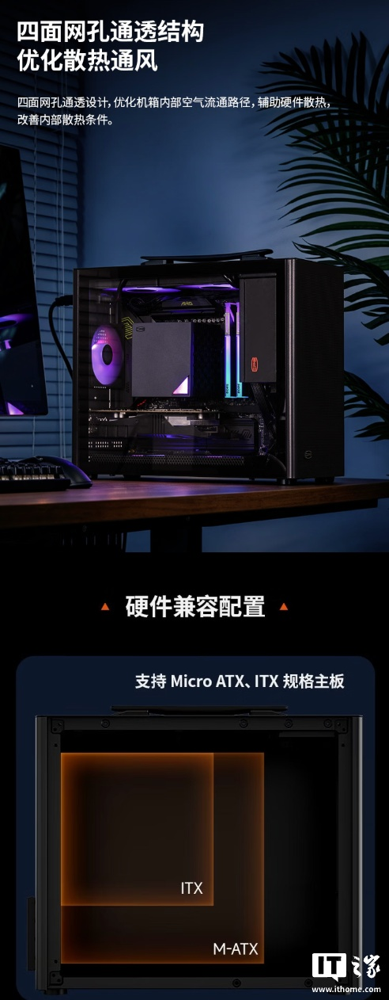
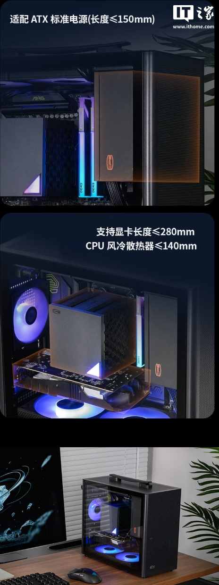
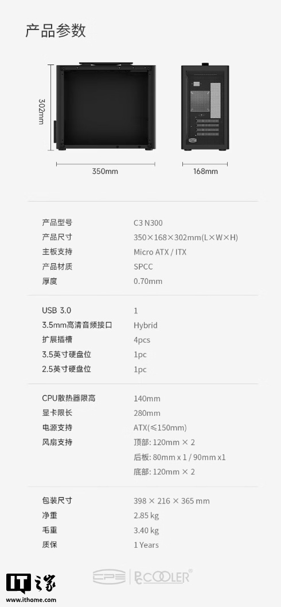

PCCOOLER ha anunciado la caja C3 N300, un chasis compacto pensado para montajes que cambian de sitio con frecuencia. Su seña de identidad es un asa integrada en la parte superior que permite levantarlo con una sola mano, y llega con compatibilidad para placas base micro-ATX e ITX. La compañía ya la ha puesto a la venta en China por 199 yuanes.

## El C3 N300, una caja con asa para moverla sin complicaciones

El C3 N300 pesa alrededor de 2,85 kg y ocupa unos 17 litros, unas cifras que lo sitúan en el terreno de los equipos portátiles. El asa va anclada al techo del chasis, de modo que el usuario puede trasladar el conjunto sin desmontar nada: la propia marca lo plantea como una solución para mudanzas, cambios de escritorio o traslados puntuales.

Las medidas declaradas son 350 × 168 × 302 mm (largo, ancho y alto), con un panel lateral transparente que deja ver los componentes.

## Acero de 0,7 mm y ventilación por las cuatro caras

El chasis se fabrica en acero SPCC con un grosor de 0,70 mm y un tratamiento de refuerzo que, según el fabricante, reduce el riesgo de deformación y da más rigidez al conjunto. A ello se suma un diseño de malla en las cuatro caras laterales, planteado para mejorar el flujo de aire y ayudar a disipar el calor de los componentes.

## Qué hardware admite el C3 N300

La caja acepta placas micro-ATX o ITX y deja espacio para una tarjeta gráfica de hasta 280 mm y un disipador de CPU por aire de hasta 140 mm de altura. La fuente debe ser de formato ATX y no superar los 150 mm de longitud. Para la refrigeración, admite dos ventiladores de 120 mm en la parte superior, uno de 80 o 90 mm en la trasera y dos de 120 mm en la base.

Estas son las especificaciones completas publicadas por el fabricante:

| Especificación | Valor |
| --- | --- |
| Modelo | C3 N300 |
| Dimensiones | 350 × 168 × 302 mm (largo × ancho × alto) |
| Placas compatibles | Micro-ATX e ITX |
| Material | Acero SPCC |
| Grosor del chasis | 0,70 mm |
| Bahías internas | 1 × 3,5" y 1 × 2,5" |
| Ranuras de expansión | 4 |
| Conectores frontales | 1 × USB 3.0 y audio de 3,5 mm |
| Altura máxima del disipador de CPU | 140 mm |
| Longitud máxima de la tarjeta gráfica | 280 mm |
| Fuente de alimentación | ATX de hasta 150 mm |
| Ventilación | 2 × 120 mm arriba, 1 × 80/90 mm detrás y 2 × 120 mm abajo |
| Peso neto | 2,85 kg |
| Peso bruto | 3,40 kg |
| Garantía | 1 año |

## Qué cambia para el lector

Por el momento, el C3 N300 solo se comercializa en China a través de JD.com, sin precio ni fecha anunciados para Europa. Quien busque una caja pequeña para un equipo que viaja encontrará en el asa su principal argumento, aunque conviene tener en cuenta sus límites: una gráfica de 280 mm y un disipador de 140 mm dejan fuera las tarjetas y torres de gama alta.

Si lo que se busca es una caja de sobremesa sin intención de moverla, hay alternativas más ambiciosas presentadas en las últimas semanas, como la [NZXT S5 RGB](/noticias/nzxt-s5-rgb/) o la [ASUS ROG Cronox ARGB](/noticias/asus-rog-cronox-eurux/); la propuesta de PCCOOLER es otra cosa: un formato sencillo y ligero para llevar el equipo de un lado a otro.
