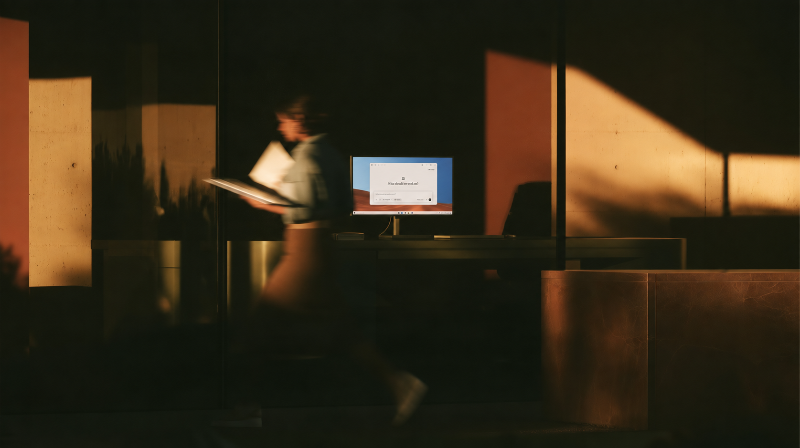

Perplexity ha llevado **Portable Computer** a Windows, su agente de IA que se ejecuta en el propio equipo en lugar de en la nube. La compañía anunció la disponibilidad el 14 de septiembre y la integra en la aplicación de Perplexity para Windows, que ya existía. Hasta ahora esta capacidad solo estaba disponible en sistemas basados en Linux, y el requisito de hardware no se ha relajado: hace falta una GPU NVIDIA GeForce RTX o RTX PRO con **al menos 24 GB de VRAM**, además de una suscripción Pro o Max.

El anuncio se apoya en una entrada del blog oficial de Perplexity, que sitúa el lanzamiento como una extensión de lo presentado en agosto para los sistemas NVIDIA DGX Spark. La compañía subraya que el modelo, el arnés del agente, el orquestador y el planificador de tareas se ejecutan íntegramente en el dispositivo con Windows.

## Qué aporta frente al agente en la nube

Portable Computer es la versión local de Perplexity Computer, el agente que la firma diseñó para tareas de varios pasos: planifica, reparte subtareas entre conectores y herramientas y entrega un resultado que va más allá de una respuesta de chat. La diferencia es dónde ocurre ese trabajo. Al correr en el PC del usuario, los archivos y las consultas no salen del equipo y el trabajo completado en local **no consume créditos** de Computer, algo que la compañía destaca para flujos largos y repetitivos.

Cuando una tarea necesita información actual o razonamiento avanzado, el agente puede recurrir a Perplexity Search o a más de 15 modelos de frontera en la nube, pero solo después de pedir permiso explícito al usuario antes de enviar nada fuera del dispositivo. En Windows, además, la versión local estrena tareas programadas recurrentes y servidores MCP locales para conectar con aplicaciones de escritorio. Perplexity cita conectores para servicios como Gmail, Outlook, Slack, GitHub, Word o Google Drive.

## Por qué importa: el listón está en la VRAM

El dato que condiciona todo es la memoria de la tarjeta gráfica. Tom's Hardware señala que los 24 GB funcionan más como una barrera de VRAM que como una barrera generacional: corta de forma transversal la oferta de consumo de NVIDIA. Entre las tarjetas GeForce que cumplen están la RTX 3090 y 3090 Ti (24 GB), la RTX 4090 (24 GB) y la RTX 5090 (32 GB). La RTX 5090 para portátiles, también con 24 GB, no ha sido mencionada de forma explícita por ninguna de las dos compañías.

En la gama profesional, las RTX PRO Blackwell que entran en los requisitos son la 4000 (24 GB), la 4500 (32 GB), la 5000 (48 o 72 GB) y la 6000 (96 GB). NVIDIA ya anticipó el 3 de septiembre que el soporte para Windows llegaría pronto y ahora confirma que el agente también estará disponible para las estaciones de trabajo RTX PRO; el soporte para DGX Station se espera más adelante.

| GPU | VRAM |
| --- | --- |
| GeForce RTX 3090 / 3090 Ti | 24 GB |
| GeForce RTX 4090 | 24 GB |
| GeForce RTX 5090 | 32 GB |
| RTX PRO 4000 | 24 GB |
| RTX PRO 4500 | 32 GB |
| RTX PRO 5000 | 48 / 72 GB |
| RTX PRO 6000 | 96 GB |

## Qué cambia para el lector

Para quien ya tiene un equipo con una de esas gráficas, la llegada a Windows elimina la necesidad de comprar un sistema aparte como el DGX Spark para probar el agente en local. La configuración se simplifica con una descarga del modelo local en un solo clic desde un desplegable en la aplicación; NVIDIA pone como ejemplo Qwen 3.8 27B, un modelo ajustado para trabajar con Perplexity Computer y optimizado para GPUs RTX.

El mensaje oficial lo resumió el consejero delegado de Perplexity, Aravind Srinivas, en una publicación del 14 de septiembre: "inteligencia local sin límites en cada PC con Windows que use hardware de NVIDIA y el arnés de Perplexity". La letra pequeña, sin embargo, sigue estando en la tarjeta gráfica: sin 24 GB de VRAM, el agente se queda fuera.
