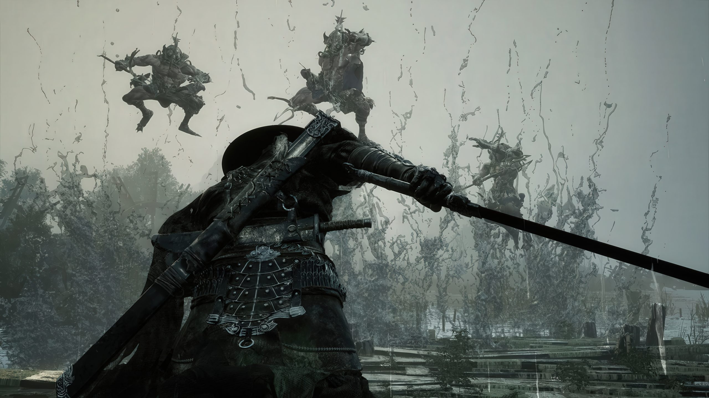
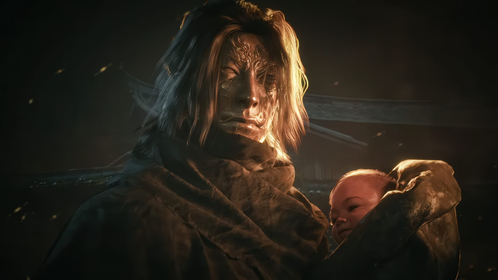
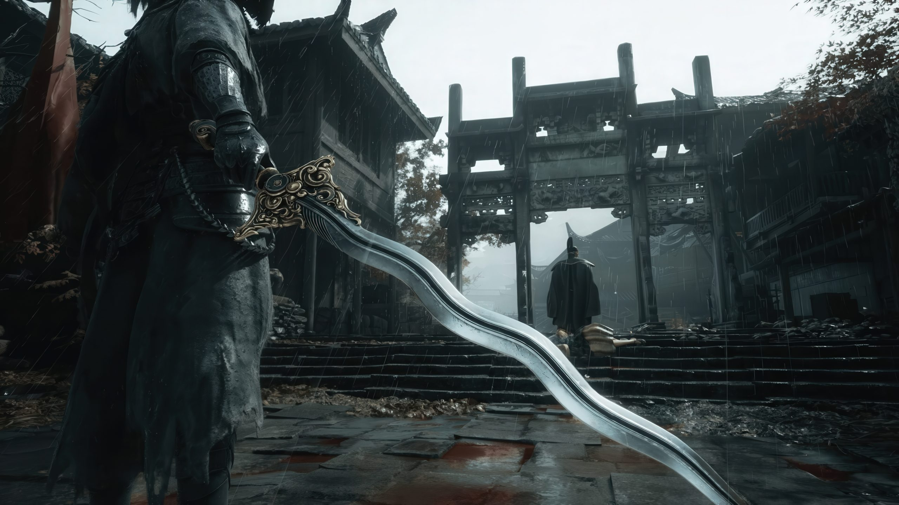
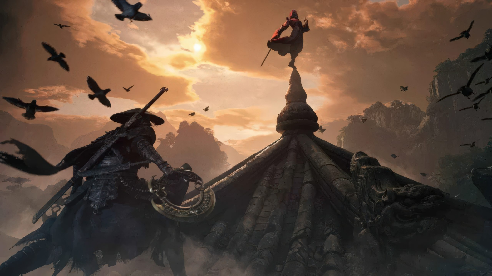

**Phantom Blade Zero**, el RPG de acción wuxia de la desarrolladora china **S-GAME**, ya tiene fecha, precio y requisitos de PC cerrados. Tras más de tres años desde su primer anuncio, el estudio confirmó que el juego llegará el **29 de octubre de 2026** a **PlayStation 5 y PC** de forma simultánea, con la versión de ordenador disponible tanto en **Steam** como en **Epic Games Store**. Estas son las claves de un lanzamiento que aspira a repetir el tirón global que tuvo **Black Myth: Wukong** en el mercado occidental.

## Una fecha que se movió dos veces

S-GAME anunció primero el **9 de septiembre de 2026** durante los Game Awards de diciembre de 2025. En junio de 2026, y en el marco de un State of Play de Sony, el estudio retrasó el lanzamiento unos **50 días**, hasta el 29 de octubre. La explicación oficial fue la de querer lanzar «la versión más sólida posible» desde el primer día, en lugar de depender de parches posteriores.

El desarrollo se dio por terminado a principios de agosto y las reservas se abrieron el **11 de agosto**, acompañadas de un tráiler de once minutos y, unos días después, de un State of Play monográfico centrado en la jugabilidad. Hay dos ediciones en preventa en las tres tiendas:

| Edición | Precio en EE. UU. |
| --- | --- |
| Estándar | 59,99 dólares |
| Digital Deluxe | 69,99 dólares |

Reservar desbloquea antes de tiempo el accesorio **Treasure Basin** y el atuendo **Legacy**, aunque ambos también se consiguen avanzando en el juego. A diferencia de otras producciones triple A, no hay acceso anticipado al juego completo por reservar.

**Aún sin confirmar:** varios medios apuntan a una **exclusividad temporal de consola de 12 meses en PS5**, lo que situaría cualquier versión para Xbox no antes de finales de 2027. S-GAME no ha anunciado esa edición ni se ha pronunciado sobre la ventana de exclusividad, así que conviene tratarlo como rumor.

## Wuxia, no soulslike: así funciona el combate de Phantom Blade Zero

El propio estudio ha insistido en que Phantom Blade Zero **no es un soulslike**. Es un RPG de acción en tercera persona para un jugador, dirigido y producido por **Qiwei «Soulframe» Liang**, con un protagonista llamado **Soul**: un asesino de élite que servía a la organización conocida como The Order y al que incriminan por el asesinato de su patriarca. El gancho narrativo es que a Soul le quedan **66 días de vida**, una cuenta atrás que da nombre también al modo de dificultad más exigente.

Todo el sistema de combate gira en torno a **Sha-Chi**, un único recurso compartido que funciona a la vez como aguante, postura y medidor de habilidad, y que gestionan tanto el jugador como cada enemigo. Soul lleva **dos armas principales** (las Blades, cada una con su habilidad definitiva o *Power Surge*) y **dos secundarias** (las Phantom Edges, un catálogo que incluye cañones, lanzas, hachas y martillos). El arsenal confirmado supera las **30 armas principales y las 25 Phantom Edges**, y cambiar de arma principal a mitad de combate restaura Sha-Chi, siempre con un enfriamiento que impide abusar del intercambio.

La defensa se apoya en bloqueo, parada y esquiva, y los ataques enemigos van codificados por colores: los **Brutal Moves** drenan mucho Sha-Chi si se bloquean y los **Killer Moves** no se pueden bloquear ni parar. Leer bien esas señales es la vía para el **Ghoststep**, que reposiciona a Soul a la espalda del rival para contraatacar. A esto se suman un árbol de habilidades, mejoras y evoluciones por arma, accesorios, un sistema de reforge que devuelve materiales y la posibilidad de invocar aliados. Hay **cuatro dificultades** —Wayfarer, Pathbreaker, Hellwalker y 66 Days— y, según el estudio, el trofeo de platino puede lograrse en una sola partida en PS5.

## Ocho regiones, ocho finales

El mundo de Phantom Blade Zero no es un mundo abierto al uso ni tampoco lineal: se divide en **ocho regiones interconectadas** y hechas a mano, con jefes y armas secretas repartidas por ellas. Las Phantom Edges funcionan además como **llaves de exploración**, con alrededor de diez combinaciones de cerradura vistas hasta ahora, lo que invita a revisitar zonas antiguas con herramientas nuevas. La exploración incluye parkour y campanas que sirven de punto de descanso y viaje rápido.

El contenido secundario no es relleno, según el equipo: las misiones principales siguen la historia de Soul, mientras que las secundarias profundizan en otros personajes y **pueden alterar el rumbo de la trama**. De ahí salen **ocho finales** que no dependen de una decisión binaria al final, sino de cómo se explore, qué misiones se completen y qué objetos se recojan. La campaña principal se estima en **20 a 30 horas**.

El apartado artístico bebe del folclore chino: S-GAME describe el escenario como **Kungfupunk**, una mezcla de artes marciales tradicionales con maquinaria steampunk y modificación corporal, ambientada en el llamado Phantom World y en el mundo marcial de **Wulin**. No hace falta conocer las anteriores sagas Phantom Blade y Rainblood para seguir la historia. Entre los nombres propios del proyecto destaca el de la estrella de las artes marciales **Donnie Yen**, que participó en consultoría creativa, captura de movimiento y facial, y trabajo de voz.

## PC y PS5: requisitos, path tracing y lo que aún es rumor

Phantom Blade Zero corre sobre **Unreal Engine 5** y admite **ray tracing por hardware**, con una sorpresa añadida: también habrá **path tracing completo** en PC. Los requisitos oficiales publicados asumen reescalado activado en todos los objetivos de rendimiento.

| Componente | Mínimo (1080p / 30 FPS) | Recomendado (1440p / 60 FPS) |
| --- | --- | --- |
| Sistema | Windows 10/11 64 bits | Windows 10/11 64 bits |
| CPU | Intel Core i7-8700K / AMD Ryzen 5 3600 | Intel Core i5-10600K / AMD Ryzen 5 5600X |
| RAM | 16 GB | 16 GB |
| GPU | NVIDIA GTX 1660 6 GB / AMD RX 5500 XT 8 GB | NVIDIA RTX 3060 Ti 8 GB / AMD RX 6700 XT 12 GB |
| DirectX | 12 | 12 |
| Almacenamiento | SSD obligatorio | SSD obligatorio |

Para trazado de rayos a 1080p y 60 FPS, la tabla pide una **RTX 5060 de 8 GB**; el **path tracing a 4K y 60 FPS** exige una **RTX 5080 de 16 GB**. En escalado, S-GAME ha confirmado **DLSS 4.5 Super Resolution y Multi Frame Generation** de NVIDIA, sin decir nada aún sobre AMD FSR o Intel XeSS. El juego estuvo entre los primeros anunciados como compatibles con DLSS 5, pero el propio Liang confirmó por escrito que no integrarían «funciones de IA que alteren la intención de los artistas», un giro que se lee como una retirada de esa tecnología tras la polémica; quien quiera aplicarla por su cuenta puede recurrir a los mods, como ocurre con [el DLSS 5 aplicado al escritorio de Windows](/noticias/dlss-5-desktop-neuralscreen/).

En el plano de la distribución, la versión de PC usa **Denuvo**. El tamaño de instalación no se ha anunciado. En PS5, S-GAME **confirmó mejoras para PS5 Pro** pero todavía no las ha detallado, y todo apunta a que el path tracing seguirá siendo exclusivo de PC.

