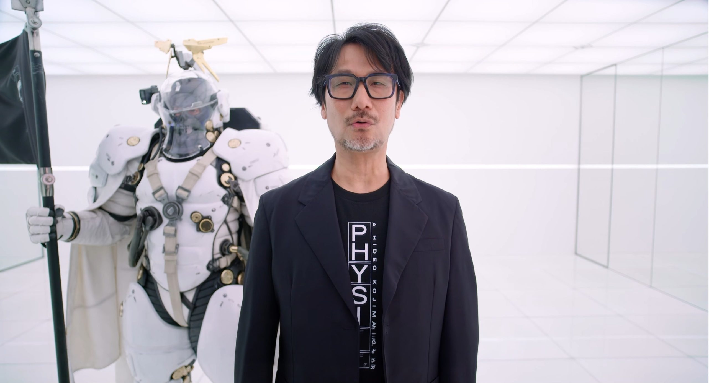

Hideo Kojima cerró por sorpresa la retransmisión de Xbox para el Tokyo Game Show 2026 con novedades sobre sus dos proyectos junto a la compañía. Para *Physint*, el anuncio llegó por partida doble: el estudio confirmó que Bill Skarsgård interpretará al personaje principal y desveló el primer póster oficial del juego, una imagen en la que el actor aparece junto a Charlee Fraser y que firma el propio Kojima como fotógrafo.

El movimiento llega apenas unos días después de que se oficializara que Xbox será la editora del título, y sirve para mostrar que el proyecto sigue avanzando pese al cambio de socio.

## El primer póster y las pistas de una Guerra Fría

El cartel, en blanco y negro y con una composición cercana al cine negro, reúne a Skarsgård y a Fraser en dos retratos enfrentados. En la parte inferior aparece un lema que los seguidores del creativo ya diseccionan: "The next Cold War begins" ("La próxima Guerra Fría comienza").

La frase encaja con lo poco que se sabe del juego. Kojima Productions lo describe como un título de acción y espionaje, y el propio estudio ha fijado el objetivo de marcar un nuevo estándar dentro del género. La mención a una Guerra Fría apunta, por tanto, a una trama de intriga política y espionaje, aunque la compañía no ha confirmado detalles concretos de la historia.

Hay un segundo indicio en el propio reparto: los cuatro actores confirmados proceden de tradiciones cinematográficas distintas —sueca, australiana, surcoreana y japonesa—, lo que sugiere un relato de alcance internacional más que una historia localizada en un único país. De momento son lecturas razonables, no hechos confirmados.

## Bill Skarsgård encabeza un reparto internacional

Kojima no ocultó su entusiasmo al anunciar el fichaje. "Estoy encantado de confirmar que el papel principal de *Physint* será para Bill Skarsgård", declaró el creativo en el comunicado del estudio, donde añadió que ambos son "admiradores de la obra del otro desde hace tiempo" y que las pruebas de vestuario, escaneos y test de cámara realizados con el actor y con Fraser "dieron una confianza enorme en la dirección del proyecto".

Skarsgård es un rostro reconocible para el gran público por haber dado vida al payaso Pennywise en las dos entregas de *It* y en la serie precuela *It: Welcome to Derry*, además de participar en títulos como *Nosferatu*, *Barbarian* o *John Wick: Chapter 4*. Se suma a un reparto en el que también figuran Fraser, el actor surcoreano Don Lee —ya vinculado antes a Kojima Productions— y la japonesa Minami Hamabe. El estudio ha adelantado que habrá más anuncios de casting en el futuro.

Cabe recordar que estos tres nombres ya se habían desvelado durante el evento del décimo aniversario del estudio, celebrado en Tokio en septiembre de 2025. La novedad de esta tanda es la confirmación de quién llevará el peso protagonista.

## Sin gameplay, pero con avances en el desarrollo

A pesar de la expectación, la presentación no incluyó ni un solo fotograma de juego. Kojima se limitó a asegurar que el desarrollo avanza de forma constante, con castings, escaneos de talento y colaboraciones con creadores externos, y que la visión final del proyecto está cada vez más definida. También agradeció públicamente a Xbox que haya respaldado la visión del estudio y haya aceptado recorrer ese camino con ellos.

El creativo aprovechó su intervención para dar señales de vida de *OD – KNOCK*, su otro proyecto con Xbox, del que mostró material de una sesión de captura de movimiento con las actrices Sophia Lillis y Hunter Schafer. Kojima describió ese juego como una propuesta que buscará poner a prueba los límites del miedo.

## Contexto: el proyecto que cambió de socio

Este anuncio llega sobre un terreno ya conocido por los lectores del portal. *Physint* nació bajo el paraguas de PlayStation, pero Sony decidió apartarse de la colaboración y el estudio encontró en Xbox un nuevo socio editorial, una [operación que ya cubrimos](/noticias/playstation-kojima-xbox/) cuando se hizo pública.

La diferencia ahora es el tono: lo que entonces era una historia de ruptura y búsqueda de aliado se ha convertido en una campaña de presentación. Con el reparto principal cerrado, el primer póster en circulación y el respaldo de Xbox confirmado, el foco vuelve a ponerse en el juego. La incógnita que sigue sin respuesta es cuándo podrá verse en movimiento.
