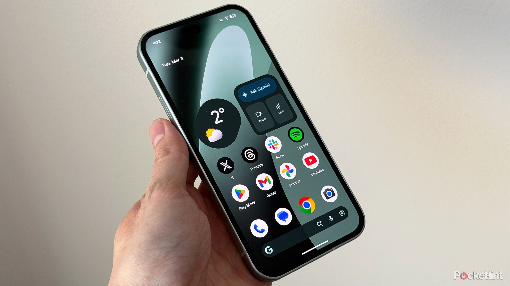

El próximo móvil económico de Google vuelve a ser noticia por una filtración y no por un anuncio oficial. Según Pocket-lint, que se hace eco de los renders publicados por Android Headlines y el filtrador OnLeaks, el **Pixel 11a** mantendría un diseño muy parecido al de sus dos antecesores, con un módulo de cámara algo más compacto y un acabado en un tono morado rojizo que aún está por confirmar.

Conviene enmarcar la información como lo que es: una filtración a partir de renders CAD, no una comunicación de la compañía. Los detalles que siguen proceden de filtradores y de imágenes que Google no ha validado, así que pueden cambiar antes de la presentación.

## Un diseño casi calcado: el Pixel 11a frente al 10a

Los renders filtrados sitúan al Pixel 11a muy cerca de sus dos predecesores. La parte trasera conserva la cámara enrasada con el cuerpo que ya vimos en el Pixel 10a, aunque el módulo pasa de un óvalo alargado a uno más corto, un cambio sutil que apenas altera la silueta del teléfono. El flash seguiría quedando fuera del módulo.

En cuanto al color, la filtración apunta a una nueva variante morada con matiz rojizo, además del negro, el plateado y el verde. Android Headlines advierte de que el tono mostrado en sus imágenes es solo una predicción y no una referencia confirmada por Google.

En tamaño, las medidas filtradas rondan los 153,46 × 72,35 × 9 mm, ligeramente por debajo del Pixel 10a (153,9 × 73 × 9 mm), aunque la pantalla se mantendría en 6,3 pulgadas. Ese ajuste, pequeño, bastaría para que las fundas del modelo anterior no encajaran del todo.

## El salto interno del Pixel 11a: Tensor G6 y módem de MediaTek

Donde más cambiaría el Pixel 11a es dentro. La filtración le atribuye el procesador **Tensor G6** —el mismo que estrena la gama Pixel 11, a la que pertenece el [Pixel 11 Pro XL que ya analizamos](/noticias/google-pixel-11-pro-xl-review/)—, un chip de seguridad **Titan M3** y un módem de **MediaTek** en lugar del módem de Samsung de las generaciones previas. Sería un salto notable frente al Tensor G4, el Titan M2 y el módem de Samsung del Pixel 10a.

La memoria RAM se quedaría, según los mismos indicios, en 8 GB, coherente con el encarecimiento de los chips de memoria de los últimos meses. La pantalla, de 6,3 pulgadas y resolución 1080p, ganaría brillo: hasta 3.350 nits de pico frente a los 3.000 nits del Pixel 10a y del Pixel 11, según Android Headlines. Las cámaras serían las mismas del 10a (48 MP principal y 13 MP ultra gran angular), sin teleobjetivo, aunque la frontal podría renovarse por primera vez desde el Pixel 7a. El almacenamiento, la velocidad de carga y las cifras definitivas de cámara siguen sin conocerse.

## Precio y fecha del Pixel 11a: todo por decidir

La presentación seguiría la estela de la serie: febrero o marzo de 2027, con llegada a las tiendas en la primavera de ese año. El precio está por ver. El Pixel 10a salió desde unos 500 dólares en su versión de 128 GB (unos 600 en la de 256 GB), y la filtración no descarta una subida de 100 dólares en toda la gama o incluso la desaparición del modelo de menor capacidad. Desde Android Headlines calculan un precio de partida en torno a 599 dólares.

## Qué cambia para el usuario

Para quien busca un móvil económico, el Pixel 11a se perfila como una actualización discreta por fuera y más relevante por dentro: mismo tamaño manejable, más potencia y mejor conectividad, pero también, posiblemente, más caro. Quien tenga un Pixel 7a u 8a notaría el cambio en procesador, señal y brillo; quien venga de un 10a encontraría, sobre todo, una mejora interna. Eso sí, todo depende de una filtración que Google todavía no ha confirmado.
