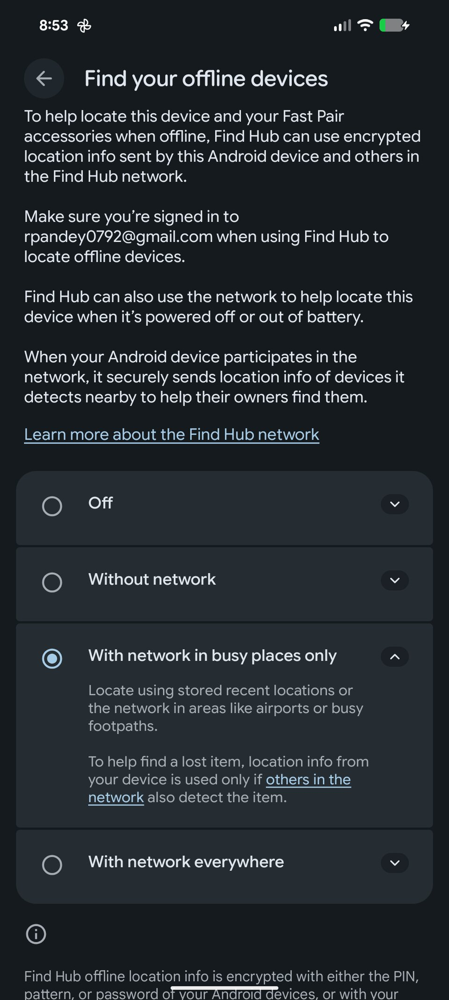
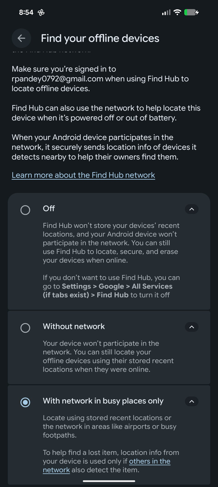

Apagar un Google Pixel ya no equivale a que el teléfono deje de comunicarse. Los modelos Pixel 8 y posteriores incorporan el llamado rastreo sin conexión, un sistema que mantiene activo un enlace Bluetooth de bajo consumo durante horas después del apagado: otros dispositivos cercanos pueden detectar esa señal y reenviar la ubicación aproximada a los servidores de Google. Un redactor de Android Police comprobó el comportamiento en su Pixel 8 Pro y encontró la manera de desactivarlo sin renunciar por completo a Find Hub.

## El teléfono sigue emitiendo Bluetooth después de apagarse

La idea de que apagar el móvil lo desconecta de todo ya no se sostiene. En el caso de los Pixel 8 y modelos posteriores, el hardware sigue alimentando un enlace Bluetooth de baja potencia que emite durante horas con la pantalla negra y el sistema aparentemente detenido. Los dispositivos que pasan cerca captan esa señal y la usan para reportar una posición aproximada al servicio de búsqueda de Google.

En teoría es una función de seguridad excelente: si el teléfono se pierde o lo roban, permite localizarlo de forma aproximada durante al menos unas horas, incluso si alguien retira la tarjeta SIM o lo aleja de cualquier red Wi-Fi. La información de ubicación está cifrada de extremo a extremo, por lo que Google no puede leerla en claro.

El problema no es la función en sí, sino la poca visibilidad que tiene. Cuando el usuario apaga el teléfono aparece un breve mensaje que avisa de que el dispositivo todavía podrá localizarse tras el apagado, pero se trata de un texto fácil de pasar por alto. Google detalla el funcionamiento en su propia página de soporte, aunque los controles quedan enterrados en los ajustes del sistema.

## Por qué este comportamiento importa para la privacidad

Para quien espera que el botón de apagado signifique un corte total, el matiz importa. La ubicación no deja de compartirse por completo, solo se reduce el consumo: el teléfono sigue siendo detectable aunque el usuario crea haberlo dejado inactivo. Es un ejemplo más de cómo la privacidad de un móvil depende de ajustes que rara vez se revisan y que se separan del resto de opciones, en lugar de explicarse en el momento de configurarlos.

Google ha ido reforzando esa capa en paralelo. La compilación Android Canary más reciente añade un ajuste que impide activar o desactivar el Wi-Fi, el Bluetooth y los datos móviles desde la pantalla de bloqueo sin autenticación biométrica, lo que dificulta que un ladrón desconecte por completo un Pixel robado de internet y complementa al rastreo sin conexión. Quien quiera ajustar antes qué se comparte sobre su posición puede empezar por revisar [cómo desactivar el historial de ubicaciones de Google Maps](/noticias/google-location-history-off/).

## Cómo desactivar el rastreo con el móvil apagado

El rastreo sin conexión se puede cortar sin desactivar Find Hub por completo, algo importante porque esa herramienta sigue siendo útil para localizar el teléfono, hacerlo sonar o borrar sus datos a distancia. El control está en una ruta concreta:

**Ajustes > Seguridad y privacidad > Protección para dispositivos perdidos > Find Hub > Buscar tus dispositivos sin conexión**.

Dentro aparecen cuatro opciones:

- **Off** (Desactivado)
- **Without network** (Sin red)
- **With network in busy places only** (Con red solo en lugares concurridos)
- **With network everywhere** (Con red en todas partes)

El autor eligió **Off** para desactivar por completo la búsqueda sin conexión, pero mantuvo activada la opción **Allow device to be located** (Permitir que se localice el dispositivo) para seguir usando Find Hub mientras el teléfono está encendido y conectado. Quien prefiera un punto intermedio puede decantarse por **Without network**: el Pixel deja de participar en la red colaborativa, pero Find Hub todavía muestra su última ubicación cifrada mientras estuvo en línea.

Conviene tener claro el intercambio. Desactivar el rastreo con el móvil apagado elimina una de las herramientas de recuperación más eficaces de Android y reduce las posibilidades de encontrar un dispositivo perdido o robado, sobre todo si el ladrón intenta aislarlo de la red. Para la mayoría de usuarios, el autor del artículo no recomienda hacerlo; su decisión responde a una preferencia personal y admite que podría arrepentirse si algún día pierde el teléfono. Lo que sí pide a Google es que la elección sea más clara y que el ajuste esté en un lugar menos escondido.
