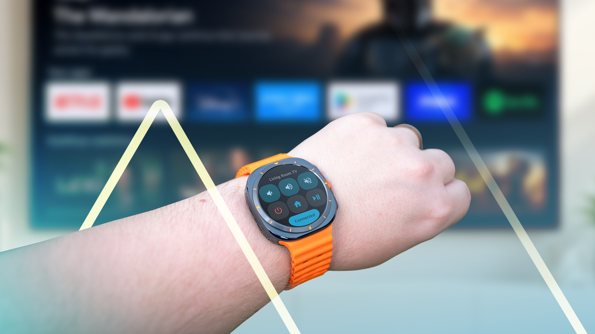
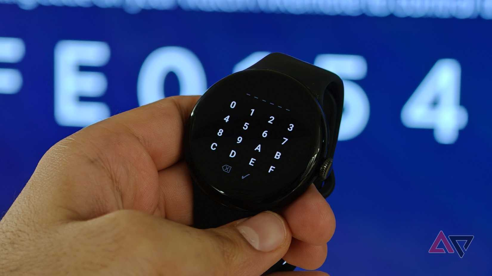
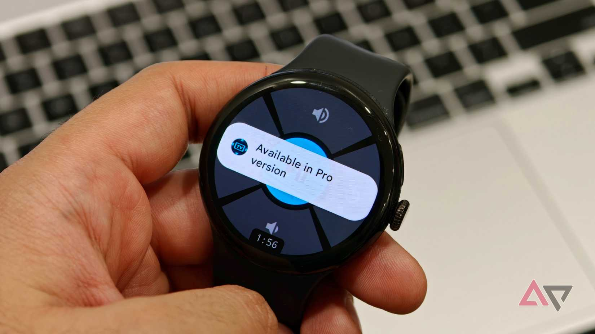
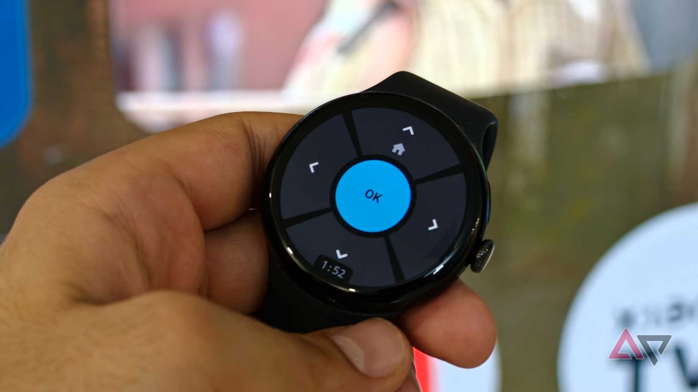
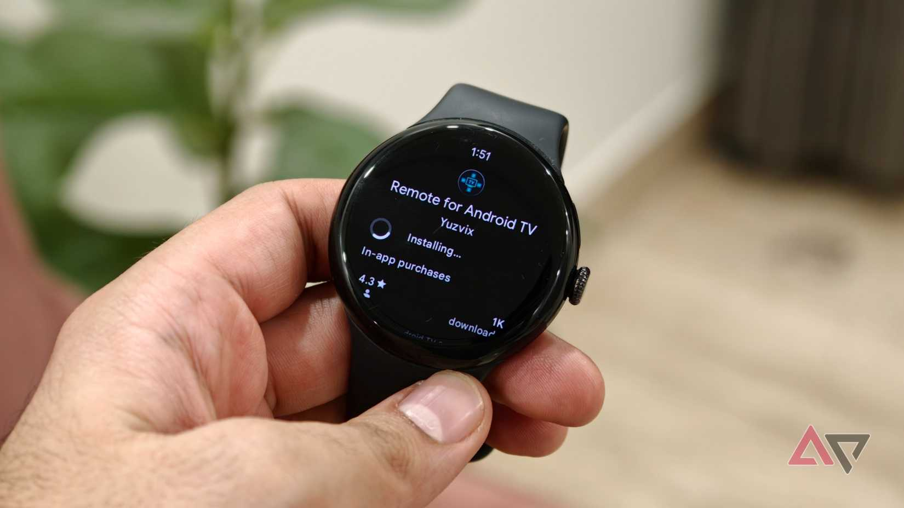

Perder el mando del televisor es un clásico del salón, y el redactor Sanuj Bhatia cuenta en Android Police que ha dejado de buscarlo: ahora controla su Google TV desde un Pixel Watch con una aplicación de terceros llamada Remote for Android TV, disponible gratis en Google Play para relojes con Wear OS. La ha probado en un Pixel Watch 3 junto a un reproductor Xiaomi con Google TV y asegura que, desde que la configuró, no ha vuelto atrás.

## Qué pasó: un mando de Google TV en la muñeca

La aplicación, presentada por su desarrollador en la comunidad r/WearOS de Reddit, lleva a la muñeca las funciones del mando que Google ofrece en el móvil a través de la app de Google TV y los ajustes rápidos. Según el desarrollador, es compatible con Wear OS 3 y versiones posteriores, lo que cubre todos los modelos de Pixel Watch y los Galaxy Watch 4 en adelante, además de algunos TicWatch Pro 5, Fossil Gen 6 y relojes OnePlus. También afirma que utiliza el protocolo Android TV Remote Protocol v2, el mismo que emplea la función de mando de Google en el teléfono.

El emparejamiento sigue el mismo esquema que en el móvil: el televisor muestra un PIN que se introduce en el reloj, con los números y letras disponibles en la propia pantalla del smartwatch. Una vez conectado, la interfaz muestra una cruceta con un gran botón OK central y un diseño acorde con el estilo Material You Expressive de Wear OS.

## Por qué importa: el hueco que Google deja en Wear OS

El autor subraya que Google, pese a llevar años con Android TV y Google TV, no ofrece una aplicación de mando dedicada para Wear OS. La vía oficial en el reloj pasa por el mosaico de mando de la app Google Home, que Google documenta en su página de ayuda del Pixel Watch, pero no existe un equivalente directo del mando del móvil pensado para la muñeca. Ese hueco es el que ocupa esta aplicación independiente, algo habitual en Android, donde los desarrolladores cubren funciones que el sistema aún no resuelve de serie.

El caso también ilustra el papel creciente del reloj como segunda pantalla del hogar: si el móvil ya servía de mando de emergencia, el reloj lo lleva un paso más allá porque siempre va puesto. Para quien ya tiene un [Pixel Watch como compañero de salud y deporte](/noticias/pixel-watch-health-guardian-gratis/), sumarle el control del televisor refuerza su utilidad diaria sin comprar ningún accesorio.

## Qué cambia si lo pruebas en tu Pixel Watch

La navegación básica es gratuita: moverse por la interfaz, reproducir y pausar contenido y controlar la reproducción desde la muñeca. Hay gestos útiles, como la pulsación larga del botón superior para volver a la pantalla de inicio o mantener pulsado el botón OK azul para abrir los controles adicionales de reproducción y volumen. La app puede guardar varios televisores, aunque cambiar entre ellos exige la versión Pro.

La versión de pago añade el control del volumen con la corona del reloj, un modo siempre activo con reloj analógico y protección contra quemados, la reasignación de botones y accesos directos a servicios populares como YouTube y Netflix. El único punto débil que señala el autor en la versión gratuita es la ausencia del botón de retroceso, necesario para volver una pantalla atrás dentro de muchas apps.

La conclusión del redactor es clara: la app funciona con fluidez y cubre lo esencial sin coste, aunque deja en evidencia que Google debería integrar algo así en Wear OS. Mientras tanto, quien pierda el mando con frecuencia tiene una alternativa gratuita que se instala desde la Play Store del propio reloj.

