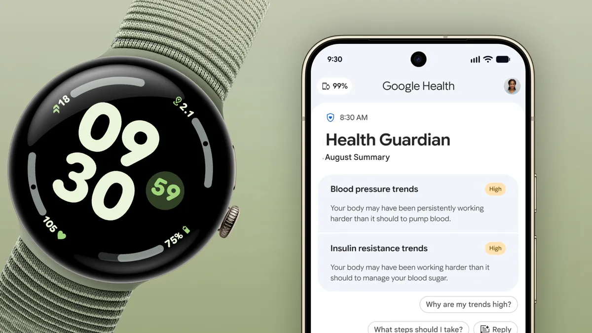

Google ha empezado a desplegar Health Guardian, su nueva familia de herramientas de salud proactiva, dentro de la aplicación Google Health. La compañía lo confirmó en su blog oficial y el anuncio llega con un matiz relevante para quien esté pensando en comprar un wearable: los relojes Pixel Watch 3, 4 y 5 reciben las funciones principales sin coste añadido, mientras que el Fitbit Air las deja detrás de una suscripción de pago.

## Qué funciones incluye Health Guardian

El paquete reúne tres métricas nuevas que se pueden configurar desde la app: tendencias de presión arterial, tendencias de resistencia a la insulina y calidad de la respiración durante el sueño. Google señala que ya se puede iniciar la configuración en los Pixel Watch 3, 4 y 5, aunque los primeros informes con datos útiles no llegarán de inmediato.

Según la compañía, los primeros informes de tendencias comenzarán a aparecer a principios de octubre, cuando haya suficiente información acumulada para generar un análisis con sentido. No se trata de mediciones en tiempo real, sino de lecturas agregadas que llegan con retraso: la presión arterial exige al menos cinco días consecutivos de datos dentro de una semana, y la resistencia a la insulina, un mínimo de siete días en el mes. Los informes se entregan el primer día de cada mes. Las funciones se apoyan en investigación clínica y trabajan en segundo plano para detectar cambios fisiológicos sutiles a lo largo del tiempo.

## Pixel Watch gratis, Fitbit Air con suscripción Premium

La diferencia entre dispositivos es el punto más llamativo del anuncio. En el Fitbit Air, las tendencias de presión arterial y de resistencia a la insulina llegarán «más adelante este año», pero solo para quienes tengan una suscripción a Google Health Premium; en los Pixel Watch 3, 4 y 5 no hay ningún requisito equivalente.

El medio Gadgets & Wearables detalla que Google Health Premium cuesta 9,99 dólares al mes o 99 dólares al año, que los compradores del Fitbit Air reciben tres meses incluidos y que la suscripción también forma parte de los planes Google AI Pro y Ultra. Ese último punto rebaja la fricción para quien ya paga por los servicios de inteligencia artificial de Google, pero mantiene una distinción clara para el resto: lo que el Pixel Watch obtiene gratis, el Fitbit Air lo condiciona a un pago recurrente.

Google sigue empujando así su ecosistema de salud, en el que conviven el Pixel Watch y dispositivos como el [Fitbit Charge 7](/noticias/fitbit-charge-7-launch/).

## Detección de emergencias respiratorias en Europa

Health Guardian no se limita a las tendencias. El paquete incorpora también la que Google describe como su primera función de detección de emergencias respiratorias, disponible para los Pixel Watch 4 y 5 en países europeos seleccionados. Su objetivo es avisar y proponer una llamada a los servicios de emergencia si el usuario sufre caídas severas de oxígeno en sangre.

Conviene leer la letra pequeña: Google advierte de que esta función no ha sido evaluada por la FDA estadounidense, aunque cuenta con el marcado CE en la Unión Europea. La compañía también recuerda que la disponibilidad de Health Guardian varía según la región y el dispositivo, y que puede requerir suscripción.

## Qué cambia para el lector

Si tienes un Pixel Watch 3, 4 o 5, puedes activar las nuevas métricas desde ya; eso sí, los informes con datos aprovechables no aparecerán hasta octubre, porque el sistema necesita acumular días de registro. Si tu dispositivo es un Fitbit Air, las dos tendencias de salud quedan supeditadas a Google Health Premium.

Más allá del reparto entre gratis y de pago, el anuncio deja una idea de fondo: estas métricas son herramientas de bienestar general y no un diagnóstico médico. La propia Google subraya que no sirven para detectar diabetes, hipertensión o apnea del sueño, ni para ajustar tratamientos, y que quienes estén embarazadas no deben usarlas. Ante cualquier duda de salud, la recomendación sigue siendo consultar a un profesional.
