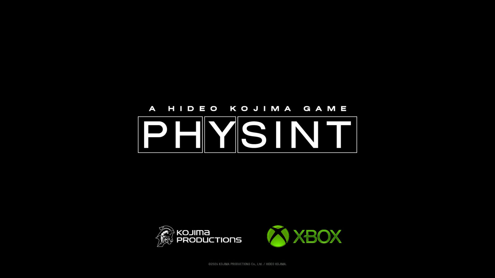

PlayStation ha decidido dar un paso al costado en *Physint*, el próximo gran proyecto de Kojima Productions, y Xbox ha ocupado su lugar. El movimiento deja al estudio de Hideo Kojima con un nuevo socio para el que estaba llamado a ser su regreso al género de espionaje y acción, y vuelve a poner el foco sobre la estrategia de Sony en un año ya marcado por decisiones polémicas.

Según el comunicado que PlayStation publicó en X, la compañía tomó "la difícil decisión de apartarse de la colaboración con Kojima Productions en su proyecto, *Physint*", aunque mantuvo que sigue teniendo "una gran admiración por la visión de Hideo Kojima". El propio Kojima ofreció su versión en la misma red social: aseguró que recibió "de forma inesperada" el aviso de PlayStation Studios de que cancelarían el proyecto.

## Tres meses buscando socio

Lejos de dar el juego por perdido, el creativo japonés explicó que su equipo pasó los últimos tres meses buscando un nuevo aliado para mantener vivo el desarrollo. El elegido fue Xbox, con quien dice compartir "una visión común de futuro" y con quien ya había trabajado en otros proyectos. La relación no es nueva: la compañía de Redmond también respalda *OD*, otra de las apuestas del estudio.

La directora ejecutiva de Xbox, Asha Sharma, celebró el acuerdo y afirmó sentirse "honrada" de que Kojima haya elegido su plataforma. En sus palabras, la ambición del desarrollador por desafiar convenciones encaja con el tipo de creatividad que la compañía quiere apoyar.

*Physint* sigue en desarrollo y Kojima lo describió como un título de acción y espionaje "que definirá el género", una etiqueta que muchos leen como su heredero espiritual de *Metal Gear*, la saga que dejó atrás tras separarse de Konami en 2015.

## El contexto: discos, suscripciones y desconfianza

La pregunta que sobrevuela el anuncio es si la ruptura se debe solo a la intentona de cancelación o si hay algo más de fondo. La propia cobertura de TechRadar apunta a un segundo factor: la postura de Kojima frente al futuro sin formato físico.

Pocos meses antes, Sony confirmó que dejará de fabricar discos de juegos y que camina hacia un ecosistema digital. Kojima calificó entonces esa decisión como "aterradora" y advirtió que el jugador "no será dueño de los datos", comparando la situación con una compañía que ofrece abrir el grifo "a cambio de una cantidad de dinero cada mes". Ese temor a que todo el acceso pase por una suscripción encaja mal con lanzar un gran juego en exclusiva para una plataforma que renuncia al soporte físico.

No hay confirmación de que ese haya sido el motivo real de la ruptura, pero la coincidencia temporal resulta difícil de ignorar. Y, si de verdad pesó en la decisión, no sería descabellado que otros estudios terminaran siguiendo un camino parecido.

## Por qué importa

Más allá del intercambio de cromos entre dos gigantes, el episodio deja tres lecturas para el jugador hispanohablante. La primera es que *Physint* sigue vivo: lo que empezó como una cancelación se convirtió en un cambio de socio, algo poco habitual en la industria. La segunda es que Xbox refuerza su catálogo con una de las firmas creativas más respetadas del sector, justo cuando busca diferenciarse por contenido y no solo por hardware.

La tercera, y quizá la más incómoda para Sony, es de reputación. PlayStation acumula críticas por su giro hacia lo digital y por la gestión de sus estudios internos, y cada decisión de este tipo alimenta la sensación de que la compañía está priorizando la estrategia de plataforma por encima de los proyectos. Que un creador de la talla de Kojima haya encontrado refugio en la competencia es, como mínimo, un mensaje difícil de maquillar.

Queda por ver si la reacción de la comunidad empuja a Sony a revisar el rumbo. Por ahora, el ganador evidente es Xbox, y el que más tiene que explicar es PlayStation.
