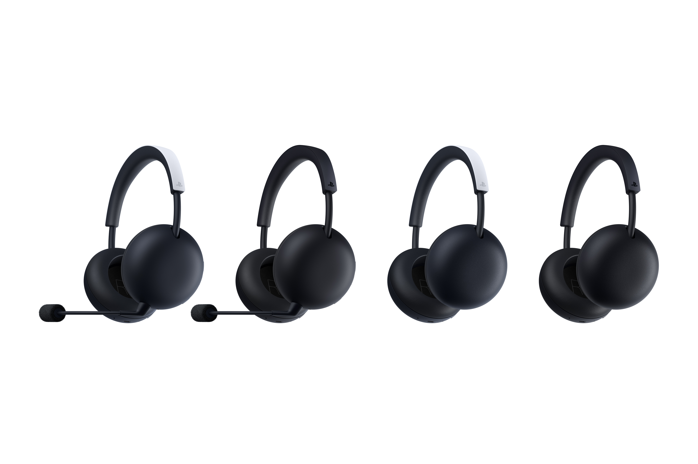
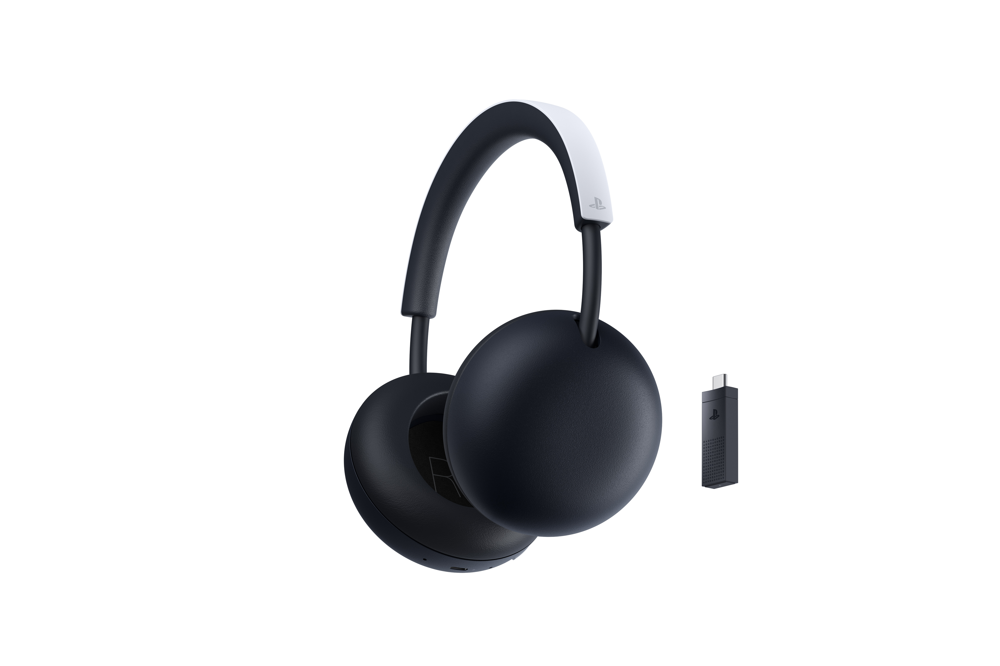
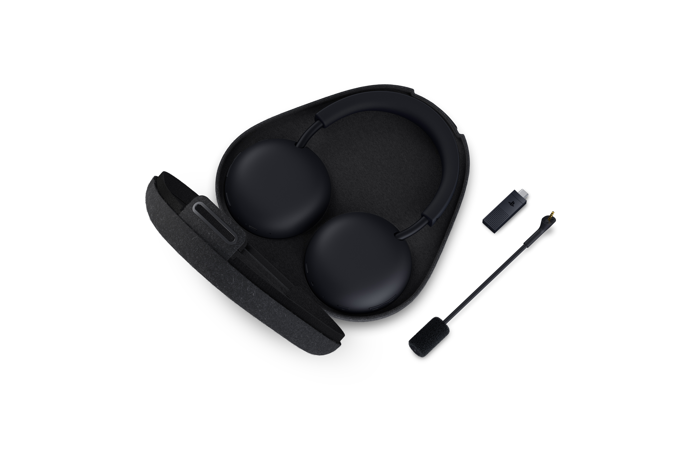

Sony presentó la nueva generación de productos de audio para PS5, compuesta por dos auriculares inalámbricos: el **PlayStation Pulse Wireless Headset** y el **Pulse Edge Wireless Headset**. Ambos sustituyen al Pulse Elite que la compañía lanzó en 2024 y mantienen la apuesta por los drivers planares magnéticos, una tecnología que hasta hace poco era territorio casi exclusivo de los auriculares de estudio y de la gama alta.

La nota oficial, firmada por Joe Bentley, vicepresidente de ingeniería de Sony Interactive Entertainment, confirma que los dos modelos comparten la misma base técnica, pero se separan en funciones y en precio. Y ahí está el primer punto que conviene aclarar: **Sony todavía no ha anunciado cuánto costarán ni la fecha exacta de lanzamiento**, algo que la propia compañía se compromete a detallar más adelante, junto con la apertura de reservas.

## Qué ha anunciado Sony

Los dos auriculares usan drivers planares magnéticos que la compañía describe como "de inspiración de estudio", con un tamaño mayor que el de la generación anterior para lograr unos graves más profundos sin perder la claridad del Pulse Elite. La diferencia entre ambos está en la cantidad de imanes por driver y en el equipamiento extra.

| Característica | PlayStation Pulse | Pulse Edge |
| --- | --- | --- |
| Drivers planares magnéticos | 4 imanes por driver | 8 imanes por driver |
| Conexión PlayStation Link | Sí, con adaptador USB-C incluido | Sí, con adaptador USB-C incluido |
| Micrófono | Integrado con rechazo de ruido por IA | Boom desmontable con rechazo de ruido por IA |
| Control de volumen integrado | Sí | Sí |
| Balance de audio de juego y chat en PS5 | No | Sí |
| Cancelación activa de ruido | No | Sí |
| Funda de transporte | No | Sí |
| Conector de audio y micrófono | No | Sí |

El Pulse Edge es, por tanto, el modelo tope de gama: duplica el volumen de imanes respecto al Pulse, añade cancelación activa de ruido, incluye un micrófono de varilla desmontable —con un micrófono oculto como alternativa cuando se retira— y suma controles de balance entre el audio del juego y la voz de los compañeros directamente integrados con el sistema de PS5.

El Pulse, en cambio, se posiciona como la opción de entrada a la nueva familia. Conserva los drivers planares y el micrófono integrado con rechazo de ruido por IA, pero prescinde de la cancelación activa, del boom desmontable y de la funda.

## Por qué importa

La clave está en el tipo de driver. Los auriculares de consumo masivo suelen usar drivers dinámicos, más baratos de fabricar. Los planares magnéticos, en cambio, reparten la fuerza motriz de forma más uniforme sobre una membrana fina, lo que se traduce en una mayor separación de sonido y en una localización espacial más precisa. En la práctica, eso importa en los juegos competitivos: distinguir si unos pasos vienen por la izquierda o por la derecha, o calcular de dónde llega una recarga, deja de depender tanto del software de audio.

Sony también destaca la conectividad **PlayStation Link**, que ofrece audio sin compresión y con baja latencia, y permite saltar entre dispositivos compatibles: consolas PS5, el reproductor remoto PlayStation Portal, PC y Mac. Además, los auriculares pueden conectarse de forma simultánea a dispositivos Bluetooth, lo que facilita escuchar el audio del juego y atender una llamada sin cambiar de accesorio.

Ambos modelos comparten un rediseño del formato, con almohadillas giratorias que permiten plegarlos planos para transportarlos con más comodidad, y estarán disponibles en blanco y en negro medianoche.

## Cuándo llegan y qué falta por saber

Las fechas no son las mismas para los dos modelos, y ese es otro detalle que conviene fijar bien:

- El **PlayStation Pulse** llegará a "mercados seleccionados" a partir de la próxima temporada navideña.
- El **Pulse Edge** hará lo propio a comienzos de 2027.

Sony ha sido explícita al reservarse los datos que los compradores esperan: no hay precio oficial, ni fecha de lanzamiento concreta, ni día de apertura de reservas. La compañía asegura que dará a conocer todo eso "pronto", pero por ahora cualquier cifra que circule es especulación.

Para el lector hispanohablante, la consecuencia práctica es que la decisión de compra tendrá que esperar, y que la comparación relevante no es solo entre los dos Pulse, sino también con las alternativas de marcas especializadas que ya compiten en ese rango de precio. Hasta que Sony publique las tarifas, no es posible saber si la renovación mantiene la relación calidad-precio que hizo popular al Pulse Elite.
