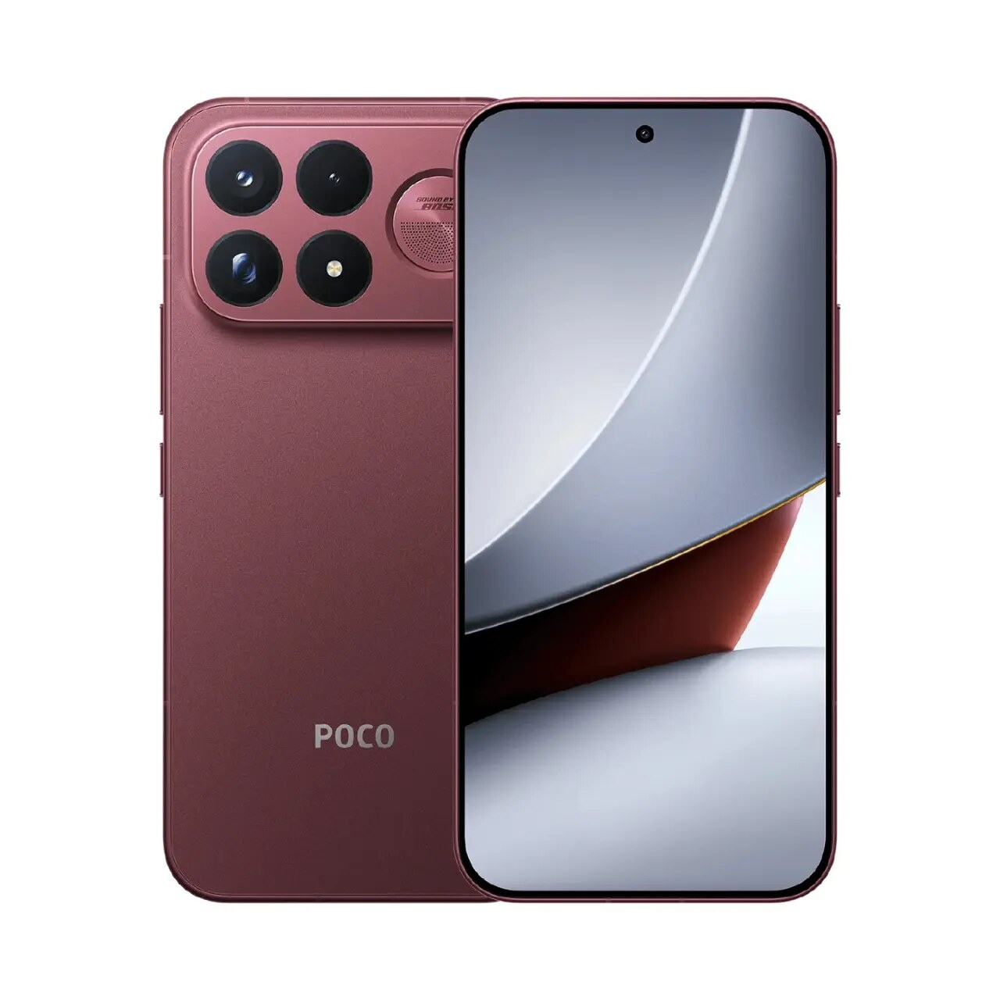
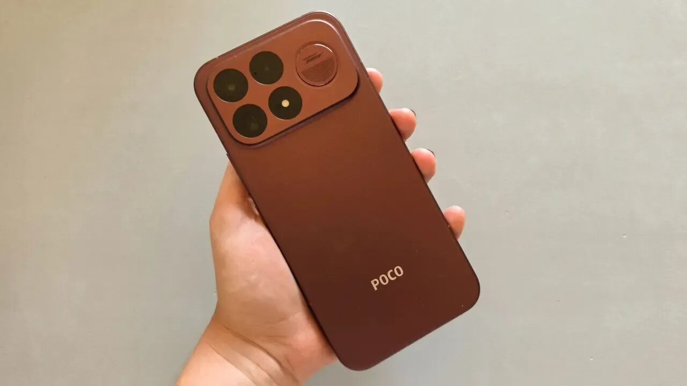
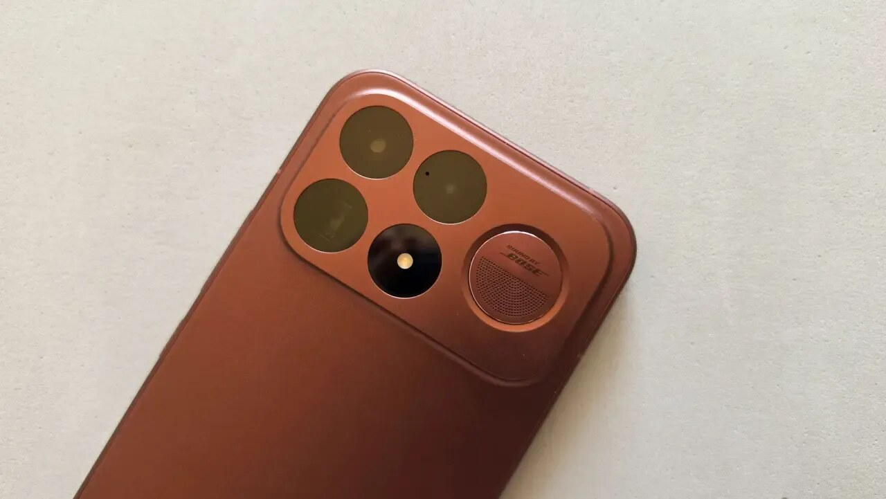
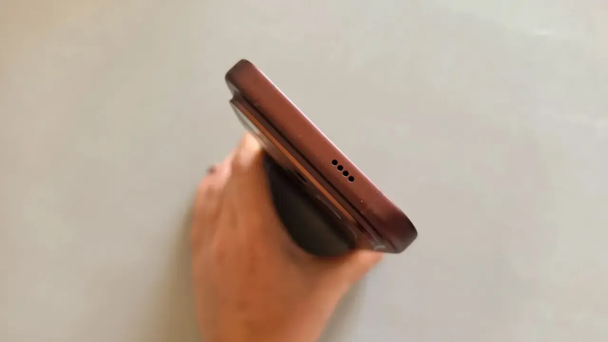
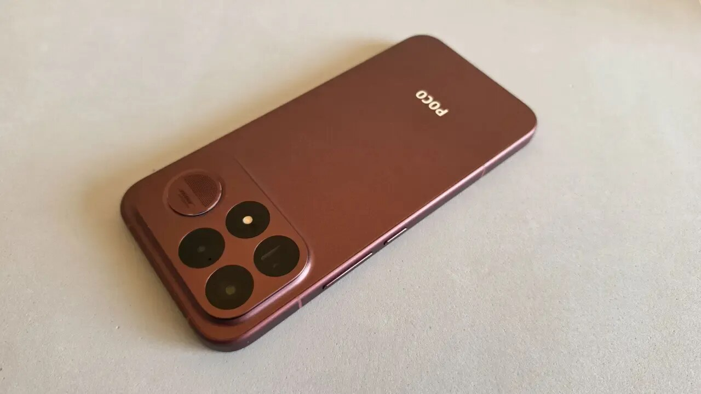
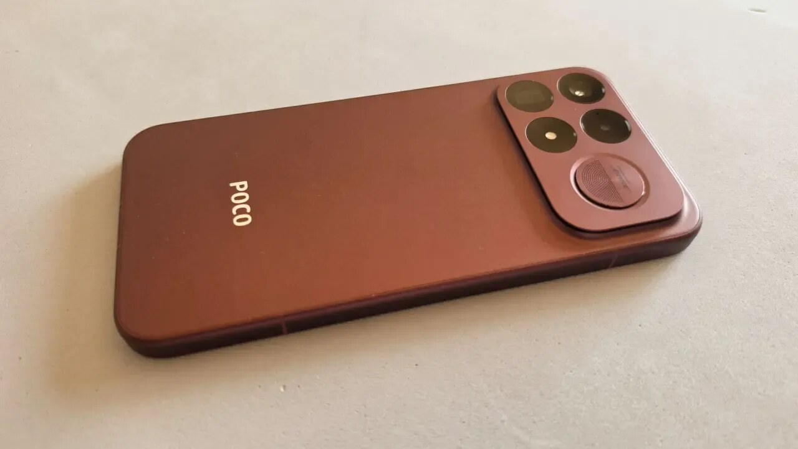
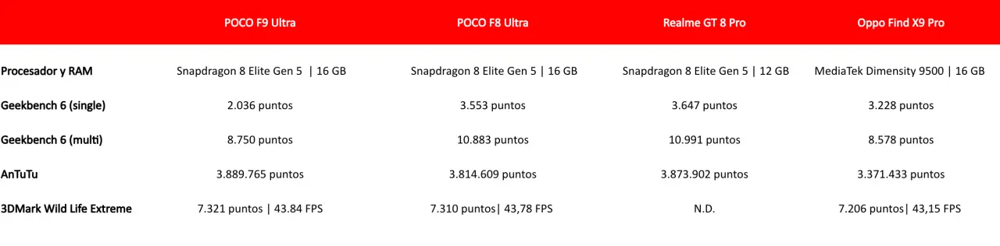
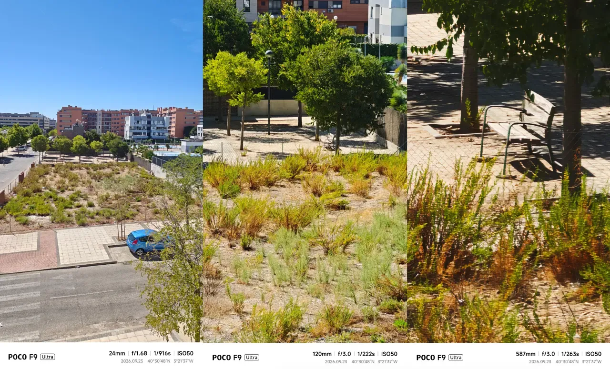
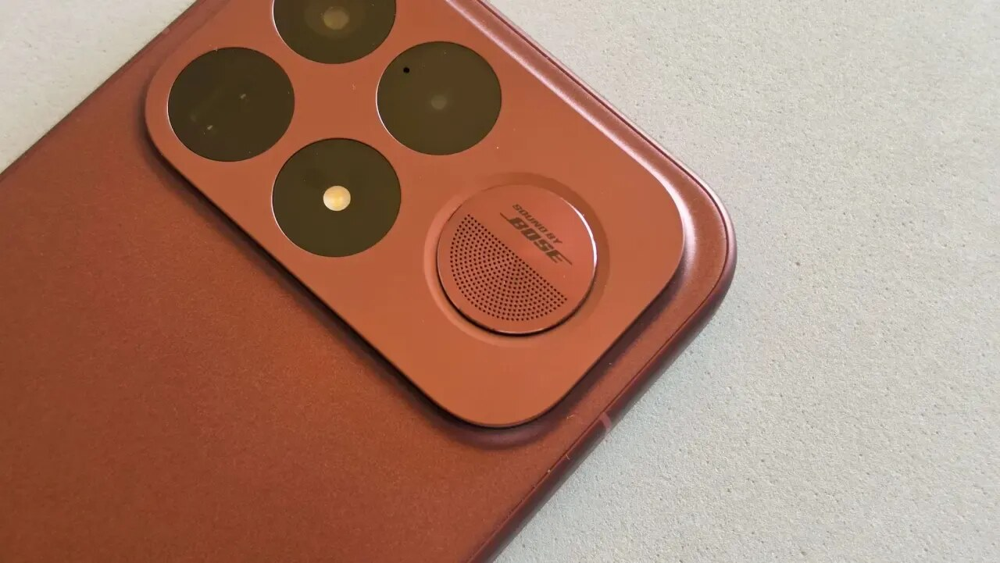

El Poco F9 Ultra llega como el nuevo tope de gama de la marca y se apoya en tres cifras: una pantalla AMOLED de 6,9 pulgadas con hasta 185 Hz de refresco, una batería de 8.050 mAh con carga de 100 W y un precio de partida de 1.099,99 euros. Dentro va un Snapdragon 8 Elite Gen 5, el procesador de Qualcomm de 3 nanómetros que también montan los buques insignia de esta temporada.

ComputerHoy ha probado el terminal y su lectura es que Poco ya no intenta solo meter hardware potente a un precio contenido: el F9 Ultra quiere competir en la gama alta de verdad. La consecuencia es que la ficha técnica deja de ser el argumento por sí sola, porque a partir de mil euros el comprador exige más que números en una tabla.

## Ficha técnica del Poco F9 Ultra y precio de salida

- **Pantalla:** AMOLED de 6,9 pulgadas, 2.608 × 1.200 píxeles, hasta 185 Hz, hasta 10.000 nits, 12 bits, Dolby Vision y HDR10+, protegida con Gorilla Glass 7i.
- **Procesador:** Qualcomm Snapdragon 8 Elite Gen 5, 3 nm, ocho núcleos hasta 4,6 GHz, con GPU Adreno y un chip dedicado VisionBoost D8 para gráficos y gaming.
- **Memoria:** 12 o 16 GB de RAM LPDDR5X; 256 GB, 512 GB o 1 TB de almacenamiento UFS 4.1.
- **Cámaras:** principal de 200 Mpx f/1.68 con estabilización óptica, ultra gran angular de 50 Mpx f/2.4 y teleobjetivo periscópico de 50 Mpx f/3.0 con zoom óptico 5x y OIS. Frontal de 32 Mpx con grabación hasta 4K a 30 fps.
- **Batería:** 8.050 mAh, carga por cable de 100 W, inalámbrica de 50 W y carga inversa.
- **Sistema y conectividad:** Android 16 con Xiaomi HyperOS 3, 5G, Wi-Fi 7, Bluetooth 6.0, NFC, Dual SIM, eSIM y USB-C 3.2 Gen 1.
- **Cuerpo:** 163,49 × 77,94 × 8,74 milímetros y 235 gramos, con protección IP68.
- **Extras:** sistema de audio 2.1 con subwoofer y firma Bose, Dolby Atmos, lector de huellas ultrasónico, emisor infrarrojo y refrigeración LiquidCool 3D IceLoop.
- **Precio:** 1.099,99 euros de salida.

## Diseño y pantalla: 6,9 pulgadas a 185 Hz

Con 235 gramos el Poco F9 Ultra no es un terminal ligero, y su pantalla de 6,9 pulgadas tampoco está pensada para quien busca un móvil compacto. La prueba de ComputerHoy señala que el peso y el tamaño se notan en el día a día, pero que la construcción compensa: los bordes redondeados y el acabado en color burdeos dan una sensación más premium de la que la marca solía ofrecer.

El panel es el otro gran protagonista: AMOLED de 6,9 pulgadas con resolución de 2.608 × 1.200 píxeles y una tasa de refresco de hasta 185 Hz, una cifra orientada sobre todo al público gaming. A cambio, el sistema de sonido monta dos altavoces estéreo más un subwoofer independiente con firma Bose, un detalle que la fuente destaca especialmente por el comportamiento de los graves.

## Rendimiento, autonomía y cámaras

El Snapdragon 8 Elite Gen 5 acompaña a 12 o 16 GB de RAM LPDDR5X y a almacenamiento UFS 4.1 de hasta 1 TB. En el uso diario el terminal responde con soltura y, según la prueba, funciona como una «bestia» al jugar gracias al chip dedicado VisionBoost D8; el matiz negativo es el calor, ya que un uso prolongado hace que el cuerpo se caliente de más. En la tabla de medidas publicada por ComputerHoy, que compara el modelo con el Poco F8 Ultra, el Realme GT 8 Pro y el Oppo Find X9 Pro, el F9 Ultra alcanza 3.889.765 puntos en AnTuTu y 7.321 puntos (43,84 FPS) en 3DMark Wild Life Extreme.

Donde el equipo se separa de la competencia interna es la batería: 8.050 mAh no son una cifra habitual ni en España ni en la gama alta. Con exigencia alta la autonomía se acerca a los dos días, y con un uso más mesurado la sensación, según la fuente, es que casi se puede prescindir del cargador durante un fin de semana completo. Cuando toca enchufarlo, los 100 W por cable completan la carga de 0 a 100 en menos de una hora y la carga inalámbrica llega a 50 W; la letra pequeña es que el adaptador no se incluye en la caja.

En fotografía, el conjunto se apoya en una principal de 200 Mpx f/1.68 con estabilización óptica, un ultra gran angular de 50 Mpx y, sobre todo, un teleobjetivo periscópico de 50 Mpx con zoom óptico de 5 aumentos. Para la fuente, ese teleobjetivo es la pieza más interesante del sistema por la versatilidad que aporta; el matiz es que los colores finales quedan algo saturados y con demasiado contraste. Existe además un modo específico de 200 megapíxeles útil cuando hace falta detalle extra o margen para recortar, y el teléfono graba vídeo en 8K a 30 fps y en 4K a 30 y 60 fps.

## Qué cambia para el comprador

El Poco F9 Ultra fija el listón de la marca por encima de los mil euros, algo impensable cuando la serie se construyó sobre la idea de ofrecer mucho hardware por poco dinero. La diferencia respecto a generaciones anteriores no está en la potencia —que sobra—, sino en el conjunto: pantalla grande y muy fluida, dos días de autonomía posibles, teleobjetivo 5x real, IP68, carga inalámbrica de 50 W y un acabado que ya no parece de gama media.

El precio es la variable que decide todo. A 1.099,99 euros el F9 Ultra entra en una franja muy disputada, mientras que las ofertas habituales que lo acercan a los 800-900 euros lo convierten en una compra mucho más fácil de recomendar. La misma lógica explica el tirón de las baterías de gran capacidad en el catálogo de Xiaomi, como ocurre con el [Redmi K100 y sus 8.000 mAh](/noticias/redmi-k100-large-battery/).

Quedan dos condiciones de compra explícitas: hay que querer un móvil grande y pesado, y hay que asumir que un uso intensivo del terminar calienta el cuerpo. Quien acepte ambas cosas y encuentre el equipo por debajo de los mil euros encontrará, según la prueba de ComputerHoy, un equipo bastante más completo de lo que la marca solía ofrecer.
