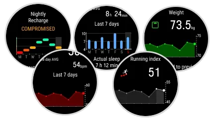

Polar ha comenzado a distribuir **Polar OS 6**, la nueva versión de software de sus relojes deportivos, con el número de firmware **6.0.18**. La actualización se publica el **30 de septiembre de 2026** de forma gratuita para seis modelos y gira en torno a dos objetivos: llevar a la pantalla del reloj datos que hasta ahora obligaban a abrir la aplicación móvil Polar Flow y proteger mejor la batería a largo plazo.

## Polar OS 6 lleva los gráficos de tendencias al reloj

El cambio más visible son los nuevos **gráficos de siete días** para las métricas de recuperación y actividad. En concreto, el reloj muestra la evolución de *Nightly Recharge*, la carga del sistema nervioso autonómico (ANS charge), la carga de sueño, la frecuencia cardiaca nocturna, la variabilidad de la frecuencia cardiaca, la frecuencia respiratoria nocturna y la duración del sueño.

A esa lista se suman un gráfico con los siete últimos resultados de **Running Index** en el resumen semanal, otro con los siete últimos pesajes en la vista de actividad diaria y un histórico de las siete últimas pruebas de **ECG**, este último solo en los modelos con esa función. La consecuencia práctica es sencilla: el usuario puede consultar tendencias que antes solo aparecían en la app sin sacar el teléfono, algo cómodo tanto durante el entrenamiento como en el día a día. Es una dirección parecida a la de otras plataformas que llevan tiempo [puntuando la disposición del deportista](/noticias/wearable-readiness-scores-evidence-gap/).

## Botón personalizable, ajustes en la muñeca y menús renovados

El botón **LIGHT** pasa a llamarse **Custom button** y admite una función asignada para el modo reloj y otra distinta para cada deporte durante el entrenamiento; de fábrica sigue encendiendo y apagando la retroiluminación. La excepción es el **Polar Ignite 3**, que no recibe esta función. Además, los ajustes clave de cada perfil deportivo ya se pueden cambiar directamente en el reloj, sin pasar por la aplicación.

El menú también se renueva con colores actualizados y transiciones más suaves, y reorganiza algunas opciones: los ajustes que antes estaban en el modo previo al entrenamiento pasan a **Ajustes de deporte** y los temporizadores quedan accesibles desde ese mismo punto. A todo ello se añaden nuevos fondos para la esfera digital y la posibilidad de introducir el peso desde los ajustes rápidos, deslizando el dedo hacia abajo en la pantalla principal.

## Carga limitada al 80 % y disponibilidad

Entre las novedades de mantenimiento destaca un **límite de carga del 80 %** opcional: cuando se activa, el reloj deja de cargar antes de llegar al máximo para alargar la vida útil de la batería. Viene desactivado por defecto y se enciende en **Ajustes > Ajustes generales > Batería**, un enfoque que ya usan los móviles y otros dispositivos recargables.

Polar OS 6 está disponible desde el 30 de septiembre de 2026 como actualización gratuita para los **Polar Vantage V3, Vantage M3, Grit X2 Pro, Grit X2, Ignite 3 y Street X**. Se instala sincronizando un reloj compatible con la aplicación Polar Flow o con FlowSync en el ordenador. La firma asegura además haber mejorado el algoritmo de pulso óptico para reducir caídas puntuales de lectura y haber corregido alertas erróneas relacionadas con los sensores de cadencia y velocidad.

El movimiento refuerza el terreno en el que Polar se juega su hueco frente a Garmin y demás rivales: un ecosistema de métricas de entrenamiento y recuperación que ya ha llegado incluso a relojes de terceros, como las [métricas de Polar integradas en el Moto Watch Ultra](/noticias/moto-watch-ultra-lte/). Para quien tenga uno de los seis modelos compatibles, la actualización no exige ninguna compra: basta con sincronizar el reloj.
