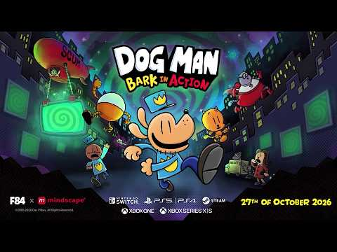
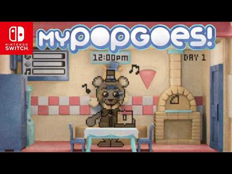
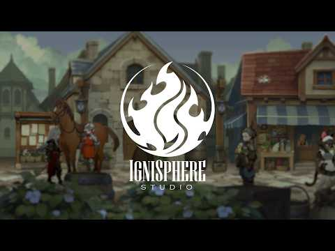
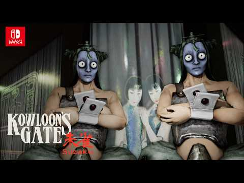
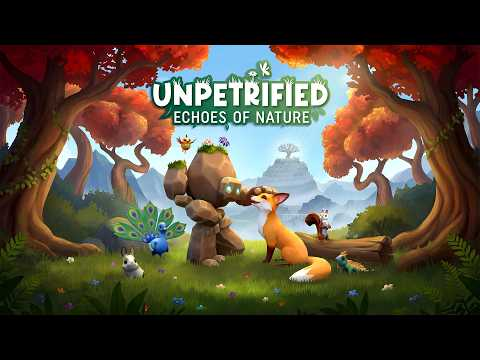
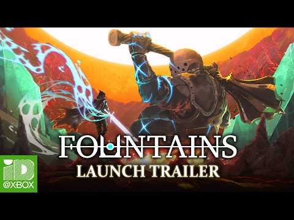
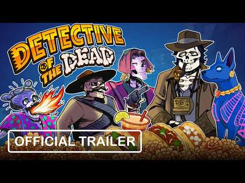

El catálogo de Nintendo Switch y Nintendo Switch 2 sigue creciendo: ocho títulos acaban de confirmar su lanzamiento en las consolas de Nintendo, con fechas, precios y detalles de sus ediciones. Entre ellos destacan el nuevo juego de Policán (Dog Man) y la llegada de myPOPGOES, la nueva entrega de la iniciativa Fazbear Fanverse, junto a propuestas que van del RPG de acción al terror lovecraftiano.

## Policán y Fazbear Fanverse encabezan los anuncios para Nintendo Switch

El nombre más familiar de la tanda es **Dog Man: Bark in Action**, que llegará a Nintendo Switch el **27 de octubre de 2026**. Se trata de la continuación de Dog Man: Mission Impawsible, basada en los cómics de Dav Pilkey, y amplía la fórmula con más de 10 personajes jugables, seis mundos nuevos, el doble de combates contra jefes y, por primera vez en la serie, modo cooperativo local para dos jugadores.

El otro foco está en **myPOPGOES**, que se pondrá a la venta en Nintendo Switch el **8 de octubre de 2026** por **4,99 dólares**. Es un spin-off de POPGOES enmarcado en la iniciativa Fazbear Fanverse: la acción transcurre dentro de un juguete LCD de los años 2000 donde hay que cuidar a Popgoes, una exigente comadreja pixelada. La versión de Switch suma los modos Sticky, Expire y Blind, minijuegos como Longest Popgoes, Fishing y Topping Juggle, además de personajes, pegatinas y entradas de diario desbloqueables.

## El resto de lanzamientos: fechas, precios y plataformas

El anuncio más lejano es **DAWNGAZER**, previsto para **2028** en Nintendo Switch 2, PlayStation 5 y PC (Steam). Es un RPG de acción ambientado en el universo de fantasía IGNISPHERE, desarrollado por IGNISPHERE Studio bajo la dirección de Takafumi Noma, con una historia y un mundo compuestos por distintas naciones y razas. El proyecto aspira a expandirse más allá del videojuego con figuras, productos y novelas ligeras.

En el extremo opuesto del calendario, **Kowloon's Gate: Suzaku** llegará a Nintendo Switch el **29 de octubre de 2026**. Es una aventura de exploración basada en Kowloon's Gate VR: Suzaku y precuela del clásico de 1997: los jugadores recorrerán los laberínticos callejones de la Ciudad Amurallada de Kowloon y usarán fotografías de un álbum para localizar lugares concretos y recuperar recuerdos mediante la «psicografía».

La oferta de otoño la completa **Unpetrified: Echoes of Nature**, disponible el **10 de noviembre de 2026** en Nintendo Switch por **29,99 dólares**. Esta aventura narrativa sigue a un gólem de piedra y un zorro que unen sus caminos para descubrir los secretos de una civilización perdida, con puzles ambientales, exploración, coleccionables y numerosos animales; el gólem empleará sus habilidades para restaurar la naturaleza y avanzar por un mundo colorido.

Para los aficionados a los desafíos exigentes, **Fountains** prepara su edición de Nintendo Switch 2: un RPG de acción de corte soulslike ambientado en un enorme laberinto interconectado con estructura de metroidvania, con combates exigentes, nuevas habilidades y herramientas, secretos, narrativa ambiental y un sistema de mensajes en línea. La versión de Switch 2 añade un modo Gauntlet exclusivo y compatibilidad con **120 FPS**, además de actualización gratuita para quienes posean la versión original de Nintendo Switch. Si este género interesa, también conviene seguir la pista de [Wo Long 2: Wings of Ember](/noticias/wo-long-2-release-date/), otro soulslike con lanzamiento ya fechado.

Cierran la lista dos apuestas para 2027: **Penguin Colony**, aventura narrativa de terror inspirada en H. P. Lovecraft que llegará a Nintendo Switch 2 ambientada en la Antártida de 1939, con dos grupos enfrentados buscando algo ancestral bajo el hielo mientras el jugador observa los hechos desde la perspectiva de un pingüino; y **Detective of the Dead**, aventura de investigación point-and-click para Nintendo Switch ambientada en el más allá mexicano, donde un detective debe descubrir quién causó su propia muerte con pistas, puzles y conversaciones con los difuntos —incluida la preparación de tacos especiales para obtener información— mientras controla a su perro Xolo, dotado de habilidades mágicas.

## Qué significan estos anuncios para los jugadores en España

La tanda confirma dos tendencias claras para el ecosistema de Nintendo Switch. Primero, la convivencia de generaciones: varios títulos llegan aún a la Switch original mientras las ediciones de Switch 2 aportan mejoras tangibles —como los 120 FPS de Fountains o la actualización gratuita—, lo que facilita el salto sin penalizar a quienes conservan la primera consola. Segundo, la variedad de precios y formatos: desde los 4,99 dólares de myPOPGOES hasta propuestas narrativas de precio completo, con hueco tanto para el público familiar de Policán como para nichos como el terror lovecraftiano o la aventura de investigación.

Todos los lanzamientos llegarán a la eShop de Nintendo, por lo que estarán disponibles para los jugadores españoles en formato digital desde el primer día. Como es habitual en estos anuncios globales, conviene confirmar el precio final en euros cuando cada ficha se publique en la tienda europea.
