El Acer Googlebook 14 es el único convertible entre los cinco equipos con los que arranca la plataforma Googlebook. La firma comparte lanzamiento con Asus, Dell, HP y Lenovo, pero es la única que ha apostado por bisagras de 180 grados para pasar de portátil a tableta. El medio británico Stuff lo ha probado durante varios días y le ha dado una valoración de 4 sobre 5: elogia el hardware y la autonomía, y reprocha que el sistema todavía no está a la altura de Windows o macOS en herramientas.

El precio de partida es de 899 dólares o 999 libras, más caro de lo que el público asociaba a un Chromebook, aunque por debajo de un MacBook Air o de un Dell XPS 14. Acer añade para los primeros compradores en Reino Unido un cargador GaN de 100 W, un concentrador USB-C de cinco puertos, un ratón, garantía ampliada y la plantación de diez árboles a través de Ecologi.

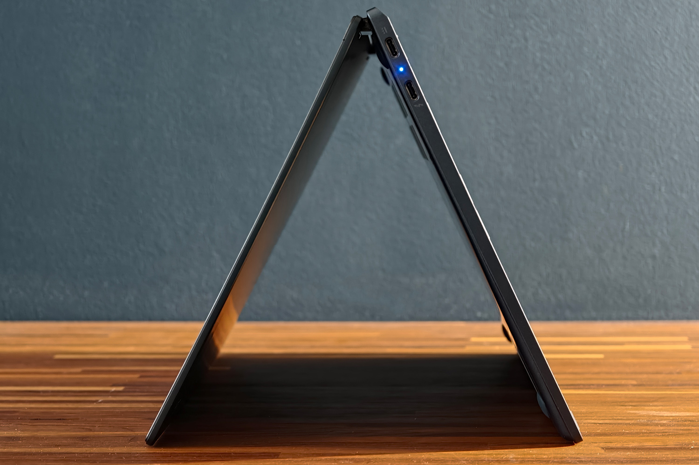

## El Acer Googlebook 14, un convertible que no renuncia a la movilidad

El Googlebook 14 pesa 1,14 kg y mide 13,9 mm de grosor, con un acabado en aluminio azul oscuro que se aparta del negro y el plateado habituales. Las bisagras sostienen el formato tienda y el modo tableta, y un sensor de orientación gira la pantalla y abre el teclado en pantalla de forma automática. Googlebook OS obliga a un chasis metálico y a la barra luminosa Glow Bar en la tapa; Acer la coloca descentrada, y responde a Gemini con tonos azules y morados, muestra la batería restante al desconectar el cargador o se ilumina con los cuatro colores de Google al cerrar la tapa. Existe incluso un modo disco oculto que reacciona al sonido de los altavoces.

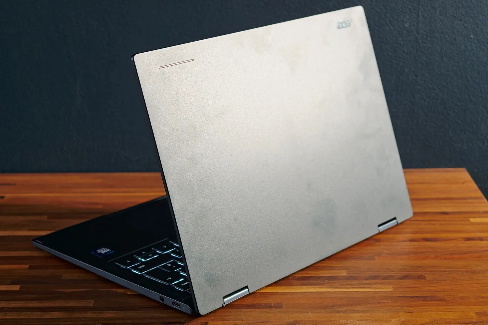

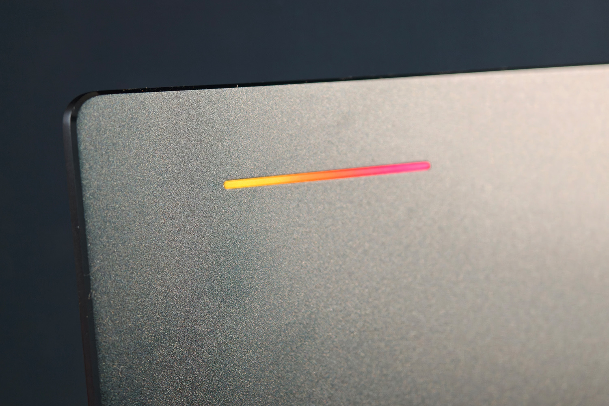

El teclado es de tipo isla, retroiluminado y con teclas de tamaño completo salvo la fila de función y las flechas, que son de media altura. Google impone una tecla Insert y la tecla G en lugar del bloqueo de mayúsculas y las teclas Windows o Command, pero el resto del diseño queda en manos del fabricante. Stuff señala que la mecanografía resulta fácil de adaptar, aunque conviene escribir con un toque ligero: las teclas apenas tienen recorrido y pierden rebote si se pulsa con fuerza. El touchpad de cristal es amplio, con presión mecánica —no háptica— y buena precisión.

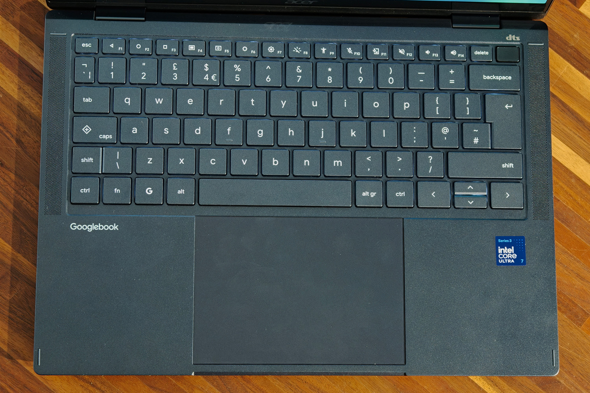

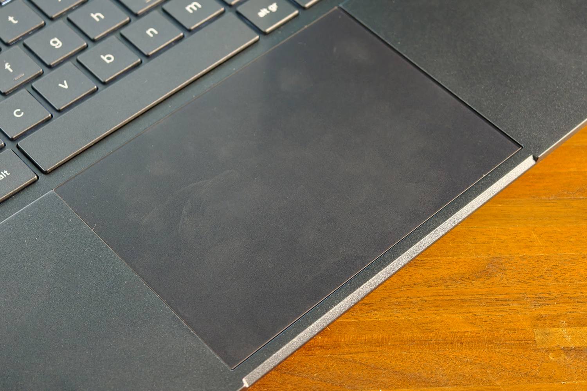

La pantalla es uno de los puntos fuertes: OLED de 14 pulgadas a 2880×1800, con tasa de refresco de 120 Hz y soporte HDR. El panel táctil responde con rapidez y el brillo permite trabajar junto a una ventana, si bien el acabado brillante refleja la luz y el sol directo sigue siendo un problema. En sonido, los dos altavoces frontales suben con facilidad y suenan claros, pero les falta cuerpo en los graves, algo esperable en un equipo tan delgado.

En conectividad hay un Thunderbolt 4, dos USB 3.2 Gen 2 Tipo C y un minijack de 3,5 mm. No hay lector de tarjetas, algo a tener en cuenta para quien trabaje con cámara, y la webcam de 5 MP incorpora obturador de privacidad. El sensor de huellas va integrado en el botón de encendido.

## Un sistema que gana en el escritorio y tropieza fuera de él

Googlebook OS es, en palabras de Stuff, una evolución estable de ChromeOS que lleva Android al escritorio, el salto que el sector venía siguiendo desde la comparativa de [Googlebook frente a Chromebook](/noticias/googlebook-vs-chromebook/). En la prueba no hubo cierres forzados y el sistema respondió con soltura incluso con muchas pestañas y aplicaciones abiertas. La interfaz recuerda a ChromeOS, con la bandeja de aplicaciones y la barra de estado en posiciones algo distintas y los ajustes rápidos arriba a la derecha, y adopta el lenguaje visual Material 3 Expressive de Android. Gemini se invoca con el gesto Magic Pointer, admite dictado con el modelo Rambler y puede reconocer el contenido de una foto o crear un evento de calendario a partir de una imagen.

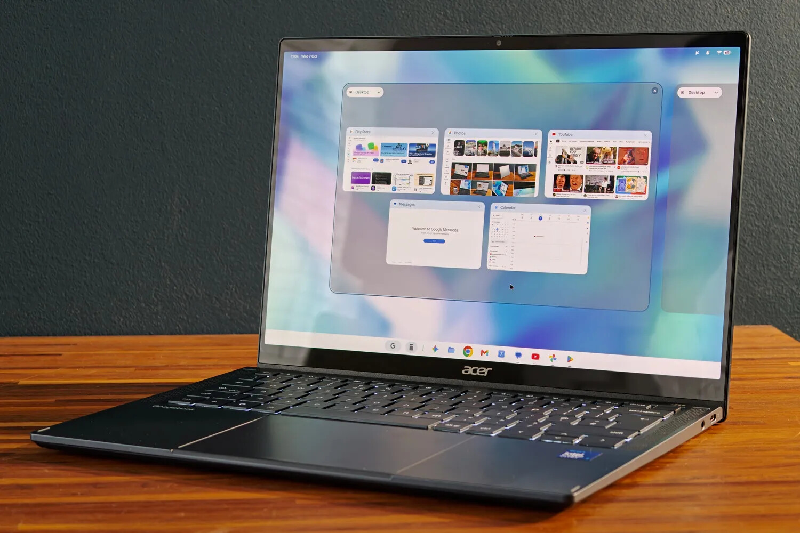

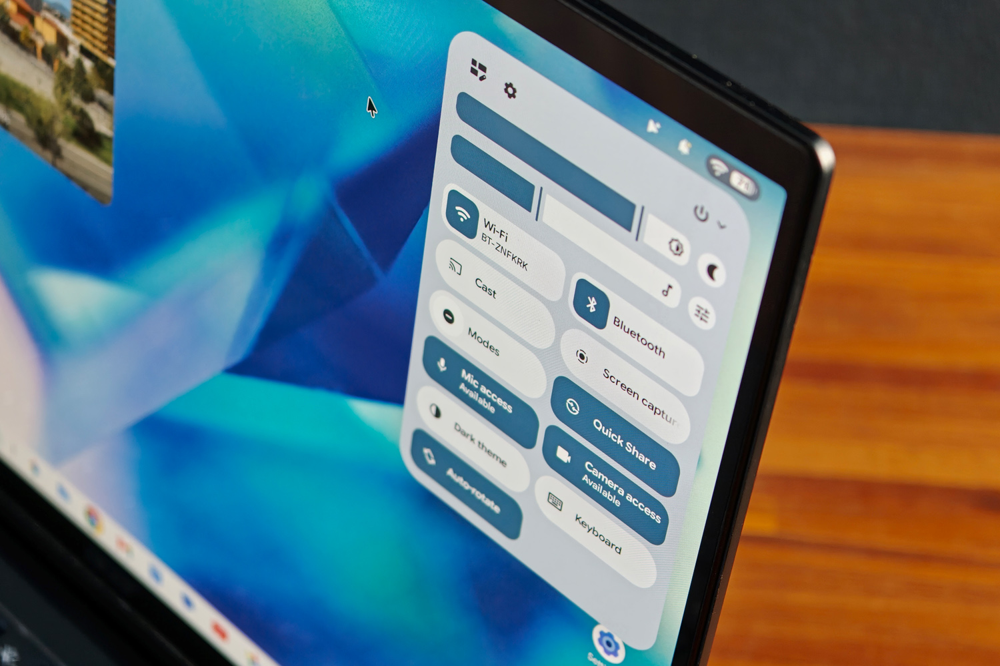

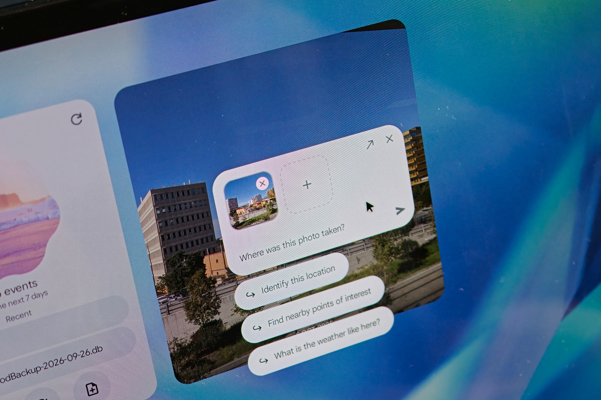

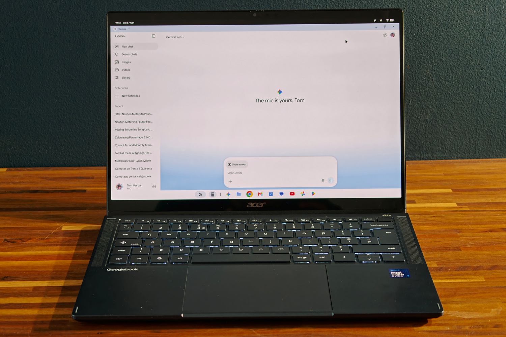

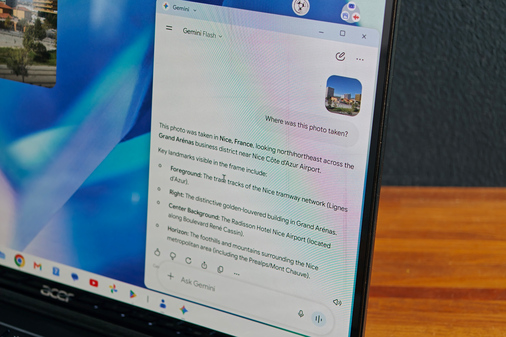

La integración con el móvil es la baza diferencial. Al configurar el equipo, un teléfono Android comparte las cuentas y las versiones de escritorio de las aplicaciones instaladas; el navegador de archivos detecta el teléfono en la misma red Wi-Fi y las notificaciones aparecen en pantalla sin duplicarse. La función «Continue On» fija en la barra de tareas las aplicaciones abiertas en el móvil para retomarlas en la pantalla grande. El problema es que exige Android 17 —un lastre para fabricantes lentos en actualizar— y que Samsung, con una cuota enorme de usuarios, no está soportado en el lanzamiento, una de las limitaciones que ya se conocieron junto a los [problemas de compatibilidad de las apps Android en los modelos Intel](/noticias/moviles/googlebook-apps-intel-samsung/). Además, «Continue On» funciona con muy pocas aplicaciones por ahora.

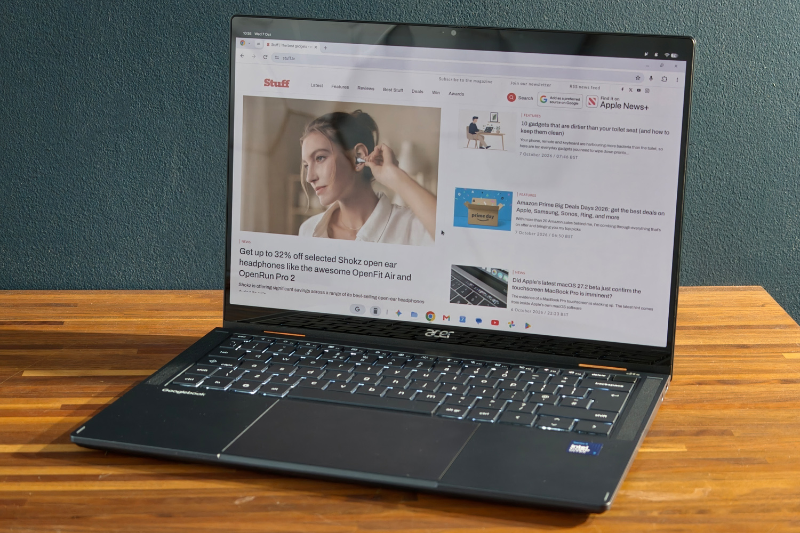

El techo aparece en la productividad: para Stuff, un día de trabajo completo solo con este equipo no es posible. Las aplicaciones de Android y del navegador no igualan a Windows o macOS en herramientas creativas como Photoshop, y aquí no se pueden instalar programas de Linux como GIMP dentro del escritorio: el acceso se limita a la línea de comandos y esas aplicaciones no conviven con las de Googlebook OS en la bandeja. Tampoco hay versiones de Steam para Linux, algunas aplicaciones web progresivas entran en conflicto con sus homólogas de Android —Slack es el ejemplo— y muchos juegos de Play Store no reconocen ratón y teclado o no se ejecutan a pantalla completa.

## Rendimiento y autonomía: bien para trabajar, con matices para crear

La unidad analizada monta un Intel Core Ultra 7 355 de ocho núcleos y hasta 4,7 GHz, con 16 GB de RAM y 512 GB de almacenamiento. El catálogo permite elegir entre el Ultra 5 325 o el Ultra 7 355 y hasta 32 GB de memoria y 512 GB de disco. En x86, Google admite que un pequeño número de aplicaciones Android todavía tiene problemas de compatibilidad, aunque Stuff no encontró ninguno durante la prueba. Los datos que publica el medio sitúan al equipo a la par de portátiles Windows con hardware similar: 2.536 puntos en Geekbench 6 de un solo núcleo, 11.531 en multinúcleo, 38,9 en Speedometer 3.1 y 16.662 en PCMark Work 3.1. La refrigeración activa mantiene las temperaturas a raya sin que el equipo se caliente en exceso ni haga ruido.

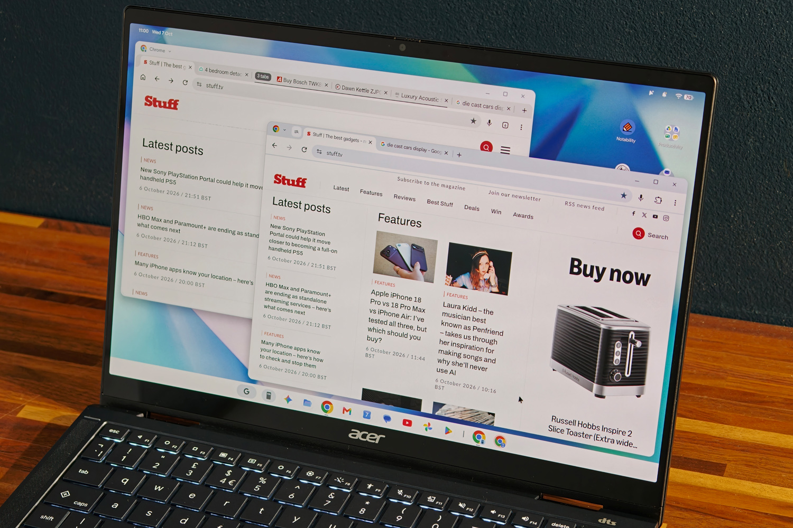

La batería de 71 Wh es generosa para un portátil de 14 pulgadas. Acer anuncia hasta 14 horas de reproducción de vídeo en streaming con el brillo al 50 % y hasta 16 horas de navegación, pero en la prueba de uso general de Stuff el registro bajó hasta unas 12 horas, aún suficientes para una jornada completa lejos del enchufe. En reposo, el consumo es muy bajo: apenas unos pocos puntos porcentuales durante la noche.

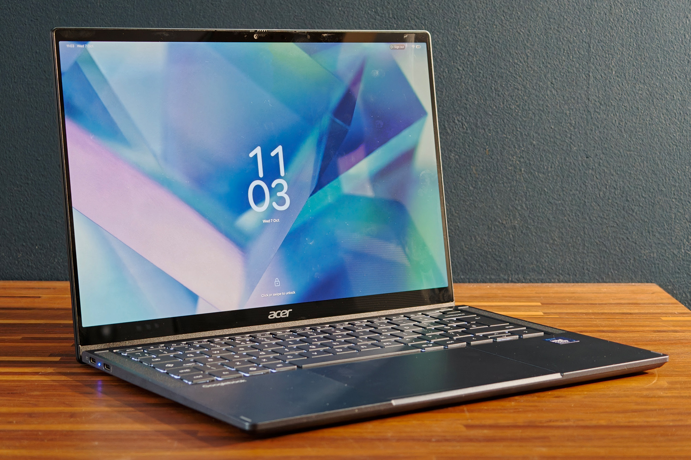

Para Stuff, el veredicto es claro: el Googlebook 14 cumple en hardware, con un convertible ligero, una pantalla excelente y una autonomía que aguanta el día, pero su sistema aún está por detrás de Windows y macOS en software creativo y arrastra funciones que ChromeOS ya ofrecía. Es un equipo para quien trabaja sobre todo en el navegador y vive dentro del ecosistema Android, no para quien depende de herramientas profesionales. Aun así, el medio recomienda esperar a ver con qué rapidez Google resuelve las carencias detectadas en las primeras reviews antes de decidirse.
